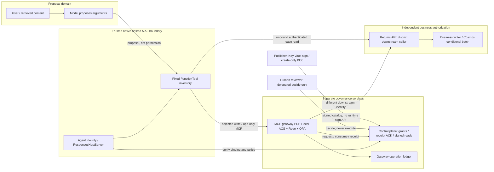
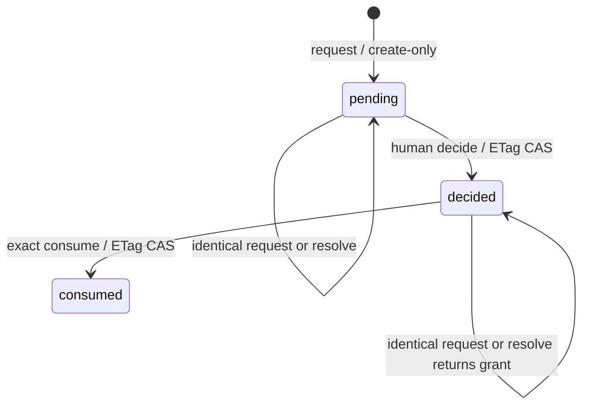
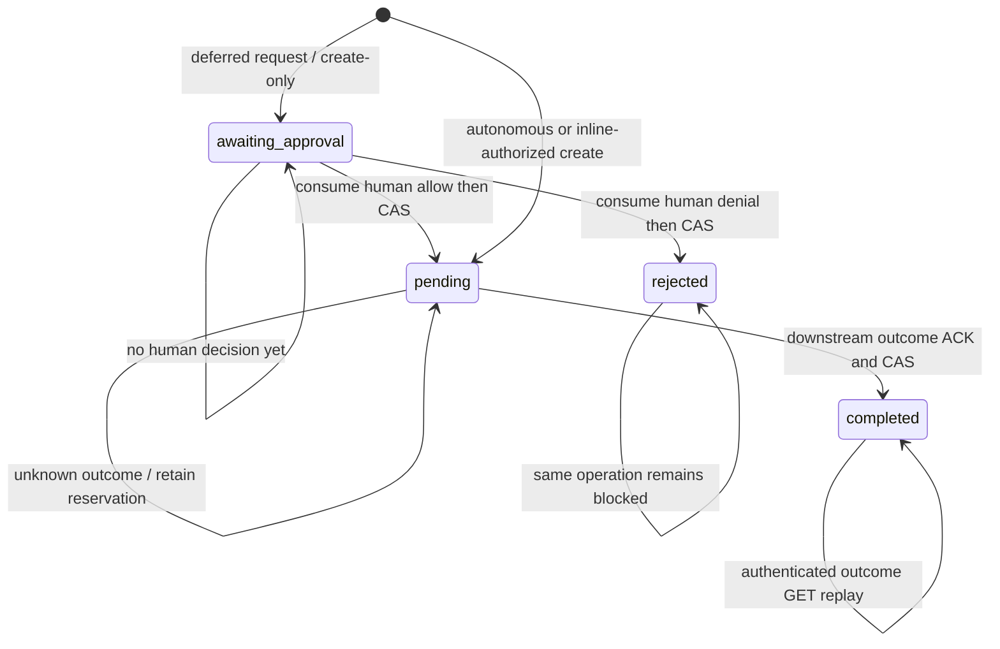

# Agent governance at the effect boundary

**Engineering deep dive · Level 500 · documentation review: 2026-09-14.**
The public hosted execution snapshot is **2026-09-13**, not a new execution
performed for this document. This is an implementation analysis, not another
deployment log, a whole-agent attestation or a production certificate.
The [dated scenario record](governed-returns-validation.md) owns observations and
their updates; the [Pages specification](production-readiness-pages-spec.md)
owns proposed public presentation, not runtime behavior.

**The model proposes; trusted components authorize effects.**
Do not give a model authority to authorize its own effects. A plausible
explanation, an `approved` argument, a retrieved instruction or a tool-selection
decision cannot mint a credential, a policy signature, a human grant or a durable
receipt. A selected action executes only through trusted code that authenticates
the caller, checks the exact proposal against policy and backend facts, obtains
required approval, records authorization durably, and invokes a separately
authorizing writer.

This reference implements that claim for a narrow native MAF/FunctionTool/MCP
path. It does not claim to control chain-of-thought, eliminate hallucinations or
make arbitrary agent frameworks safe.

## Reading map and scope

| Question | Implementation source |
|---|---|
| What gets generated and frozen? | [Deployment contract](../skills/threadlight-deploy/references/governance/README.md), [generate.py](../skills/threadlight-deploy/references/governance/generate.py) |
| How does native MAF call the selected gateway? | [maf-gateway-container.py](../skills/threadlight-deploy/references/governance/maf-gateway-container.py), [maf_gateway.py](../skills/threadlight-deploy/references/governance/maf_gateway.py) |
| Where is the effect authorized? | [Gateway contract](../skills/threadlight-govern/references/gateway/README.md), [dispatcher.py](../skills/threadlight-govern/references/gateway/dispatcher.py), [server.py](../skills/threadlight-govern/references/gateway/server.py) |
| Who can decide, consume and acknowledge? | [Control-plane contract](../skills/threadlight-govern/references/control-plane/README.md), [app.py](../skills/threadlight-govern/references/control-plane/app.py), [models.py](../skills/threadlight-govern/references/control-plane/models.py) |
| What changes in the business database? | [returns_mcp_backend.py](../skills/threadlight-deploy/references/governance/returns_mcp_backend.py), [CosmosEffectTransport](../examples/returns-triage-governed/src/agent/cosmos_effect.py) |
| How is evidence reconciled? | [returns_reconcile.py](../skills/threadlight-deploy/references/governance/returns_reconcile.py) |
| How would an operator reproduce or diagnose it? | [Returns MCP runbook](../skills/threadlight-deploy/references/governance/returns-mcp-demo.md), [execution record](governed-returns-validation.md) |

The canonical [returns-triage-governed example](../examples/returns-triage-governed/README.md)
is a different, richer native-hook integration: ordered OMS/customer/case reads,
policy citations and additional tools. Its current business binding remains
live-unverified in the catalog. S3 is a separate **two-tool inventory**:
`returns_get_case` and `returns_apply_decision`. Neither proof transfers to the
other automatically. There is **no financial settlement**: the effect records
a return recommendation or supervisor handoff and its audit, not a payment.

## Authority is not output safety or network location

**SAFE is the method** for defining business invariants and the evidence needed
to evaluate them. **ACS is the PDP**: native Agent Control Specification evaluates
Rego through local OPA. **Agent Hooks** supplies a **host/interceptor contract**
SDK. The selected native host or governed-tool gateway is the **PEP** that can
stop an effect. **AGT is the toolkit**, not an automatically installed security
perimeter. **ASSERT is assurance**, not the enforcement engine. See the
[runtime contract](../skills/threadlight-govern/references/runtime/README.md)
and [govern skill](../skills/threadlight-govern/SKILL.md).

| Mechanism | Useful protection | What it does not establish |
|---|---|---|
| Prompts and prose skills | Guide reasoning, tool choice and explanations | Independent authorization; model compliance with an exact ETag |
| Output guardrails, filters and buffered post-tool checks | Reject or transform supported returned content | Prevention or rollback of an already executed mutation |
| Model gateway | Control model access and selected model-traffic policies | Closure of downstream business-write paths |
| VNet/private endpoints/network isolation | Restrict reachability and potential bypass routes | Whether an authenticated caller may perform this exact action now |
| Native host/gateway PEP plus independent backend | Enforce selected action scope and preconditions before transmission; constrain the writer | Control over unbound tools, arbitrary host code or all output |
| Durable receipts and reconciliation | Evidence of scoped decisions and observed effects | Continuous remote attestation of the entire agent |

The public S3 and private S2 outcomes make the distinction concrete: public
authenticated infrastructure executed the selected business control. Earlier
private startup controls failed before sessions; private BASIC version 7 later
produced a real model response. That private hosting success still does not
establish selected business authority or complete network-isolation assurance.

## Threat model and trusted computing base

Treat model text, user text, retrieved documents, tool arguments and operation
selectors as proposals, even when well formed. Relevant failures include prompt
injection, a fabricated amount or eligibility flag, a changed revision, duplicate
delivery, stale authorization after an asynchronous wait, cross-tenant receipt
reuse, forged human consent and an unknown outcome after a lost acknowledgement.

The **trusted computing base** includes:

- Frozen host code, its allowed tool inventory, credential selection and HTTP
  transport wrappers; trusted OS/container/platform identity injection.
- Correct Entra signature validation, configured tenant/issuer/audiences,
  workload mappings, human reviewer permissions and TLS trust.
- An authorized publisher, immutable policy/configuration inputs, versioned key,
  verifier, ACS/OPA implementation and the host-owned SAFE evidence adapter.
- Control-plane and gateway code/stores with create-only writes and ETag CAS;
  stable clocks, one writable Cosmos region and retained nonce/operation records.
- The independent business API and its database permissions, current fact
  validation, conditional transaction and outcome lookup.
- An independently authorized evidence collector and authenticated readbacks.

This is **not a defense against arbitrary malicious trusted host code**. A host
administrator that replaces the PEP, alters configuration, obtains a writer's
credential or deletes nonce tombstones is outside this cooperative boundary.
Separate identity names do not provide hostile-process isolation on a shared
VM whose managed identities are available through the host. S1 explicitly had
that limitation. S3 demonstrated real Agent Identity use, not a hostile-host or
container-escape test.

The model is exposed to the declared FunctionTools, not arbitrary shell/HTTP
executors. Closing alternative effects requires separately validating network
**and** IAM paths, direct credentials and built-in/provider tool coverage.
Removing a tool from a prompt is not that closure. Required selected
configuration fails closed; invalid configuration never silently becomes `off`.

Report each binding as `enforced`, `observed`, `unbound`, `unverified`,
`unsupported` or `bypassable`, rather than calling an entire agent governed.
Support is **not all frameworks**: selected MAF local hooks can mediate supported
tool/lifecycle and buffered-output points; compaction, provider-hosted tools,
incremental streaming/custom clients remain unsupported. The gateway-only MAF
host is narrower still: no lifecycle bindings or application middleware. GHCP
can use registered gateway actions but has no implemented deferred-resume adapter
here. S4 prompt agents do not execute this Python host/client; an equivalent
identity, operation-header and resume contract would need separate proof.

## Identity and trust boundaries



The diagram is logical ownership, not a statement that S3 has private subnets.
S3 used separate authenticated public HTTPS services. S1/S2 private paths are
documented separately in the record.

| Role | Allowed purpose | Separation that matters |
|---|---|---|
| **Agent Identity** | Model inference, exact control/gateway workload access, key verification, business GET case read | No agent Cosmos writer, business POST authority or signing permission |
| **Human reviewer** | Delegated `Governance.Approve`, allowlisted UI client/subject, required `Approver` role | Not an app-only workload; cannot execute or consume from the review client |
| **control-plane identity** | Read signed catalog, verify key, persist approvals and receipts | Not the publisher or business-case writer |
| **gateway identity** | Control API workload calls and gateway operation ledger | Different from the credential authorizing downstream POST |
| **downstream identity** | Registered business POST `/decisions` and GET `/outcomes` | No direct Cosmos access; not a forwarded agent or human token |
| **business writer** | Cosmos case read/replace and decision-audit create; optional read-audit create | Independently authenticates downstream calls; does not sign policy or grant approval |
| **publisher** | Versioned Key Vault sign and create-only Blob publication | Operator backend only; no HTTP sign/publish route, no runtime agent signing rights |
| Evidence operator | Authorized native-response and independent store reads; optional minimized record creation | No decision or grant is manufactured by reconciliation |

All three API audiences are distinct: control, gateway and business. Workloads
require the validated tenant/issuer/audience, token version, `idtyp=app`,
`Governance.Workload`, no delegated `scp`, and exact `(oid, client)` allowlists.
`azp`/`appid` selection follows the configured token version. Headers containing
decoded claims are not authentication. The gateway authenticates every MCP HTTP
request, including initialize/list/call; an initialized session is not an
authorization cache. Only gateway `/health` is anonymous.

The business `Configuration` distinguishes `writer_subject` (the authenticated
downstream caller) from `service_client_id` (its own Cosmos-writing identity)
and `agent_subject` (read caller). Its `workloads` map contains exactly the
agent and downstream subjects. These are not three aliases for the same token.

Human approval requires the role in the signed human token, service
`approver_roles` and intent `allowed_roles`, plus the delegated scope and
allowlisted client/subject. The service derives the approver from authenticated
claims and forbids self-approval. It revalidates its configured role/subject
constraints at consume time; this is not a claim of instantaneous directory-wide
revocation of every already-issued token.

**OBO A-to-B is not proved in S3.** The separate **per-user native MCP
authentication** workstream is not equivalent to this app-only host → gateway →
distinct downstream flow. An end-user ID in `review_context` or an email does
not create delegation. Do not forward the human decision token to MCP.

## Frozen policy, registry and bootstrap authority

The [shared pin](../skills/_shared/governance-upstream-pin.json) selects AGT core
`5.0.0`, ACS `0.3.1b0`, Agent Hooks `0.1.0a5`, MAF core `1.14.0`, Foundry
`1.11.0`, hosting `1.0.0b260813` and OPA `1.18.2`; MCP is `1.29.1`.
These include preview/alpha dependencies, not a general support guarantee.
`NativePolicy.load` verifies package versions and the pinned OPA Linux amd64
binary digest before creating `AgentControl.from_path`.

### Three different signed associations

| Object | Exact fields or content | Validation boundary |
|---|---|---|
| `BundleEnvelope` | `policy_id`, `version`, `content_digest`, `expires_at`, `tenant_id`, `key_id`; `SignedBundle` wraps `envelope`, `signature` | Canonical sorted-key compact UTF-8 JSON → SHA-256 digest bytes → RS256; both immutable policy/version and digest indexes must agree |
| `Registry` | `schema: threadlight-gateway-registry/v1`, `tenant_id`, `gateway_url`, `deployment`, `actions` | `gateway-registry.json` is inside the digest-covered bundle, never injected after signing |
| `BootstrapBinding` | `schema: threadlight-hosted-bootstrap/v1`, `reference`, `tenant_id`, `key_id`, `policy_id`, `policy_version`, `native_policy_digest`, `policy_digest`, `config_digest`, `project_endpoint`, `agent_id`, `agent_version`, `image_digest`, `subscription`, `resource_group`, `environment`, `principal`, `client_id`, `issued_at`, `expires_at`; optional `native_probe_assets` | Exact frozen configuration plus independently observed platform identity/version/image and policy chain; bounded declarative data, not remotely supplied application code |

`deployment` in the registry contains `agent_id`, `agent_version`, `image_digest`,
`environment`, `subscription`, `resource_group`. Each `Action` binds `name`,
`policy_binding`, nullable `post_policy_binding`, `workloads`, application `scope`,
`approval_roles`, `endpoint`, `outcome_endpoint`, `credential_scope`,
`input_schema`, `output_schema`, and optional approval settings. For this
business action, the native `pre_tool_call` binding is `returns-safe` with
`policy_target: $.tool_call.args`. Optional `post_tool_call` targets
`$.tool_result`. A control-plane bundle ID is not the native Rego policy ID.

Both schemas are bounded strict objects with `additionalProperties: false`.
The gateway supports an explicit subset, not arbitrary JSON Schema evaluation:
no remote references, coercion, defaults or generated validators. Endpoint
validation requires canonical fixed HTTPS paths, exact host allowlists, no
redirects, query, userinfo or arbitrary shell routing. A model cannot select a
different destination by changing an argument.

The [control-plane publisher](../skills/threadlight-govern/references/control-plane/app.py)
uses [KeyVaultSigner](../skills/threadlight-govern/references/control-plane/storage.py).
The actual S3 key was **RSA-3072**, signing/verifying **RS256**, with tampered
digest rejection observed: **no exported private key**, **no demo signer**.
Application publication uses `overwrite=False`, not an editable `latest`.
Key version, expiry, policy digest and tenant are all part of the association.
A partial two-index publication fails closed; it is not repaired by overwrite.
Create-only application semantics are not proof of a locked Blob retention policy.

### Resolve the hosted identity cycle without inventing a version

[hosted_lifecycle.py](../skills/threadlight-govern/references/control-plane/hosted_lifecycle.py)
persists a protected `creating` intent before `create_version`, records `created`
after acknowledgement, and refuses ambiguous automatic recreation. Direct
observation checks the actual definition, version, image and identity.
`enableVnextExperience: "true"` is creation metadata, not permission to execute.
Endpoint configuration and signed-bootstrap publication are separate operations.
Do not insert guessed `FOUNDRY_*` values or rebuild the agent after signing just
to embed its newly assigned identity.

[bootstrap.py](../skills/threadlight-govern/references/control-plane/bootstrap.py)
checks the signed reference and both policy indexes. `config_digest` hashes
canonical frozen configuration; it is not an arbitrary revision marker.
`BootstrapGate` uses an async lock for one-time initialization. Missing
publication before initialization is retryable; failed initialization invalidates
the gate. `check()` is only a local lease check; `authorize()` recontacts
authenticated authority and verifies the exact unchanged signed binding.
There is no fallback from invalid authority to an ungoverned selected tool.

The default `bootstrap_scope: host` gates application request surfaces until
activation. S3 used explicit staging/preproduction `bootstrap_scope:
selected-tools`: `DeferredBootstrapAuthority` permits native host readiness
before binding exists, but the **first selected dispatch** activates the signed
authority and authenticates discovery. Frozen `gateway_descriptors` must exactly
match the live selected descriptors. Native readiness here is not selected-tool
readiness or permission; it breaks a startup dependency cycle, not the effect gate.
Production does not accept this nonproduction deferral.

`GatewayAuthority.authorize()` fetches the exact envelope, checks key health,
signature, configured identity/policy fields and expiry, and rejects changed
envelope bytes. The gateway's loaded `NativePolicy.fresh()` checks UTC expiry,
a `time.monotonic()` deadline, OPA path and bundle integrity; it does **not**
promise immediate revocation of every issued snapshot. Refresh/key rotation is
an explicit lifecycle. Frozen snapshots cannot renew themselves.

The optional `hosted_cohort: {file, sha256}` input to `generate.py` validates a
bounded retained dependency file and copies three exact Agent Server pins, not
arbitrary dependencies. S3 used core/responses `2.1.0b1` and invocations `1.1.0b1`
with the unchanged MAF family. That packaging adjustment preceded the generator
option; the option was not retroactively executed to produce hosted v5.

## From proposal to the actual Cosmos effect

`create_gateway_agent` validates the governance contract and exact local read
inventory. `GovernedMCPTools` exposes selected descriptors as real native MAF
`FunctionTool`s, uses official Streamable HTTP MCP, and repeats authenticated
inventory comparison. `GatewayAgent.run` rejects request-time injected tools,
middleware, compaction strategy, client kwargs and unsupported options.
`ResponsesHostServer` and `FoundryChatClient` are native, not a simulated model
loop. Installing Hooks in the image does not mean Hooks mediated this gateway
path; the remote gateway is this write's PEP.

### Proposal and wire shape

This is a sanitized **argument object**, not a complete HTTP request. The
JSON-escaped quote characters belong to the Cosmos ETag string and must survive
model/tool serialization. `RMA-EXAMPLE` and `revision-from-read` are illustrative.

<!-- contract: returns-decision -->
```json
{
  "case_id": "RMA-EXAMPLE",
  "expected_etag": "\"revision-from-read\"",
  "decision": "approve_refund",
  "reason": "Eligible ordinary return; record the recommendation."
}
```

`Decision` accepts only `case_id`, `expected_etag`, `decision`, `reason`, with
decisions `approve_refund`, `deny_refund`, `escalate_to_supervisor`,
`request_more_info`. It does not accept model `amount`, `eligible`, `approved`
or writer credentials.

An MCP `tools/call` has `params.name: returns_apply_decision` and that object in
`params.arguments`. Trusted client code creates the per-operation
`Idempotency-Key`; it is not a business argument. For a deferred resume only,
the MAF schema adds optional `governance_operation_id`, strips it before MCP,
and reuses it as the header. **The selector is not consent.**

The gateway independently validates/authenticates, forms host facts and hashes
canonical `{"facts": facts, "arguments": arguments}`. `facts` contains `tenant`,
`subject`, `client`, `action`, `scope`, `policy`, `deployment`. `input_hash`
binds the original proposal; `action_hash` binds the enforced arguments after
any ACS transform. Transformed input must satisfy schema and be approved under
its transformed hash, not the original text.

The downstream request uses its **own** short-lived token and these provenance
headers: `Idempotency-Key`, `X-Action-Hash`, `X-Governance-Provenance`,
`X-Tenant-ID`, `X-Requester-ID`, `X-Action-ID`, `X-Policy-Digest`,
`X-Deployment-Hash`. `Authorization` authenticates the distinct downstream
identity; provenance headers alone are not credentials.

The fixed POST `/decisions` and GET `/outcomes` respond with exactly
`{"receipt_id": "<business-operation-id>", "result": {...}}`. The registered
business result is exactly `case_id`, `decision`, `audit_id`. No asynchronous
202 write jobs, redirect targets or arbitrary backend response bodies are accepted.

### SAFE evidence and domain facts

| Invariant | Trusted input and enforcement | Limit |
|---|---|---|
| Correct caller/action/deployment | Signed registry plus validated workload, host-built `facts` | No end-user/OBO authority inferred |
| Correct business target/schema | Fixed registry endpoints and strict schemas, independently configured backend | No arbitrary HTTP tool executor |
| Eligible ordinary return | Demo's signed operator-observed case snapshot, plus backend current `eligible` | Snapshot publication is operator-owned, not a live ERP adapter |
| High value/risk only reaches supervisor handoff | Current integer `amount`, boolean `high_risk`; threshold `amount > 500` | No declared currency or payment semantics |
| Revision has not changed | Exact signed snapshot revision and backend current `_etag`, followed by CAS | An ETag supplied by the model is not trusted by itself |
| Required human decision | Exact immutable intent, authenticated grant, successful one-use consume | Email, model assent and an operation ID are not grants |
| Authorization is durable before effect | Central audit ACK before downstream POST, then persisted receipt linkage | Local spool fsync or a trace span is insufficient |

The generic gateway `safe_provider` supplies host-owned facts; its default
evidence is not an omniscient business-state reader. Deferred execution stores
`safe_hash` and rechecks the provider before send. This detects changed supplied
facts but cannot turn static snapshots into dynamic data. The backend reads
current Cosmos state and rejects wrong ID/partition/kind, wrong `_etag`,
non-`in_triage` state and invalid business facts. The richer canonical example
uses an ordered backend-evidence adapter; S3 must not borrow that claim.

`decision_batch` deep-copies the case, sets its status/decision/audit association,
then prepares exactly:

1. `("replace", (case["id"], updated), {"if_match_etag": expected_etag})`.
2. `("create", (audit,), {})`.

`execute_item_batch` commits both under partition key `case_id` in the `/case_id`
container. The decision-audit stores the actual business arguments, result and
provenance; unlike central governance receipts it is **not payload-free**.
Its own access/retention policy must reflect that. A case revision changed after
the read still fails CAS. `existing()` returns a previously matching durable
decision only after checking provenance, and POST also compares exact arguments.

`CosmosEffectTransport.batch` binds the full semantic target: owned container,
origin/path, atomic batch flags, partition hash, body hash, replace `ifMatch`
and audit create. It does not monkey-patch Cosmos' private formatter. This is a
specific owned-client protocol, not a general interceptor for arbitrary database
clients. The separate business API trusts the gateway for the central receipt
ACK protocol; it checks provenance and caller rather than querying the control
plane for every POST. A compromised authorized gateway is therefore in the TCB.

## Execution sequence and wait boundaries

```mermaid
sequenceDiagram
    participant M as Model / native MAF
    participant H as Trusted FunctionTool client
    participant G as MCP gateway + ACS/OPA
    participant C as Control plane
    participant R as Human reviewer
    participant B as Returns backend
    participant D as Cosmos
    M->>H: returns_get_case(case_id)
    H->>B: Authenticated unbound GET
    opt read_audit_container configured
        B->>D: Create case-read audit
        D-->>B: Durable ACK
    end
    B-->>M: Case revision and optional read_audit_id
    M->>H: Propose returns_apply_decision(arguments)
    H->>C: Verify signed binding / policy
    H->>G: Authenticated tools/call + Idempotency-Key
    G->>G: Trusted facts, schema, native pre_tool_call
    alt policy deny
        G->>C: POST /receipts (deny)
        C-->>G: Receipt ACK
        G-->>M: blocked / policy_deny; no POST
    else deferred escalation
        G->>G: Create awaiting_approval operation
        G->>C: request exact intent
        C-->>G: pending
        G-->>M: pending_approval; no effect
        R->>C: decide with delegated human token
        C-->>R: Grant recorded; execution not started
        M->>H: Exact original arguments + operation selector
        H->>G: Same operation header
        G->>G: Re-evaluate and compare immutable context
        G->>C: request stored grant, then consume once
        C-->>G: consumed ACK
    end
    Note over G,D: Only allow/transform or approved resume enters the following path
    G->>G: Reserve pending execution by create/CAS
    G->>C: POST /receipts (execution_authorized)
    C-->>G: Durable receipt_id ACK
    G->>G: Persist receipt linkage
    G->>B: Recheck after waits; POST with different identity
    B->>D: Read current case; conditional replace + audit create
    D-->>B: Atomic transaction ACK
    B-->>G: Durable outcome reference + result
    G->>G: CAS completed; validate/post-gate output
    G-->>M: Bounded result
```

The sequence's common tail is conditional: pending, denial or unavailable
authority cannot fall through. Autonomous policy allow does not need human
approval when the signed action selects `approval_requirement: policy`.

### Rechecking at the terminal boundary

Checking immediately before an `await` is insufficient: credentials may be
acquired, the SDK may retry, a pool slot may be delayed and TLS may connect only
after the lease ends. Three owned adapters address different boundaries:

| Boundary | Actual hook/check | What remains independent |
|---|---|---|
| MAF → MCP | `GovernedMCPTools._session` guards before/after token acquisition; `AuthorizedTransport` guards at `http11.send_request_headers.started` and `http11.send_request_body.started` | Incoming server authentication still validates each request |
| Gateway → business | `DownstreamClient` obtains a distinct credential, then `final_check`; one-use transport ticket checks method/endpoint/body/required headers; HTTP/1 send callbacks repeat guard and deferred `effect_check` after pool/TLS waits | Backend independently authenticates, checks facts and CAS |
| Business → Cosmos | Owned Azure Core `CosmosEffectTransport.send` checks after credential/retry scheduling and transport open; owned aiohttp header/chunk callbacks repeat authorization and wire checks after connection waits | Database transaction/CAS protects state changes after transmission |

HTTPX MCP/downstream retries and redirects are disabled; HTTP/2 is not this
supported send contract. At the Cosmos boundary, every SDK retry that reaches
the owned transport must still pass the same guard. A failed send check does
not silently replay with new authority.

Clocks are explicit, not one universal lease: control-plane `fresh(intent)` uses
current UTC before and after durable writes; expiry cannot exceed policy expiry
or `approval_max_seconds` (default 300, at most 3600). `NativePolicy` also
establishes a monotonic deadline when loaded. The MAF client tracks token UTC
expiry and a monotonic deadline, retaining the minimum across refreshes so a new
token cannot extend an in-flight session lease. Inbound authenticated gateway
requests and downstream tokens have separate token expiry checks. Correct
clocks are an assumption; this is not a Byzantine clock protocol.

For deferred dispatch, approval freshness and `safe_hash` are checked before
effect transmission. The gateway deliberately does not retroactively invalidate
a confirmed effect merely because approval expires while its response returns;
it can record the completed outcome. Inbound token/policy checks still apply.
See `test_deferred_approval_expiring_after_dispatch_does_not_lose_completed_effect`
in the [deferred tests](../skills/threadlight-govern/tests/test_deferred_gateway_approval.py).

### Native telemetry injection is not arbitrary header permission

The native HTTPX OpenTelemetry layer injects headers **after** the outer MAF
wrapper captures the request. S3 initially failed with
`headers:baggage,traceparent`: exact header equality rejected legitimate native
injection. Removing request-integrity checks or disabling telemetry would hide
the incompatibility rather than implement the contract.

`AuthorizedTransport.same_headers` in
[maf_gateway.py](../skills/threadlight-deploy/references/governance/maf_gateway.py)
now does the following:

1. Identical header tuples pass as before.
2. If changed, non-tracing headers must remain tuple-exact, including
   `Authorization`, `Idempotency-Key`, Host and content metadata.
3. `TraceContextTextMapPropagator` and `W3CBaggagePropagator` inject the **exact
   active** context into a fresh carrier at validation time.
4. Only `traceparent`, `tracestate`, `baggage` may differ. Actual ASCII values
   must equal that complete active carrier, which must contain `traceparent`.
   Any duplicate trace header, foreign/stale value, unapproved baggage, missing
   expected field or unrelated mutation fails.
5. The real `httpcore.Request` method, scheme/host/port/path and immutable
   `httpx.ByteStream` body are still compared at both HTTP/1 send events.
   Caller-supplied trace callbacks and unsupported streams are rejected.

This is an exact-current-context acceptance rule, not “ignore all trace
headers.” Propagation is correlation, not authorization. Trusted instrumentation
owns the context; it must not populate baggage with credentials or business
payloads. **No SDK patches** are required and **telemetry remains enabled**.
`OTEL_INSTRUMENTATION_GENAI_CAPTURE_MESSAGE_CONTENT=false` disables message
content capture in the generated host, not all spans.

The [native client tests](../skills/threadlight-deploy/tests/test_maf_gateway_client.py)
exercise actual instrumented HTTPX over TLS, exported spans, duplicate/foreign
context rejection, credential waits and method/URL/body/auth/idempotency
tampering. This source-backed local coverage is not evidence that every such
race was injected in the live S3 run.

## Two ledgers, not one approval state machine

### Control-plane decision and consumption

The real persisted states in `ControlPlane.approval` are **`pending`**,
**`decided`**, **`consumed`**. `approved` is a boolean inside the grant, not a
fourth state. Storage key is `approval:<nonce>` in the authenticated tenant
partition (`/scope`).



All operations use **`POST /approvals/resolve`**, discriminated by `operation`:
`request`, `resolve`, `decide`, `consume`. There is no `/resume` HTTP endpoint.
An identical request returns pending or the stored decision; changed intent,
duplicate decision or consumed nonce conflicts. A rejection is recorded through
`decide` with `approved: false` and is also consumed once. Expired records keep
their persisted state as tombstones; there is no automatic `expired` state
transition or TTL deletion.

This complete **shape example** shows the human decision request. Angle-bracket
placeholders are not executable authority: supply the exact live pending intent,
never reconstruct hashes, tenant, subject or times from model text. It intentionally
contains no real principal IDs, resource endpoints, token or live nonce.

<!-- contract: approval-decision -->
```json
{
  "operation": "decide",
  "intent": {
    "principal": "<gateway-object-id>",
    "agent_id": "returns-example",
    "tenant": "<tenant-id>",
    "allowed_roles": ["Approver"],
    "action_hash": "sha256:<64-hex-action-hash>",
    "policy_hash": "sha256:<64-hex-policy-digest>",
    "session_id": "<gateway-operation-key>",
    "context_identity": "sha256:<64-hex-facts-hash>",
    "nonce": "<32-lowercase-hex-nonce>",
    "expires_at": "<exact-UTC-intent-expiry>",
    "policy_expires_at": "<exact-UTC-policy-expiry>"
  },
  "approved": true,
  "approving_role": "Approver"
}
```

The gateway service is the control-plane requester (`principal` and configured
`approval_agent_id`), while `context_identity` and `action_hash` bind the original
agent subject/client and full deployment facts. `session_id` here is the hashed
gateway operation key, **not the native Foundry session ID**.

[`review.validate_pending_review` and `review.decide`](../skills/threadlight-govern/references/control-plane/review.py)
verify the display arguments/context against the intent, then use a separately
authenticated human credential. `threadlight-review-action` requires a real
interactive confirmation such as `APPROVE <nonce>`. Successful review reports
`execution: not-started`; it never consumes or calls the backend.

[`ApprovalClient.verify`](../skills/threadlight-govern/references/control-plane/client.py)
always performs server-side `consume`, comparing the whole returned grant:
`intent`, `approved`, `approver`, `approver_tenant`, `approver_role`, `provenance`.
It is not a local `True` flag. An ETag CAS winner receives
`{"consumed": true, "grant": ...}`; replay conflicts. A lost successful consume
ACK or expiry racing the durable update burns the nonce without permitting
execution. Availability is sacrificed rather than inventing another grant.

### Gateway reservation and execution

The real operation states in `GovernedDispatcher.dispatch` are
**`awaiting_approval`**, **`pending`**, **`rejected`**, **`completed`**.
`pending_approval` is a tool response status.
**outcome_unknown is a reason code, not a stored state**.



`awaiting_approval` stores `input_hash`, `action_hash`, `facts_hash`, `safe_hash`,
immutable `approval_intent`, and null receipt/outcome references.
[`HTTPControlPlaneApprovalService.request_pending`](../skills/threadlight-govern/references/gateway/receipts.py)
performs one `request` exchange, not an open-ended HTTP wait. It returns
`None` for central pending or the stored grant. Resume re-evaluates ACS and
compares exact original input, enforced action, facts, roles, policy, expiry and
intent. Changed facts or policy need a new operation and decision, not extension.

After consume, an ETag update reserves `pending`. For an autonomous allow,
conditional create reserves it directly. The gateway requires a real
`ReceiptClient.append` ACK for an `execution_authorized` receipt and persists its
`receipt_id` before calling downstream. A concurrent resume cannot become a
second consume/reservation winner. There is no atomic transaction spanning the
two service ledgers: a crash between consume and reservation can burn authority
without execution, and a crash after reservation can leave an unknown operation.

There are three related identifiers, not one interchangeable string:

- MCP header: original client operation selector.
- Gateway key/correlation: `digest(idempotency_key)[7:]`, where `digest` hashes
  canonical JSON. Partition: `digest([tenant, subject, action])`.
- Downstream header: `digest([tenant, subject, action, gateway_key])[7:]`;
  the returns backend derives its deterministic `decision-...` ID from tenant,
  agent subject and that scoped key.

Reusing a selector with changed input/policy/deployment conflicts. A `pending`
operation never expires or reopens automatically, even if the request timed out.
A lost network ACK, cancellation or store failure after transmission can leave
an effect committed but the gateway unable to report completion.
This is **not exactly-once** distributed execution.

For `completed` replay, current identity/policy must still be valid. ACS
reconstructs enforced arguments and must match the stored `action_hash`.
The gateway performs a separately authenticated GET at `outcome_endpoint`,
checks its `receipt_id` against `outcome_reference`, revalidates output and runs
any declared post-tool policy. It does not consume approval again or cache
business result payloads in the operation ledger. A post-tool denial suppresses
output; it cannot roll back the prior write.

For unknown outcomes, stop and independently reconcile the backend transaction,
receipt linkage and operation. There is **no automatic** retry with a fresh ID,
no supplied general reconciliation mutation API, and no permission to delete a
pending key. `returns_reconcile.py` creates evidence; it does not repair execution
state. The one-region/no-TTL storage contract is essential to one-use CAS, not a
deployment detail that can be changed while serving traffic.

## Three evidence planes and their joins

### Native traces and responses

Native model responses expose function-call IDs, arguments/results, response
identity and session/version association. Telemetry supports diagnostics and
correlation, not authorization. A completed model response alone proves neither
the writer's transaction nor complete tool coverage. Local native response
storage and spool fsync are not central durability or durable session restoration.

### Optional inline read audit

`returns_get_case` is an **unbound read**, usable **without ACS**. Its local
FunctionTool uses the supplied host credential against authenticated
`GET /cases/{case_id}`; it does not call the write authority. Optional
`read_audit_container` adds disclosure accounting, not a policy binding.

Before returning the case, the backend creates a `case-read` record using the
separate create-only `CosmosEffectTransport.append_audit` protocol and waits for
the database ACK. Failure stops that read response. Returned `read_audit_id`
identifies the record. Its outer fields are `id`, `scope`, `body`;
`scope` is `tenant + ":" + subject` in a `/scope` container without TTL.
The body records authenticated `subject`, `client`, `case_id`, `case_revision`,
`deployment`, `result_digest`, `recorded_at`, `action_id: returns_get_case`,
`policy_binding: none`, `kind: case-read`. It excludes the raw case body.

This is `backend-acknowledged-before-return`. It is not the central
pre-write policy receipt, and earlier unaudited reads do not acquire this
property by later collection. Persistence requires the business writer's
separate narrow create permission; no database authority is granted to the agent.

### Post-run collector

`collect()` in [returns_reconcile.py](../skills/threadlight-deploy/references/governance/returns_reconcile.py)
requires explicit `expected_binding`, original `binding_file`, observed
`gateway_principal`, `cosmos_url`, `cosmos_database`, and a bounded `responses`
list of native `{id, session_id}` references. It verifies signed bootstrap
authority, native version identity/image and each retrieved response's reference.
It independently reads `governance-records`, `gateway-idempotency`,
`returns-cases`, `runner-activity`. This implementation queries those containers;
collectors need appropriately scoped read rights and private handling of raw
readbacks. Minimized output does not make broad evidence reads anonymous.

`reconcile_response()` accepts exactly the two named tools; unknown/duplicate
calls, orphan outputs and unsupported native tool-call kinds fail. Its record
is `native-tool-call`, with `evidence_scope: post-run-not-attestation`,
`arguments_digest`, `output_digest`, response/session/call identity, deployment,
caller, timestamps, status and policy receipt associations.

| Association | Required join | Do not infer |
|---|---|---|
| Central receipt | Correct tenant `scope`, authenticated gateway `owner`, action hash, policy, version/image | A receipt with a matching hash from another owner/partition is not evidence |
| Successful business call | Exact audit ID, result, arguments and action hash; matching central allow receipt; completed scoped gateway record and receipt linkage | Model text or audit ID alone does not prove the chain |
| Pending call | Operation-selector hash, exact intent/context and gateway partition | A nonce without an independent operation is not pending proof |
| Audited read | Exact record ID and tenant/subject partition, kind/action, case revision, client/deployment, `result_digest` | No retroactive inline ACK for historical reads |
| Denial | Matching action hash and response time window (with bounded one-second tolerance) | Identical retries can share a receipt set; no invented one-to-one mapping |
| Expired-selector failure | Unchanged scoped `awaiting_approval`, exact expired intent, central `pending` with null grant | Generic failure does not independently identify the guard that fired |

The persisted call ID is deterministic from `[response_id, tool_call_id]`;
partition is `tenant:principal`. `--persist` uses create-only creation and
read-back comparison in `runner-activity`: an identical record is reusable,
a mismatch fails with a conflict report. This **no-overwrite** behavior protects
prior evidence; it does not assert immutable storage against administrators.
The pure offline reconciliation function does not independently authenticate
saved inputs; the live collector verifies a still-fresh signed binding. After
expiry, offline reproduction of retained bytes is historical analysis, not
renewed online authority.

S3 collected **14 tool calls** from **8 native responses**, persisting and
reading back 14/14 selected records. This is an explicitly scoped post-run
inventory, **not continuous attestation** of all model/provider/host activity.
The inline read ACK happened before that read's response; the 14-call collector
ran afterwards. Neither observation upgrades an entire agent to governed.

## Dated evidence matrix

The following is grounded in the [scenario record](governed-returns-validation.md),
not a probe executed while writing this page. **Public snapshot: 2026-09-13;
documentation review: 2026-09-14.** Preserve failures and distinguish source
implementation from scenario execution.

| Evidence scope and date | Observation that may be credited | Boundary that must remain visible |
|---|---|---|
| **S1 · historical · 2026-09-11** | `S1-MODEL-ALLOW`: real model selected read then write. `S1-MCP-DENY`: direct native FunctionTool denied. `S1-HUMAN-RESUME` and `S1-COMPLETED-REPLAY`: real delegated human approval, exact native resume and same completed outcome | VM-hosted, **not hosted** by Foundry. Deny/request/resume were direct native calls, not all model-initiated. Expired historical authority; S1's grant cannot authorize S3 |
| **S2 · private pre-session failure · 2026-09-13** | Canonical control without governance/bootstrap/business tools also failed. The project managed identity had attributed registry `Login`/`Pull` HTTP 200 with `Buildah/1.42.1` on the exact image; operator Push and security-scanner pulls were separated | No native session/business call. No per-caller blob completion, layer unpacking, snapshot creation or startup proof; root cause not established. Aggregate GetBlob metrics cannot fill that gap |
| **S2 · recorded update · 2026-09-14** | [Sole unchanged canonical diagnostic](governed-returns-validation.md#september-14-one-unchanged-private-transient-control-retry): native azd `1.27.0` registered version 4; direct GET again reported `ProvisioningError`, with no native sessions. Same frozen manifest and observed account/project/model/network/host scopes; fresh project-MI Login/Pull 200 remained distinct from operator/scanner activity | No overnight recovery observed. `READY_FOR_REGISTRATION` / `NOT_TESTED` setup is not hosted runtime proof. No per-caller blob completion, unpacking, snapshot or root-cause proof. This parent-owned diagnostic was not run by the documentation task; unchanged failure does not prove a backend defect |
| **S2 · separate egress authorization · 2026-09-14, 10:55 Italy** | [Scoped egress inspection](governed-returns-validation.md#september-14-scoped-egress-inspection-with-no-network-change): hosted subnet had no NSG/UDR, no applicable customer firewall route and existing shared NAT/PIP. There was no customer network change. One frozen private-control version 5 again failed with zero sessions, despite six project-MI Login/Pull 200 events from that hosted subnet | This was not an A/B relaxation test. Shared NAT metrics are not hosted Internet egress proof; no managed source VM/NIC was exposed for effective routing or Network Watcher. Registry acquisition does not establish all blobs/unpacking/snapshot or a backend cause |
| **S2 · registry correction and BASIC success · 2026-09-14** | [Private BASIC model smoke](governed-returns-validation.md#september-14-private-basic-model-smoke-after-registry-binding-and-image-comparison): the missing project ContainerRegistry connection was added using the native ManagedIdentity module; version 6 still failed with the old image. A digest-preserving copy of public BASIC v1, not public governed v5, produced private version 7: two active GETs, a real `Billing Issue` model response, active native session and independent response readback | Private governed returns remains unproved; governed versions 1-3 and startup versions 1-6 remain historical failures. No MCP/governance/business action was exercised. The source tag was mutable, then the experiment pinned the verified digest. The whole artifact changed: **not a format-only causal proof** of Docker versus OCI; propagation/backend timing was not isolated |
| **S3-HOSTED-ALLOW · 2026-09-13** | Separate public-authenticated real hosted v5, model → native MAF → MCP/ACS → independent API → one Cosmos decision/audit, completed operation and central allow receipt | Synthetic ordinary case, no financial settlement, not private-network proof |
| **S3-HOSTED-DENY · 2026-09-13** | Actual attempted ineligible refund with exact quoted ETag; `policy_deny`, unchanged case and zero business audit for that case | Earlier altered/stripped-quote ETags are revision failures, not clean eligibility proof |
| **S3-PENDING-APPROVAL · 2026-09-13** | Durable `awaiting_approval` and central pending intent, no grant and **no execution** of the proposed handoff | Pending is not human consent, a successful resume or a second business write |
| **S3-EXPIRED-RESUME · 2026-09-13** | Exact original arguments/selector in the same native session; expired **ungranted** intent; `Error: Function failed.`; no additional business audit/central receipt | The **causal expiry guard was not independently isolated**. Source has `approval_expired`; native generic output does not prove it caused this failure |
| **S3-AUDITED-READ and collector · 2026-09-13** | One read's independent before-return audit ACK; post-run 14-call/8-response selected reconciliation | Different timing and proof planes, not whole-agent continuous capture |

These already-sanitized associations identify the retained S3 snapshot:

| Artifact association | Published value |
|---|---|
| Agent / version | `governed-returns-public` / `5` |
| Agent image | `sha256:3e46f91052d3f22bcaa1897c394075caed767f54585be57725fa93b13096c69d` |
| Policy / version | `returns-public-v1` / `5` |
| Policy digest | `sha256:c44746f2cafb96065cd9f18727e51f9774e469860c61bf08f196bc9359dafafb` |
| Bootstrap reference | `returns-public-s3-wire5-20260913` |
| `reconciliation.json` SHA-256 | `967ca2b3103d84980a08a1ec319b2549457daab08392adb1c98eb7943a04215a` |

Hashes identify bytes retained privately; they do not let a public reader inspect
those bytes or independently authenticate their origin. This page includes
**no private** endpoints, tenant/subscription/principal IDs, emails, credentials,
cache paths or raw private logs.

### Freshness is an authority condition

The public signed bootstrap expires **2026-09-14T10:26:48.991423+00:00**
(12:26 Italy, UTC+02:00). The final signed policy has a different, later expiry,
**2026-09-14T12:03:41.859581+00:00** (14:03 Italy, UTC+02:00), as recorded
in the scenario's association. The UTC timestamps above retain exact precision;
the Italy labels are minute-level reading aids.
The earlier bootstrap lease already limits selected execution. At or after its
expiry, retained success cannot establish current executable authorization.
**Historical successful receipts do not imply current executable authorization,
even before either expiry.** Fresh checks of the signed binding, policy/key,
identity, configuration, business facts and required approval/audit authority
remain mandatory; a future expiry timestamp alone is not permission.
There is **no automatic renewal**. A newly signed envelope, file mtime or
preserved running resource cannot refresh yesterday's evidence.

**Neither expiry nor resource retention renews a grant or signed authority.**
Resource retention is independent of authority expiry. Preservation tags,
locks, images, failed versions, pending records and business audits must not be
deleted because the lease ended. A fresh run requires the supported fresh
publication/binding lifecycle, current facts and new evidence, not changed
timestamps or overwritten old references.

### Human and policy blockers

**S3 HUMAN APPROVED-RESUME, positive replay and EMAIL are not proved.**
Human approve/reject and successful post-approval resume/replay remain separate
missing demonstrations. Never borrow S1's grant or silently renew the expired
S3 pending operation. A future positive exercise needs a present reviewer, fresh
authority, new pending request, real delegated decision and exact same-operation
resume, followed by independently verified completed replay.

The [notification-only module](../skills/threadlight-deploy/references/governance/review-notification.bicep)
creates a Logic App in `Disabled` state with SAS authentication `Disabled` and
explicit Entra trigger policy. Office 365 connection state `Enabled` did not
mean mailbox consent: S3 was `Unauthenticated`, and no email was sent.
`Review_notification_requested`/`Notify_operator` can notify a fixed authorized
recipient after consent and explicit enablement; they do not resolve grants,
consume approvals or execute decisions. An email/reply/click is not approval.

S3 used a specifically authorized new-resource-group `SecurityControl=Ignore`
exception after organization policy modified public data-plane networking.
This was a public lab exception, **not a production compliance** finding or
private-isolation proof. Never recommend global `SecurityControlIgnore` or
`SecurityControl=Ignore` as a default, and never generalize that tag to customer
production or private S2. Concrete policy decisions require authorized owners.

## Validation thresholds and implementation review

| Threshold | What must actually exist | What it cannot replace |
|---|---|---|
| **Offline inventory** | Valid selected contract, native bundle/registry and source mapping | Executed interception or live credentials |
| **LOCAL-14 / exact native checks** | Actual selected adapters, pinned SDK/OPA and declared conformance vectors executed | Cloud execution or business integration |
| **Live hosted/model smoke** | Actual platform version/session and model response | Business effect/denial/approval proof |
| **Live business proof** | Exact selected invocation joined to independent backend, operation and central receipts | Other tools, network isolation, full production readiness |
| **Restoration** | Recovery of required state, identity/configuration and operation outcomes under a tested restore procedure | A saved response file, resource lock or replay of one completed operation |
| **Reproducibility** | Source closure plus operator inputs and a fresh independently observed deployment/binding/case set | Byte-identical offline replay of private records alone |
| **Production decision** | Current scoped runtime evidence plus evals, adversarial testing, load, recovery, privacy and human ownership across the readiness pillars | A two-tool demonstration or a high score with low verification coverage |

The CTK coverage is **47 declared** vectors and **four undeclared** incremental
output vectors, not “51 passed.” The official SDK is unchanged; the correction
is test-oracle-only. Reserved `governance_probe_noop` collection cannot certify
`returns_apply_decision`. LOCAL-14, CTK, Task15 and hosted business proof are
distinct gates; none was rerun merely to write this document.

Focused sources for expert review (linked coverage is not a claim of execution
in this documentation pass):

- [Deferred gateway tests](../skills/threadlight-govern/tests/test_deferred_gateway_approval.py):
  restart persistence, concurrent one-winner resume, changed facts/arguments,
  expiry, human authentication, before-send facts and expiry after dispatch.
- [MAF gateway client tests](../skills/threadlight-deploy/tests/test_maf_gateway_client.py):
  real FunctionTool/MCP, frozen inventories, native Responses host, authenticated
  one-use human decision, TLS/credential checks and real telemetry injection.
- [Read-audit tests](../skills/threadlight-deploy/tests/test_returns_read_audit.py):
  minimized authenticated fields, required ACK and separate create-only protocol.
- [Reconciliation tests](../skills/threadlight-deploy/tests/test_returns_reconcile.py):
  native identities, independent receipt/business joins, exact pending scope,
  denial windows, wrong partitions and expired-ungranted observation limits.
- [Backend tests](../skills/threadlight-deploy/tests/test_returns_mcp_backend.py):
  strict schema, conditional batch, current-domain facts and package closure.
- [Documentation contracts](../tests/ci/test_governance_deep_dive_docs.py):
  source/link existence, real schema field names/state names and evidence/copy
  boundaries only; not a cryptographic or runtime verifier.

## Reproduction and diagnostic handoff

Follow the [returns MCP runbook](../skills/threadlight-deploy/references/governance/returns-mcp-demo.md)
for materialization, canonical cohort selection, native image passthrough,
read-audit setup, collector configuration and human continuation. Source closure
exists through `package_returns_mcp.py` and the real generator. It is **not
single-command** end-to-end deployment: concrete tags/images, infrastructure
composition, scoped roles/app registrations/consents, seeding with real ETags,
Key Vault signing/publication and final observed binding remain **operator-owned**.
The organization-specific tag and adopted existing grant name are not portable
defaults. This analysis grants no authority to deploy, repair, enable mail or
change permissions.

| Symptom | Diagnostic pointer and safe interpretation |
|---|---|
| Failed version before any session | [S2 record](governed-returns-validation.md#s2-foundry-hosted-agent): direct version GET and attributable registry events, not LIST `active`, aggregate metrics or invented container logs |
| Selected tool unavailable while native readiness works | Check signed bootstrap scope, exact binding/configuration and authenticated per-binding health; selected-tools readiness is deliberately weaker than dispatch |
| Native wire rejection with tracing enabled | Compare active propagation against the exact supported header rule and pinned TLS tests; do not disable telemetry or loosen unrelated headers |
| Domain deny | Preserve exact ETag including quotes and independently inspect unchanged case/audit; separate malformed-revision denial from ineligibility |
| Pending or expired human operation | [Human continuation](../skills/threadlight-deploy/references/governance/returns-mcp-demo.md#human-continuation-after-an-expired-request): real reviewer, fresh request, no fabricated grant or silent renewal |
| Unknown write or post-effect failure | Preserve operation/nonce and inspect backend transaction/receipt linkage before any new request; no reset/delete-to-retry |
| Missing inline read evidence | Check backend `read_audit_container`, writer permission and actual create ACK; never relabel historical native reads |
| Collector conflict | Preserve original records and conflict evidence; verify partitions, owner, binding and exact response set; no overwrite |

The `08:12` September 14 transient-control diagnostic and its detailed timings
remain in the parent-owned scenario record. **No second attempt was made under
that earlier authorization**. The later **10:55 Italy** authorization separately
covered egress inspection and the private version-5 observation above; it did not
turn an unchanged network into a relaxation experiment. The subsequent reviewed
registry-connection correction and image comparison produced BASIC version 7,
not private governed returns. The copied scaffold includes an unused placeholder
local tool/SkillsProvider path, not the separate strict zero-tool sample.
Future builds must verify `.dockerignore` exclusions; no new context was sent
by the prebuilt experiment. Further diagnostics need
a **new observed difference or justified correction** and applicable authority.
This document neither schedules nor runs another private attempt.
Reproduction in another environment requires new authenticated evidence, not
reuse of the S3 image label, old approvals or a public digest table.
