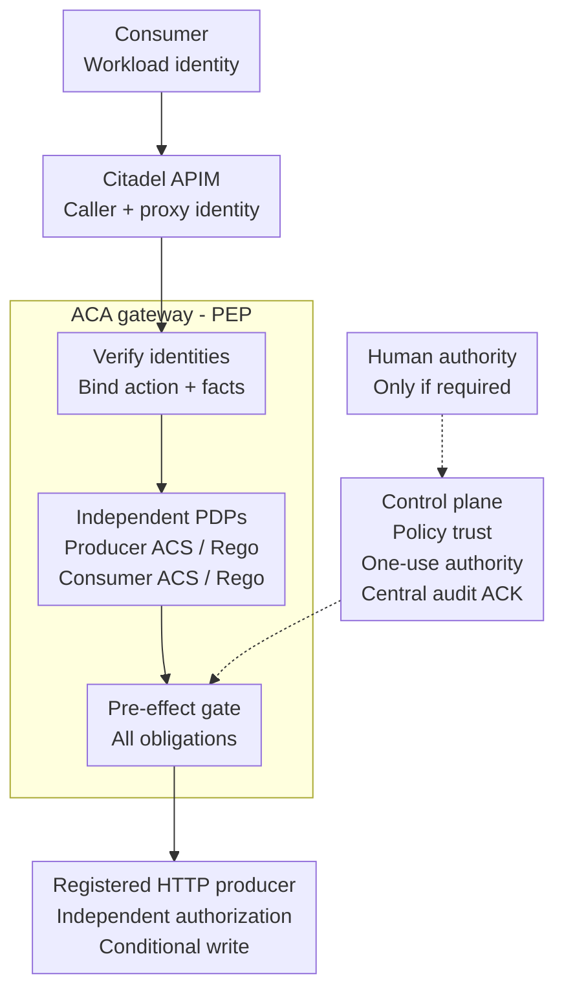
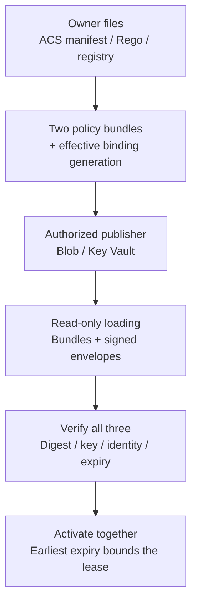

# Citadel action governance: local execution profile

**Working draft for engineers integrating a selected business action with Citadel.**
APIM authenticates and routes the call; a separate execution gateway checks both
owners' policies and required authority before calling the business service.
The business service still authorizes and commits its own operation.

## What exists today

The opt-in `threadlight-citadel-binding/v1` profile has buildable gateway source,
an executable bundle example and an APIM overlay. It covers **one tenant, one
producer, one consumer, one registered operation** and one exact
deployment/image/version binding, not a replacement Citadel hub or whole-agent governance.

The [S7 execution record](governed-returns-validation.md#s7-citadel-public-route-and-isolated-producer-ack-loss)
records public MCP/REST routing and a separate job-only producer ACK-loss test.
Its **September 25 continuation closes genuine requesting-user confirmation for
that exact binding**: browser authentication, native email approval, exact-operation
resume and unchanged replay. The earlier expired attempt remains in the record.
This is dated proof, not certification of a new deployment; release and acceptance
limits are [listed below](#update-rollback-and-the-external-gate).

## What you build and run

| Artifact | Purpose and boundary |
|---|---|
| [Gateway Dockerfile](https://github.com/aiappsgbb/threadlight-skills/blob/main/skills/threadlight-govern/references/gateway/Dockerfile) and [runtime package](https://github.com/aiappsgbb/threadlight-skills/blob/main/skills/threadlight-govern/references/gateway/README.md) | Build the portable execution image from the repository root. A tested private ACR image exists in S7; this is not a generic public signed release. |
| [Executable example](https://github.com/aiappsgbb/threadlight-skills/blob/main/examples/citadel-governance/README.md), [build.py](https://github.com/aiappsgbb/threadlight-skills/blob/main/examples/citadel-governance/build.py) and [composer](https://github.com/aiappsgbb/threadlight-skills/blob/main/skills/threadlight-govern/references/gateway/citadel_package.py) | Produce two owner bundles plus the effective binding generation. Synthetic inputs are not deployment credentials; the composer signs nothing. |
| Generated APIM overlay | Publish/access policy XML and native API properties for the existing Citadel hub. The hub owner reviews and applies them; no forked hub infrastructure. |
| Separate [control plane](https://github.com/aiappsgbb/threadlight-skills/blob/main/skills/threadlight-govern/references/control-plane/README.md), stores and identities | Cosmos holds durable operation/authority/audit state; Blob and Key Vault support signed publication. Publisher, runtime reader, proxy and backend identities have distinct permissions. |

**The container is not self-contained.** It needs those external services,
read-only policy/configuration mounts and an independently authorizing registered
HTTP producer. It does not wrap an arbitrary remote MCP producer.

[Action flow](#adr-position-of-authority-and-ownership) |
[Policy lifecycle](#policy-lifecycle) |
[Contracts](#contracts-and-canonical-joins) |
[Identity and protocols](#identity-endpoints-and-protocols) |
[Build and ownership](#build-activate-and-integrate) |
[Updates and limits](#update-rollback-and-the-external-gate)

## ADR: position of authority and ownership

The **Policy Decision Point (PDP)** evaluates the rules: here, two independent
native Agent Control Specification (ACS)/Rego engines. The **Policy Enforcement
Point (PEP)** allows or blocks execution: here, the ACA gateway dispatcher.
APIM is the front door, not a holder of a reusable `allow=true` ticket.

Editable Mermaid source: action path

<!-- diagram: citadel-action-path -->

Solid arrows are the request/decision path; dashed arrows are **required support,
not a business-execution bypass**. All selected authority and central audit ACK
must be present before the producer call.
[Open the action diagram at full size](assets/governance/citadel-action-path.svg).

### One request, step by step

1. **Identify the caller.** APIM validates the consumer's workload token and adds
   its own managed-identity credential. The gateway verifies both independently;
   APIM's identity is not the consumer's identity.
2. **Evaluate both policies.** Each owner's engine receives the same canonical
   action and trusted facts. **Deny overrides**: either deny stops the write.
   Allow still requires every selected obligation.
3. **Defer human decisions when required.** Return `pending_confirmation` or
   `pending_approval` promptly; no HTTP request stays open awaiting a person.
   Resume the **original operation** with authenticated one-use authority, not
   a new proposal. Requester context identifies the user; it is **not consent**.
4. **Authorize immediately before the effect.** Obtain central audit ACK and
   recheck policy, identities, facts and required authority after credential and
   transport waits. Missing or expired prerequisites stop dispatch.
5. **Commit once, or reconcile.** The producer independently authorizes, checks
   the current business revision and binds idempotency to the action. For a
   return, the effect is a **decision/audit, not settlement**. A lost ACK is an
   unknown outcome: never blindly retry or reopen; use the authenticated outcome
   GET. Read-only reconciliation does not promote a pending operation to completed.

## Policy lifecycle

Policy authoring is separate from serving requests. **Two owners write rules;
one effective binding pins their exact combination.** The composer produces a
third immutable generation referencing both owner bundles, not a merged policy
that can discard one owner's obligations.

Editable Mermaid source: policy lifecycle

<!-- diagram: citadel-policy-lifecycle -->

[Open the policy diagram at full size](assets/governance/citadel-policy-lifecycle.svg).

| Stage | What must hold |
|---|---|
| Author and compose | Each owner keeps its native manifest, Rego and action registry. The binding pins policy IDs, versions, digests, signing keys and exact deployment. |
| Publish | A separately authorized publisher signs all three envelopes through Blob/Key Vault. Runtime read/verify permissions do not grant publish/sign permissions. |
| Load and activate | Verify every envelope and bundle before **atomic activation**; the effective lease ends at the earliest expiry. The initial profile uses the same pinned signing key authority for all three. |
| Change or recover | Create a fresh complete generation for policy or signing-key/lease rotation. No hot refresh, immediate revocation or last-known-good use past the valid lease. |

App Configuration is an **optional version mapping**, not an implemented publisher
or a required policy source. It supplies neither executable file/code adapters nor
signing authority. [Build steps](#build-activate-and-integrate) describe the actual inputs.

## Contracts and canonical joins

**Both owners constrain the same action.** Deny overrides; confirmation,
independent review and signed evidence are distinct AND obligations. No dynamic
transformations or post-output policies are supported in this profile.

Binding fields, obligation composition and unsupported combinations

`Producer`, `Consumer` and `Binding` are strict versioned wire models reusing
the control plane's canonical serializer, GUID/digest/key types and gateway
`Action`, bounded JSON schemas and `Deployment`. Unknown or missing fields,
cross-tenant references, different targets/schemas, extra workloads or selected
unsupported protocols are errors, not disabled governance.

The producer contract contains its independent policy selector, action and
`effect_protocol: registered-http-v1`. The consumer references the exact producer
ID/version and its own policy; principal/client/audience are explicit. The
effective generation signs both contract digests and both policy digests, and
preserves subscription, resource group, environment, agent version and image.
These values are included in request facts, action hashes, user-confirmation
and reviewer intents, terminal wire checks and audit's effective policy digest.
`X-Citadel-Binding`, `X-Citadel-Producer-Policy` and `X-Citadel-Consumer-Policy`
are protected outbound provenance, never incoming identity.

Each independent native engine receives a deep copy of the **same canonical
action and trusted facts**. Deny overrides. Transformations and post-output
policies are explicitly unsupported in this first profile. Escalation without
an authority declared by that owner fails closed. Confirmation, independent
review and signed business evidence remain distinct AND obligations. When an
owner escalates, the effective requirements can conservatively require the
other owner's selected conditional authority too; this never removes one.

Two independent reviews cannot be expressed by the current one-reviewer
authority protocol: selecting reviewer roles on both sides is rejected, even
if their role names match. A role list means one reviewer may hold any allowed
role, not two required reviewers. Conflicting confirmation/evidence profiles are
also rejected. One side's review plus the other's confirmation is representable
and retains Wave1 one-use/separation rules. Inline human waits are unsupported.

### Trusted facts and producer effects

`host-identity-v1` provides only authenticated identity, scope and deployment.
It does not invent order eligibility, evidence authenticity, balances or business
revisions. Signed evidence uses the existing selected provider protocol. A
business requiring additional mutable facts needs a reviewed adapter and
revision control at the producer; do not encode model booleans as host facts.

`registered-http-v1` is the existing fixed HTTPS POST operation / GET outcome
protocol. The producer receives a **distinct** downstream MI credential, never
the consumer or APIM bearer. It must independently validate issuer, tenant,
audience, allowed PEP principal/client, action/schema and generation provenance,
enforce business permissions and atomically bind the idempotency key to action
hash and effect, using conditional revision checks (CAS). The response is exactly
`{receipt_id, result}`. The GET
reconciliation route must return the same immutable outcome for that key.
The existing returns producer writes a decision/audit, not payment settlement.
Its historical receipts are not Citadel evidence.
The [executable synthetic example](https://github.com/aiappsgbb/threadlight-skills/blob/main/examples/citadel-governance/README.md)
builds all three bundles and reuses that producer with `citadel_binding`;
the backend independently reconstructs the same effective request facts.

## Identity, endpoints and protocols

The original caller is initially **Entra v2 app-only** with `Governance.Workload`,
exact issuer/tenant/audience and principal/client allowlist, no delegated `scp`.
Configure the actual GUID audience admitted by the token verifier, not an assumed
application URI.
The original user, when needed, remains the Wave1 authenticated context registered
by the application; a workload token is never a human identity.

Dual JWT verification, protected headers and exact Host/Origin

The consumer sends its ordinary Authorization header to public APIM. The overlay
rejects caller-supplied `x-threadlight-consumer-authorization` and spoofed
attribution/provenance headers, captures the original token, keeps Citadel
`security-handler` and `mcp-usage`, validates the caller JWT, then authenticates
APIM's selected MI to the **different** PEP audience. The PEP independently
verifies both JWTs using the existing `EntraAuth`; neither a subscription key,
product name nor APIM's MI identifies the original consumer. Both token expiries
bound final effects after credential and transport waits.
The generated product sets the pinned fragment's `jwtAudience`, `jwtIssuer`,
`jwtOpenIdConfigUrl` and `requiredRoles` overrides, rather than accidentally
requiring the hub's unrelated default audience.

The signed `public_url` is the APIM route; `gateway_url` is the exact internal
ACA HTTPS route. The overlay sets internal Host/Origin and preserves the business
body, reserved metadata and Idempotency-Key. A browser Origin, if sent, must
equal the signed public origin before rewriting. ACA still verifies exact
internal Host/Origin; direct callers without both admitted identities fail.
No discovery-driven OAuth flow is advertised: provision the explicit consumer
audience/client and token out of band; this is not OBO, arbitrary OAuth discovery
or an EasyAuth-header trust profile.

| Path | Initial support |
|---|---|
| `mcp-existing` | Remote FastMCP Streamable HTTP initialize/list/call, protocol `2025-06-18`; APIM uses the path as-is, **no appended `/mcp`** |
| REST `/operations/{registered-name}` | Same authenticated dispatcher, `POST {"arguments": {...}, "_meta": {...}}`; requires original operation Idempotency-Key |
| Producer transport | Registered HTTP JSON operation/outcome only; no arbitrary URL, shell or MCP executor |
| MCP streams | Current PEP returns finite JSON results; overlay does not buffer SSE or inspect response bodies; no long-lived human-wait stream |
| Resources, prompts, A2A, MCP workspaces | Unsupported, not inherited from a producer |
| API-to-MCP (`mcp-from-api`) | Not enabled by this overlay; requires a separate verified source-API auth/key-forwarding contract and direct-source bypass test |

The MCP result has existing explicit `completed`, `blocked`, `unavailable`,
`pending_approval` or `pending_confirmation` state. REST maps those to
200/403/503/202, with unknown outcomes and conflicting operation reuse as 409.
Pending returns promptly with the exact original operation reference; no HTTP
request remains open awaiting a person. Resume that operation, not a new one.
An ambiguous send or lost ACK never automatically retries an effect. Completed
outcomes do not consume user/reviewer authority again; expiry of that authority
does not undo a durable effect. Fresh policy/authentication remain required for
retrieval. Reconciliation requires producer evidence, not a locally assumed success.

## Build, activate and integrate

### Ownership

Threadlight owns `references/gateway/citadel.py`, `citadel_package.py`, tests,
the portable service image and this runbook. The Citadel maintainer owns hub
infrastructure, fragments and approval of the overlay. Application owners own
producer authorization, action schema, trusted business facts and reconciliation.
SAFE is a method, AGT the toolkit, and Agent Hooks the interceptor contract.
No upstream Bicep is forked or vendored. Public upstream evidence is frozen at
`Azure-Samples/ai-hub-gateway-solution-accelerator`,
`23fbc8fe7f2f068de3ed3c80da2344760faac1e6` on `citadel-v1`. The installed
`citadel-hub-deploy` skill's older pin remains historical and unchanged.

### Build and integration reference

Use the native-pinned Linux amd64 environment from
[run-governance-pin-tests.py](https://github.com/aiappsgbb/threadlight-skills/blob/main/scripts/ci/run-governance-pin-tests.py);
ordinary native skips do not count.
The repository example and tests use synthetic identifiers, never deployment
credentials or existing S2/S3 resources.

Six integration steps: bundles, signed activation and APIM publication

1. Build producer and consumer bundles independently with the existing
   `build_bundle`. Each includes its owner's `gateway-registry.json` and native
   `manifest.yaml`/Rego. Policy bindings/action shape and the full deployment
   must match; only supported obligations can differ.
2. Populate a `Binding` with their exact metadata policy IDs, versions, content
   digests and versioned Key Vault key IDs. Run `threadlight-citadel-package`
   with `--binding`, `--producer`, `--consumer`, `--destination`, `--policy-id`,
   `--version`, `--asset-id`. It verifies both owner inventories and builds a
   third immutable generation; stdout contains unsigned digest and policy XML.
   It performs no Azure operations and signs nothing.
   Exported policy XML uses APIM **`rawxml`** expression syntax for the upstream
   `policyXml` hook. The Python `policies()` helper returns ordinary encoded XML:
   use APIM `format: xml` for that representation, or `raw_policy_xml()` for a
   rawxml hook. Passing encoded C# quotes/operators to rawxml can fail compilation;
   do not fix that by deleting authentication or request-binding expressions.
3. Have the separate authorized publisher publish **all three** envelopes
   through the existing Blob/Key Vault control-plane mechanism. Runtime readers
   have verify/read permissions, not publishing/signing authority. Mount all
   three immutable directories read-only. Supply ordinary `Configuration` with
   `bundle_path`, `policy_id`, `policy_version`, `policy_digest` selecting the
   generation, plus `citadel: {producer_path, consumer_path}`. Null, partial or
   one-sided Citadel selection fails. The initial profile uses the same pinned
   signing key authority for all three; independently administered key rotation
   requires a newly reviewed complete generation.
4. Runtime authenticates/retrieves all envelopes and verifies digest, key, native
   manifest, owner registry, identity and expiry **before atomic activation**.
   Effective lease is the earliest of all three. No hot refresh or immediate
   revocation is claimed. App Configuration, if used, selects immutable versions;
   it does not supply executable adapters or signing authority. No last-known-good
   generation survives its valid lease.
5. The Citadel owner supplies generated publish XML via the existing asset
   `policyXml` input and access XML via a dedicated TOOL product. Unknown APIs
   fail instead of falling through the mixed product's LLM default. The sample
   retains upstream's 60 calls/minute and 10,000 calls/month; these are example
   quotas, not agreed performance/cost limits. Existing nonempty custom XML is
   rejected for manual composition rather than overwritten. No selection
   preserves the original policy inputs byte-for-byte.
   For direct publication, the package emits the observed native API property
   shape and `apim_api_version: 2025-09-01-preview`. Use `mcpProperties` (not the
   older pinned module's ignored `mcpPropperties`) and the endpoint dictionary
   `{"message":{"uriTemplate":"/"}}`. The API/backend service URL is the **origin**;
   the policy owns the exact internal `/mcp` path. A backend URL already ending
   in `/mcp` combined with that rewrite can produce `/mcp/mcp` and a backend 404.
   Read actual deployed properties; source/template acceptance alone is not a
   working MCP route. This is a local overlay, not an upstream module update.
6. Verify inherited policies do not transform effects after the PEP decision,
   read `context.Response.Body` or enable MCP response-body logging (global
   diagnostic bytes must be zero). The overlay retains baseline auth, usage,
   alerts and product quotas, and explicitly owns the single non-retrying
   backend forward with `buffer-response=false`.

Build the existing gateway Dockerfile from the repository root. Its dependency
pins come from `skills/_shared/governance-upstream-pin.json` and service manifests;
do not upgrade ACS/AGT to avoid an advisory. The runtime is UID/GID 10001, has no
embedded configuration/keys and uses Cosmos external durable state. Run with
read-only root and a bounded `/app/scratch` tmpfs; policy/config are read-only
mounts. Native loader scratch is not an operation store. `/health` checks real
policy, dual auth, Cosmos, receipt and selected authority dependencies per binding.

For release, use existing container tooling to retain immutable image digest,
SBOM, provenance, scan output and licenses. A local Docker `--load` is not a
registry signature or guaranteed attestation retention. Base-image review,
registry publishing/signing, vulnerability disposition, production network/IAM,
multi-replica and latency/load validation remain separately owned gates, **not
certification**.

## Update, rollback and the external gate

### Updating a running binding

Rebuild owner policy changes and assemble a new signed generation. Do not edit
mounted files, reuse policy ID/version for different bytes or mix generations
between replicas. Deploy an immutable image/config revision, check readiness
then route traffic explicitly; pending operations from an older generation are
not migrated or silently rebound. Retain their exact operation IDs and
reconciliation custody. Roll back only to a still-valid, explicitly authorized
complete generation and matching image/config; expired leases cannot be extended
by rollback. Drain/reconcile uncertain operations before removing a revision.

### What the dated evidence does not release

S7 records runtime `d8f97cc`, publication fix `d45806c` and human proof `c538f4c`.
These are dated references, not proof for a new image or deployment. The run is
not model-driven; it does not establish MFA, SLOs or full certification.
The preexisting **cryptography HIGH advisory** remains open; image scan,
registry signing and vulnerability disposition are still explicit release gates,
not fixes delivered by this guide.

For each new **W2-I** acceptance gate, agree hub/target/profile, producer operation, permitted mutations,
budget and p95/p99/throughput bounds. Collect fresh original-caller/proxy/backend
identity and signed-generation evidence for allow, both denies, exact human
resume, audit outage, wrong audience/spoof/direct ACA calls, lost ACK and replay.
No local/noop test substitutes for business-write proof. Maintainer review,
merge, registry publication, Pages and live acceptance are distinct gates.
Wave1 email is not MFA; its same-operation proof does not become same-session
effect or live Conditional Access proof here.
