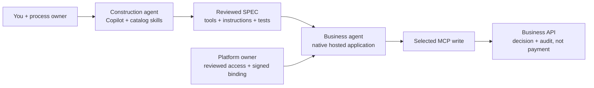
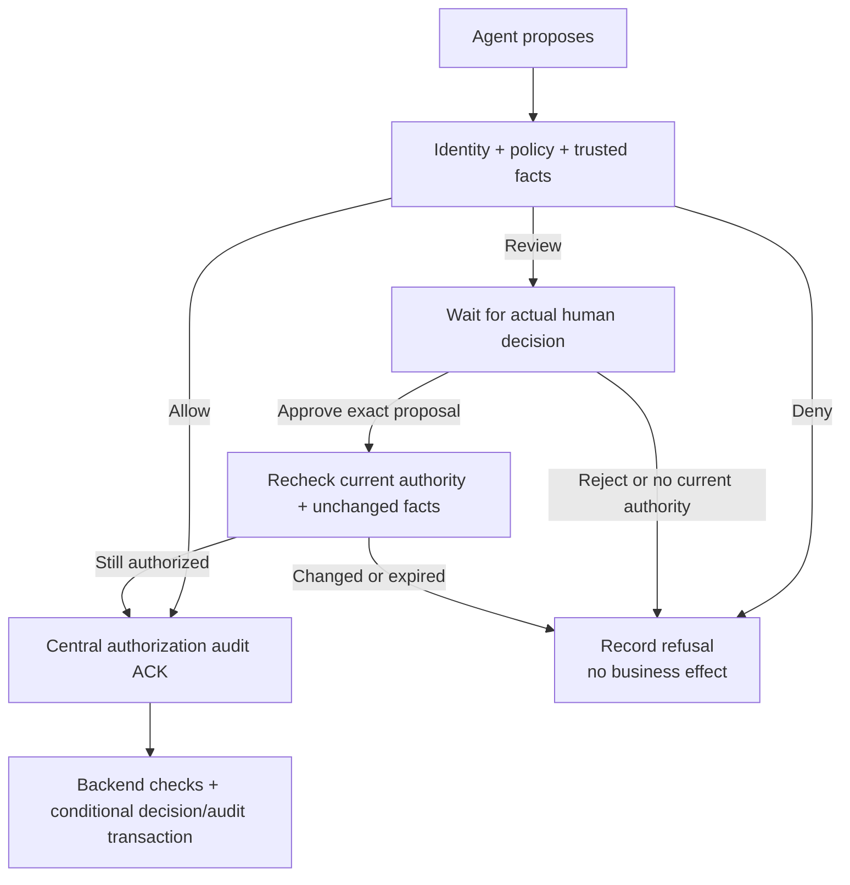
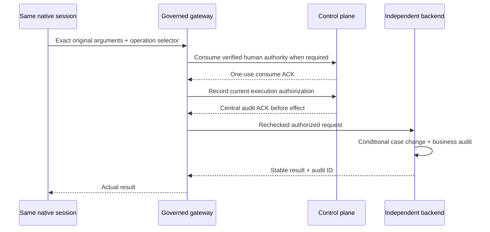

# Your first governed workflow: workbook

Build a returns assistant that can read a case, record an allowed recommendation,
and ask a real person in Outlook before recording a supervisor handoff.
The useful outcome is **a business decision with a traceable authorization and
audit**, not payment settlement.

Watch the [three decision paths](agent-governance.html#workflow-in-action), then
work through these exercise cards. Fill inputs, ask Copilot, inspect an artifact,
and check the result yourself. Open the L500 runbooks only at their handoff.

## Start here

1. [Describe the decision](#phase-1-describe-the-decision-you-want-to-improve) - agree on three synthetic cases and review the SPEC.
2. [Prepare the handoff](#phase-2-prepare-the-people-inputs-and-access-handoff) - separate your inputs from platform prerequisites.
3. [Rehearse locally](#phase-3-rehearse-locally-without-calling-it-azure-proof) - inspect/package the source and run fixture checks.
4. [Review, then authorize deployment](#phase-4-opt-in-to-governance-and-review-the-hosted-setup) - opt in, obtain platform review, then approve the exact run.
5. [Demonstrate the decision](#phase-5-demonstrate-allow-deny-and-a-real-human-decision) - observe allow/deny, real Outlook review, resume and audit.
6. [Hand off release and operations](#phase-6-hand-off-a-controlled-release-and-safe-operations) - use the existing release profile and preserve evidence.

**Need now:** Copilot with repository/shell access, a separate pilot repository,
a reviewed complete catalog ([installation](../README.md#install)), a process
owner and synthetic examples. **Need later:** a platform owner, approved Azure
target/model/access/budget, signing authority and an available Outlook reviewer.

**Phases 1-3 can be completed without Azure** using offline checks; model
rehearsal is optional and separately budgeted. Phase 4 preparation can also
remain local, but Phase 5 cannot start until its deployment handoff is complete.
Do not generate the pilot inside this catalog.

**Worksheet convention:** use nonsecret aliases and descriptions in the tables,
not customer data or credentials. Keep exact deployment identifiers and signed
configuration in the operator's protected files. Shell examples use your
locally set variables; do not run with unset variables or literal placeholders.

| Local variable | Set it to |
|---|---|
| `CATALOG` | Absolute path to the complete reviewed catalog, not an installed single script |
| `PROJECT` | Absolute path to your separate pilot repository |
| Other variables | The reviewed paths named in the exercise; never a credential or token |

## One example, one supported profile

Use **MAF / Foundry hosted / Responses + governed MCP + Cosmos
decision/audit + native Outlook approval**. In the foundation, that means
`microsoft-agent-framework`, `runtime_shape=agent`, `responses`, and
`governed-tool-gateway`. This business journey is **not a deterministic MAF workflow**:
use the supplied agent host's same-session review seam, not arbitrary workflow
pause/resume. See [runtime support](runtime-support.md).

The [two-tool reference](../skills/threadlight-deploy/references/governance/returns-mcp-demo.md)
exposes only:

| Tool | What it does | Boundary |
|---|---|---|
| `returns_get_case` | Reads an authorized synthetic case and its current revision | Unbound to ACS; backend authentication and data access still apply |
| `returns_apply_decision` | Records a recommendation or supervisor handoff with a Cosmos decision/audit transaction | Selected gateway authorization before the independent business API writes |

`approve_refund` does not send money. The richer
[canonical returns example](../examples/returns-triage-governed/README.md)
needs additional OMS/CRM data, policy evidence and tools; it is not this
two-tool application.

**Two agents:** Copilot, the **construction agent**, uses catalog skills to
build the **business agent**: its own instructions, tools and runtime.
Installing a construction skill does not give that application permissions or
tools. This reference supplies executable tools and instructions; added domain
skills must actually be loaded by the host. See
[the two libraries](skill-based-agents.md#two-agents-and-two-libraries) for details.



**How to use the prompts:** these are instruction examples, not guaranteed
automation or slash commands. Use one reviewed catalog revision consistently.
Copilot usage/billing still applies to offline project work.

> **Rules for every phase**
>
> - Preparation is not permission. The platform owner authorizes scoped cloud
>   changes; the actual mailbox user owns OAuth consent and the reviewer owns
>   each action decision. Never paste keys, tokens, callback URLs or caches.
> - The publisher and private key remain outside the agent. Selected writes
>   require fresh signed policy, trusted facts, policy-required one-use approval
>   and central audit ACK **before effects**; recheck authorization after waits.
>   See [the L500 control contract](agent-operations.md#required-controls-precede-effects).
> - Offline inventory, executed LOCAL-14/native tests and live evidence are
>   distinct. No borrowed evidence: every deployment attempt needs fresh
>   after-deployment proof for its envelope, policy, key, environment,
>   image/version and identities. A noop is not business-write proof.
> - Missing prerequisites, expired authority or uncertain effects mean stop,
>   not fake success, automatic renewal or blind retry. Keep original records.

## Phase 1: Describe the decision you want to improve

**Cost and safety:** local authoring only; no Azure or business-system calls.
Use synthetic cases, not customer records.

**Goal:** agree on a small, useful business outcome before generating a host.

**Skills:** [threadlight-design](../skills/threadlight-design/SKILL.md), Full mode
with the reviewed SPEC checkpoint.

**Inputs:** a process owner and three synthetic cases: eligible, ineligible,
and supervisor-only. Use the reference's reviewed sample rules; do not invent a
business threshold or silently extend the example into settlement.

| Fill in locally | Your value |
|---|---|
| Process owner / reviewer role | ___ |
| Ordinary / invalid / supervisor case aliases | ___ / ___ / ___ |
| Useful outcome and how you will measure it | ___ |

**Copilot prompt:**

```text
Use threadlight-design in Full mode for the two-tool returns MCP reference:
returns_get_case and returns_apply_decision. Record recommendations and
supervisor handoffs, never payments. With synthetic cases, capture the owner's
rules, reviewer, success measure and unresolved prerequisites.
Select microsoft-agent-framework, runtime_shape=agent, protocol=responses,
Foundry hosted and governed-tool-gateway; resolve actual capability signals
through the runtime policy, not a forced override. Stop at the SPEC checkpoint.
No Azure discovery, business-system calls, deployment or presentation work.
```

| Who | Next action |
|---|---|
| **Assistant:** | Record the foundation, SPEC, read/write boundaries and unresolved decisions |
| **Human:** | Review the synthetic rules and measurable outcome before continuing |
| **Platform owner:** | Identify the later model/environment/identity owner; no changes yet |

**Result:** `specs/foundation.md`, `specs/SPEC.md` and `specs/manifest.json`
at the Phase A checkpoint. SPEC section 8 names actions; section 14 records
value baseline, target, owner, timeframe and measurement source.

**Verify:**
- [ ] The owner can explain the three expected outcomes without mentioning a payment.
- [ ] The foundation matches the [runtime policy](../skills/threadlight-design/references/runtime-policy.json); unresolved capabilities are not silently false.

**Command:** none creates an approved SPEC for you. Use the prompt and human
checkpoint, then inspect the generated files rather than inventing a Design CLI.

**If blocked:** a different runtime or real payment is outside this profile; revisit
[Foundation](../skills/threadlight-design/SKILL.md#step-0-foundation-from-scratch-path-only).

## Phase 2: Prepare the people, inputs and access handoff

**Cost and safety:** offline preparation, not Azure discovery or sign-in.

**Goal:** know what you can do locally and what must come from a platform owner.

**Skills:** [threadlight-design](../skills/threadlight-design/SKILL.md) for the
approved continuation; the companion
[azure-tenant-isolation](https://github.com/aiappsgbb/awesome-gbb/blob/2ef44f6b47803a0166956cc668e5f429c1c1f8cb/skills/azure-tenant-isolation/SKILL.md)
contract for later Azure access.

**Inputs:** approved SPEC and these handoffs; reuse approved resources, not replacements.

| Fill in locally | Your value |
|---|---|
| Reviewed SPEC revision | ___ |
| Tenant/index alias and intended environment alias | ___ |
| Platform, publisher and evidence owners | ___ |
| Missing prerequisite and its owner | ___ |

| Needed when | Minimum handoff |
|---|---|
| Local construction | Git and isolated Python 3.12+; native packaging uses Linux amd64 or the documented container route. A thin Codespace is not an Azure deployment workstation. |
| Model rehearsal | One approved model deployment and authorized inference access, plus a small call budget; otherwise remain offline |
| Hosted preparation | Foundry project, model, registry/project connection and operator workstation or runner with the required reachability, approved Azure CLI/azd versions and deployment authority |
| Governance services | Separate control-plane, gateway and business API services; versioned Key Vault signing key, signed-policy Blob storage, single-write-region Cosmos, scoped identities and service app roles |
| Human review | Existing authorized Office 365 connection, real available reviewer, approved responder-to-role mapping and an owner for the Logic App and its sensitive run history |
| Evidence and operations | Independent observer access, approved retention location, budget, recovery owner and explicit resource-preservation/cleanup scope |

**Copilot prompt:**

```text
Use threadlight-design to continue the approved SPEC into two-tool instructions,
synthetic inputs and tests. Reuse the reference: no OMS/CRM, extra UI or tools.
Read azure-tenant-isolation for the selected personal tenant index and paired
az/azd contexts. List missing platform prerequisites and what I can do locally.
Do not access token caches, sign in, grant/consent/provision or select a default
subscription for me.
```

| Who | Next action |
|---|---|
| **Assistant:** | Prepare instructions/tests and record missing prerequisites in the existing SPEC |
| **Human:** | Identify the intended tenant/index entry, subscription and reviewer |
| **Platform owner:** | Choose the networking posture and supply the scoped access handoff |

Prefer an approved existing `private-required` environment with a reachable
operator host. Private hosted networking is a first-account-creation contract;
a laptop outside the VNet may not reach it. `public-authenticated-proof` is an
explicit nonproduction exception, not a default or private-network workaround.
Do not copy policy-exemption tags or broaden access. Private business services
do not make the Outlook companion's Entra-authenticated trigger private.

**Result:** reviewed implementation inputs and named owners for missing
prerequisites, not new resources or consents.

**Command - offline skill-contract inspection:** after the project files exist,
run the [actual validator](../skills/threadlight-design/scripts/skill_contract_check.py).
It checks any generated domain skills and registration, not tool execution.
The small reference's instructions alone are not proof that domain skills exist.

<!-- workbook-command: skill-check -->
```sh
: "${CATALOG:?Set CATALOG}" "${PROJECT:?Set PROJECT}"
python3 "$CATALOG/skills/threadlight-design/scripts/skill_contract_check.py" \
  --target "$PROJECT" --emit --gate --json
```

**Artifact / oracle:** inspect `specs/skill-contract-manifest.json` against
`AGENTS.md` and the actual skill/tool files. Exit `2` means `must_fix`;
`not-verified` can still accompany exit `0`, so read the findings.
See [validator exits](skill-based-agents.md#schema-and-exit-meaning).

**Verify:** before every Azure operation, the operator derives both
`AZURE_CONFIG_DIR` and `AZD_CONFIG_DIR` from the **personal tenant index**,
checks the selected tenant and `allowed_subscriptions`, and asserts the exact
intended subscription immediately before acting, with the matching isolated azd
environment. A default hint is not an explicit selection; one CLI login does not
authenticate the other. Never copy caches or change a global context. Retain
identifiers in protected operator configuration.

- [ ] The manifest findings agree with the actual files; missing skills are not a pass.
- [ ] The platform owner has confirmed the intended isolated context and outstanding handoffs.

**If blocked:** missing connection, route, reviewer or publisher means stay local.
Use
[existing isolated dependency requirements](../skills/threadlight-deploy/references/governance/returns-mcp-demo.md#supply-existing-isolated-azure-dependencies)
for the handoff; do not ask for broad Owner/Contributor grants.

## Phase 3: Rehearse locally without calling it Azure proof

**Cost and safety:** packaging and fixture checks are offline: no model call
or Azure effect. Optional model rehearsal needs an approved endpoint/budget;
downloads/builds need the approved local toolchain.

**Goal:** make the example understandable and catch contract mistakes cheaply.

**Skills:** [threadlight-local-test](../skills/threadlight-local-test/SKILL.md)
for local rehearsal; [threadlight-deploy](../skills/threadlight-deploy/SKILL.md)
only for its offline source packager at this phase.

**Inputs:** reviewed synthetic cases, unused output directory, instructions
and installed test dependencies.

| Fill in locally | Your value |
|---|---|
| `PACKAGE_OUTPUT`: absolute, unused output directory | ___ |
| Local Python environment / reviewed catalog revision | ___ |
| Optional model rehearsal endpoint alias and budget | ___ / not requested |

**Copilot prompt:**

```text
Use threadlight-deploy's offline packager only:
skills/threadlight-deploy/references/governance/package_returns_mcp.py.
Confirm an unused destination; do not overwrite. Use threadlight-local-test
for offline synthetic instruction/schema/tool checks first. Model rehearsal
needs my endpoint/budget approval. Label quickstart CRUD stubs separately
from the real gateway, and report executed versus simulated/unverified results.
No deployment, Cosmos seeding or fabricated signatures/approvals.
```

| Who | Next action |
|---|---|
| **Assistant:** | Package sources; use the [backend contract tests](../skills/threadlight-deploy/tests/test_returns_mcp_backend.py) for allowed decisions, ETag checks, rejected model authority and conditional case/audit writes. Use documented dependencies, not replacement SDKs. |
| **Human:** | Review the three synthetic outcomes; separately approve any model rehearsal |
| **Platform owner:** | Supply inference access only if requested; offline checks need no new Azure services |

**Command - package real sources, without Azure:**

<!-- workbook-command: package -->
```sh
: "${CATALOG:?Set CATALOG}" "${PACKAGE_OUTPUT:?Choose an unused PACKAGE_OUTPUT}"
python3 "$CATALOG/skills/threadlight-deploy/references/governance/package_returns_mcp.py" \
  --output "$PACKAGE_OUTPUT"
```

**Result:** an unused-directory source package with `source-package.json`,
status `source-only-not-deployment-proof`, plus the actual local test results.
The packager supplies no deployment configuration or automatic seed/reset.
Its VM-first entrypoint is not the native hosted host used in Phase 4.

**Verify:** inspect file hashes, check output, loaded instructions/tools and
skill-loading warnings. A quickstart is not the governed gateway or hosted
route: CRUD tools mutate memory. Git-ignore and retain any
`tests/quickstart.jsonl` under the agreed privacy rules; it contains raw
queries/responses, not governance receipts.

- [ ] `source-package.json` has the source-only status, not a deployment verdict.
- [ ] Recomputed SHA-256 values for packaged files match its `files` map and the reviewed sources.
- [ ] Local case/ETag tests reject model-supplied authority; mocked results remain labelled local.

**If blocked:** missing packages or failed skill loading mean stop. Follow
[materialization commands](../skills/threadlight-deploy/references/governance/returns-mcp-demo.md#materialize-the-executable-sources)
and [local loading limits](skill-based-agents.md#local-quickstart-is-a-different-test-surface).
The executable source is [package_returns_mcp.py](../skills/threadlight-deploy/references/governance/package_returns_mcp.py).

## Phase 4: Opt in to governance and review the hosted setup

**Cost and safety:** preparation/local tests first; separately authorized,
billable deployment follows the review. The first prompt does not authorize it.

**Goal:** connect the selected write to real authorization and a reviewed
native host, without giving the agent direct effect or signing authority.

**Skills:** [threadlight-govern](../skills/threadlight-govern/SKILL.md),
[threadlight-governed-actions](../skills/threadlight-governed-actions/SKILL.md)
and [threadlight-deploy](../skills/threadlight-deploy/SKILL.md). For the native
host baseline, use the companion
[foundry-hosted-agents](https://github.com/aiappsgbb/awesome-gbb/blob/2ef44f6b47803a0166956cc668e5f429c1c1f8cb/skills/foundry-hosted-agents/SKILL.md)
revision identified by the two-tool runbook, not an independently upgraded SDK.

**Inputs:** explicit selected-governance consent, `specs/governance-contract.json`,
approved policy rules and the real operator-supplied inputs from Phase 2.

| Fill in locally | Your value |
|---|---|
| `GOVERNANCE_CONTRACT`: reviewed project contract file | ___ |
| `INFRA_CONFIG`: protected, reviewed foundation configuration file | ___ |
| Native host + separate services change-list revision | ___ |
| Exact role / resource scope / expected identity approvals | Protected handoff reference: ___ |
| Publisher, personal consent and reviewer availability | Owners / outstanding decisions: ___ |

**Copilot prompt:**

```text
I select governed-tool-gateway for returns_apply_decision; leave
returns_get_case unbound to ACS. Use threadlight-govern,
threadlight-governed-actions and threadlight-deploy for the two-tool policy,
host, services and local validation; foundry-hosted-agents supplies the
documented MAF baseline. Select deferred, policy-required native Outlook review.
Present the deployment scope, cost and operator/human handoffs. Stop for
missing publisher, observed binding, permission or consent. Do not deploy,
grant roles, sign policy or enable/send email yet.
```

**Assistant:** uses the [existing generator](../skills/threadlight-deploy/references/governance/README.md#order-and-required-inputs)
and [MAF gateway host](../skills/threadlight-deploy/references/governance/maf-gateway-container.py),
not an assessment-only skeleton. Preserve unbound reads; invalid selected
configuration fails closed, not off. The gateway is the PEP, ACS/Rego its PDP;
Agent Hooks does not automatically add a security boundary to this path.

**Human:** reviews the scope before the authorization message below. Use the
user's approved work-browser/profile; **Edge Work** is only an optional example.
The actual human performs sign-in/consent for the named connection and later
Approve/Reject; neither is automated.

**Platform owner:** reviews [runtime pins](../skills/_shared/governance-upstream-pin.json)
and the native host/services. Build/register once. After registration, match the
observed Agent Identity to the reviewed workload/service and tenant before
applying its pre-approved MCP/control-plane app roles. Each assignment must
match the reviewed exact role, resource scope and expected identity;
workflow-scoped Reader goes only to the observed control-plane identity, not
the agent. Missing approval, identity mismatch or broader permissions means stop.
Then bind the observed version, image digest and identities, without redeploying
after signing to update them. No agent Cosmos-write/signing rights; service app
roles are not ARM role grants.

For Outlook, the operator uses the
[native approval template](../skills/threadlight-deploy/references/governance/review-approval.bicep),
which references an existing connection and defaults to Disabled. It does not
grant permissions or consent. Explicit enablement, observed workflow pin,
`outlook_approval`, gateway `approval_channel: "outlook"`, responder mapping and
workflow-scoped Reader for the control identity remain required. Reader exposes
sensitive run history; notification-only mail is not approval.

**Result:** generated host/service/infra files, `specs/governance-manifest.json`
inventory and actual local results, ready for platform review.

**Command - foundation generation only:** run once at the
[documented foundation stage](../skills/threadlight-deploy/references/governance/README.md#order-and-required-inputs),
not over an already generated or preserved deployment. The
[generator](../skills/threadlight-deploy/references/governance/generate.py) needs
real reviewed configuration; this command neither signs nor provisions anything.

<!-- workbook-command: foundation -->
```sh
: "${CATALOG:?Set CATALOG}" "${PROJECT:?Set PROJECT}" "${GOVERNANCE_CONTRACT:?Set GOVERNANCE_CONTRACT}" "${INFRA_CONFIG:?Set INFRA_CONFIG}"
python3 "$CATALOG/skills/threadlight-deploy/references/governance/generate.py" foundation \
  --project "$PROJECT" --contract "$GOVERNANCE_CONTRACT" --configuration "$INFRA_CONFIG"
```

**Artifact / oracle:** inspect the generated foundation sources and reported
JSON against the approved resource/change list. A generated file is not an
observed Azure resource. Policy publication, final host generation and binding
continue in the existing create-once runbook, not a second command pipeline here.

**Command - native catalog validation:** the
[pinned runner](../scripts/ci/run-governance-pin-tests.py) executes real published
native packages with Linux amd64/Docker and download prerequisites. It makes no
model call; it is catalog/local validation, **not your pilot acceptance**.
This is an operator exercise, not a requirement to rerun native CI for this workbook.

<!-- workbook-command: native-validation -->
```sh
: "${CATALOG:?Set CATALOG}"
python3 "$CATALOG/scripts/ci/run-governance-pin-tests.py" --deployment
```

**Verify:** use the [native validation gate](agent-operations.md#3-validate)
and current `threadlight-governance-manifest/v1`, not archived v2 green.
Skipped required tests stay unverified; preview/alpha pins require review.

- [ ] Generation matches the selected two tools and reviewed inputs.
- [ ] Actual local/native results are retained; source inspection or skipped tests are not executed proof.
- [ ] Platform review, publisher and human consent handoffs are resolved before the authorization below.

**If blocked:** retain ambiguous registration attempts and reconcile through the
[signed-bootstrap operator contract](../skills/threadlight-deploy/references/governance/README.md#signed-remote-bootstrap-operator-contract).
Do not create a second version. Missing Outlook authority stops at
[workflow prerequisites](native-outlook-approval-architecture.md#4-workflow-contract-and-permissions);
do not silently switch to delegated CLI approval.

### After platform review: authorize the exact deployment

After the operator confirms prerequisites, replace the placeholders with the
reviewed scope. This separate next message is not blanket authorization.
Follow the existing
[create-once sequence](../skills/threadlight-deploy/references/governance/README.md#signed-remote-bootstrap-operator-contract);
the assistant helps the authorized operator execute it, not invent access.

```text
I authorize threadlight-deploy to execute the reviewed deployment handoff
[handoff revision] for [tenant/index entry], [subscription], [resource group]
and [azd environment], using [model deployment] and [network posture].
Limit changes to [resource/change list: native host, control plane, gateway,
business API and explicitly approved Outlook companion changes].
Use the approved operator and publisher identities.
Permission handoff: [exact role, resource scope and expected identity per grant].
Apply only these approved assignments to actual observed identities after
registration. No unapproved grants; stop for missing approval, identity mismatch
or broader permissions. Personal OAuth consent is separate and not authorized here.
Deployment budget: [ceiling]; native model smoke budget: [calls/cost ceiling].
Cleanup owner: [owner]; preserve existing/shared/demo resources, retain
evidence, and request separate approval for exact test-owned cleanup.
Stop on missing prerequisites, scope drift or an ambiguous outcome.
Return the observed deployment and binding; do not start Phase 5 business
scenarios or send approval email under this deployment authorization.
```

**Before Phase 5**, require an actual native hosted response/session, ready
control/gateway/business services, verified Outlook companion configuration,
and a **fresh signed binding** matching the observed version, image and
identities. Keep the real observations and protected attempt record.
An image build, source package or health endpoint alone cannot satisfy this
handoff; if anything is missing, stay in Phase 4.

## Phase 5: Demonstrate allow, deny and a real human decision

**Cost and safety:** live model calls, synthetic Cosmos writes and approval
email. Approve the nonproduction scenarios/budget separately, with the reviewer
present; no automatic retries or unbounded prompt loops.

**Goal:** observe permitted, blocked and human-approved actions and replay.



**Skills:** [threadlight-governed-actions](../skills/threadlight-governed-actions/SKILL.md)
for selected-path evidence;
[threadlight-safe-check](../skills/threadlight-safe-check/SKILL.md) for the
separately approved hosted collector. Neither invents the human or business proof.

**Inputs:** completed Phase 4 handoff, fresh policy/bootstrap, synthetic cases
with independently read revisions, native session access, reviewer and observer
permissions. Enable optional read audit to demonstrate backend-acknowledged reads.

| Fill in locally | Your value |
|---|---|
| Approved target and scenario/budget reference | ___ |
| Native response/session and operation references | Protected evidence reference: ___ |
| `RECONCILIATION_CONFIG`: protected input with exact binding, responses and stores | ___ |
| `EVIDENCE_OUTPUT`: new protected evidence-output path | ___ |
| Reviewer availability / independent observer | ___ |

**Copilot prompt:**

```text
Use threadlight-governed-actions for this deployment's allow, deny, pending,
native Outlook Approve, exact resume, replay and separate Reject cases.
Execute only with operator-approved target/cases/budget and a present reviewer.
No borrowed evidence. Keep session_id, previous_response_id, original
arguments and governance_operation_id. Never paraphrase resume, fabricate
approval or silently replace a failed operation.
Use threadlight-safe-check only for separately authorized noop scope.
Independently reconcile effects/audit; unexecuted scenarios stay unverified.
```

**Assistant:** retains protected pending output and native response IDs.
Model output is **nondeterministic**: check actual tool/effect fields, not a
category word or promise. If the model never calls the tool, the scenario
has not run. Label separately authorized direct native-tool checks honestly,
not as model-driven.

**Human:** checks case, action, reason and expiry, then chooses **Approve** or
**Reject** in Outlook. A handoff approval never authorizes a refund.
Use current connection readback before repeating OAuth. ARM witness and trusted
responder mapping supply authority, not OBO or a model's `approved` field.

**Platform owner:** seeds new cases create-only, retains independent observations
and checks the [review window](runtime-support.md#time-and-operations) before
requesting review. Policy/intent expiry and the native mail window still apply;
this is not multi-day case management.

**Result:** the following observations, **only if each scenario actually ran**.

| Scenario | Stable acceptance evidence |
|---|---|
| Read | Native tool result matches the case/revision; when configured, `read_audit_id` joins an independently read durable backend ACK |
| Allow | `case_id`, `decision`, `audit_id` join the real case change and decision audit, gateway completed operation and earlier central authorization receipt |
| Deny | Actual policy denial and independently unchanged case/no decision-audit creation for that operation; a `deny_refund` recommendation is not itself a policy denial |
| Pending | Real `pending_approval` and immutable intent; no business effect while the person has not decided |
| Approve and resume | Verified `outlook-native/v1` authority, grant `consumed`, central receipt and one business audit; same native session, original selector and unchanged arguments |
| Replay | Matching stable `audit_id`, with no second business effect or second grant consumption |
| Reject, separate case | Verified human rejection, rejected operation and no business effect; do not reuse the approved case to imply this test |



**Command - independent post-run reconciliation:** only after approved live
scenarios, with the exact configuration described in
[response reconciliation](../skills/threadlight-deploy/references/governance/returns-mcp-demo.md#durable-unbound-read-audit-and-response-reconciliation).
This reads Azure/native responses and stores but makes no model call or business
write. The optional `--persist` ledger write is deliberately omitted.

<!-- workbook-command: reconcile -->
```sh
: "${CATALOG:?Set CATALOG}" "${RECONCILIATION_CONFIG:?Set RECONCILIATION_CONFIG}" "${EVIDENCE_OUTPUT:?Choose a new EVIDENCE_OUTPUT}"
python3 "$CATALOG/skills/threadlight-deploy/references/governance/returns_reconcile.py" \
  --configuration "$RECONCILIATION_CONFIG" --output "$EVIDENCE_OUTPUT"
```

**Verify:** resume with the exact original `expected_etag`, decision, reason and
`governance_operation_id` in the **same native session**.
`previous_response_id` preserves conversational continuity; `session_id` is
not the gateway operation key. Never fetch a newer ETag and attach the old
approval. Use [exact resume](native-outlook-approval-architecture.md#7-resume-authorization-ack-and-effect)
and independent [response reconciliation](../skills/threadlight-deploy/references/governance/returns-mcp-demo.md#durable-unbound-read-audit-and-response-reconciliation).
The [reconciler](../skills/threadlight-deploy/references/governance/returns_reconcile.py)
joins an explicit response set to four configured stores; optional ledger
persistence needs narrow approved write access.

Sanitize shared before/after/replay evidence: business audits and workflow runs
can contain review data. This is **not whole-agent governance**;
`governance_probe_noop` cannot prove `returns_apply_decision`.

- [ ] Independently retrieved responses, case/audit records and signed bindings join for this exact deployment.
- [ ] Deny/pending/reject caused no business effect; replay returns the same audit ID without another effect.
- [ ] A native session or an email alone has not been counted as an approval grant.

**If blocked:** for expiry, changed facts, unavailable review or unknown outcome,
stop and reconcile the original operation through
[current failure handling](native-outlook-approval-architecture.md#9-failure-handling-and-operating-ownership).
Do not resend email, change IDs or renew timestamps. A lost authorization ACK
may leave no safe automatic continuation.

## Phase 6: Hand off a controlled release and safe operations

**Cost and safety:** local artifact preparation only. Actual candidate deployment,
eval/red-team execution, promotion and cleanup each need their approved scope.

**Goal:** prepare operations without treating a demonstration as go-live.

**Skills:** [threadlight-cicd](../skills/threadlight-cicd/SKILL.md) for the existing
verified-release profile, and
[threadlight-production-ready](../skills/threadlight-production-ready/SKILL.md)
for an evidence-based gap/handoff report.

**Inputs:** reviewed commit/image/binding evidence, chosen CI platform,
datasets/thresholds, application-owned adapters, operations/retention owners
and protected validation/production environments.

| Fill in locally | Your value |
|---|---|
| Chosen CI platform / approved release-policy revision | ___ |
| Adapter, environment and approval owners | ___ |
| Evidence-retention location and cleanup owner | Protected reference: ___ |

**Copilot prompt:**

```text
Use threadlight-cicd's existing verified-release profile for our chosen CI.
Identify missing deployment, observation, eval/red-team and promotion adapters,
plus platform identities/runners/approvals. Use threadlight-production-ready
to report evidence/gaps, separating release, action approval and go-live.
Generate only: no CI run, deployment, merge/release, paid checks or deletion.
Prepare operations and test-owned cleanup handoffs with retained sanitized
evidence and preservation of pre-existing/shared resources.
```

**Assistant:** generates delivery artifacts, identifying missing integrations.
Use [AgentOps: controlled release](agentops-deep-dive.md) for the explanation and
the [release contract](../skills/threadlight-cicd/references/release-contract.md)
for commands. Optional native AgentOps adoption is not a guide prerequisite.

**Human:** separates **release approval**, **runtime action approval** and
**business go-live**, accepting only current scoped risks, not a green badge.

**Platform owner:** supplies distinct validation/production identities,
federation, protected environments and runners; the application team supplies
real adapters/evaluator/scanner execution. The pipeline validates a candidate
then promotes the **same immutable image** after receipt/approval checks.
Production bindings and business behavior still need fresh verification.

**Result:** reviewed pipeline and `specs/release-policy.example.json` awaiting
real configuration as `specs/release-policy.json`, plus
`docs/production-readiness-report.md` and
`tests/production-readiness-manifest.json` when the assessor actually runs.
An accepted `.threadlight-release/candidate.json` exists only after executed
candidate validation, not after generating YAML.

**Command - preflight in the real CI context only:** after the
[release setup](../skills/threadlight-cicd/references/release-contract.md#operator-sequence),
the [existing runner](../skills/threadlight-cicd/scripts/release_runner.py) checks
committed policy, inputs and adapter entrypoints. Do not forge CI variables to
make this work on a laptop. Missing customer adapters are a stop, not an invitation
to substitute saved reports.

<!-- workbook-command: release-preflight -->
```sh
: "${CATALOG:?Set CATALOG}" "${PROJECT:?Set PROJECT}"
python3 "$CATALOG/skills/threadlight-cicd/scripts/release_runner.py" preflight \
  --repo "$PROJECT" --policy specs/release-policy.json
```

**Artifact / oracle:** preflight exit `0` means inputs passed inspection; there is
**no candidate receipt** and no deployment. Failure exits `1` with
`Release blocked:` diagnostics. Real candidate validation and same-image
promotion still follow the existing approved workflow.

**Verify:** name owners for entitlements, signing/rotation, monitoring, spend
and uncertain effects. Use the [operations spine](agent-operations.md) and
[static rescore](agent-operations.md#6-rescore); neither proves a customer
pipeline or live production Doctor ran.

- [ ] Release approval, runtime action approval and business go-live remain separate decisions.
- [ ] The candidate receipt exists only after actual producers ran against the observed candidate.
- [ ] The operations owner has retained evidence and reviewed the exact cleanup scope.

**If blocked:** a promotion timeout means keep traffic closed and follow
[Stop and recover](../skills/threadlight-cicd/references/release-contract.md#stop-and-recover).
There is **no automatic rollback** or retry by deleting the attempt.
Application rollback does not undo a committed Cosmos decision.

Retain sanitized evidence and protected originals **before cleanup**. Inventory
exact resources/records with their owner; remove **only new temporaries owned
by this test** after specific approval. Preserve **pre-existing, shared and
preserved demo** environments, images, attempts and audits. Never tear down an
unknown whole environment; expiry or failure does not authorize deletion.

## Where to go next

For implementation details, use the [action-governance deep dive](agent-governance-deep-dive.md),
[native Outlook contract](native-outlook-approval-architecture.md) and
[two-tool runbook](../skills/threadlight-deploy/references/governance/returns-mcp-demo.md).
Their dated captures remain historical examples.

This path was checked against catalog `main` at
`c8de52e6652ef0e7830cf7774aa8deb2fffc6f2f`. It needs no unmerged runtime work.
Check the complete reviewed catalog and installed versions before executing
commands. Publishing this guide performs no deployment, consent or cloud acceptance.
