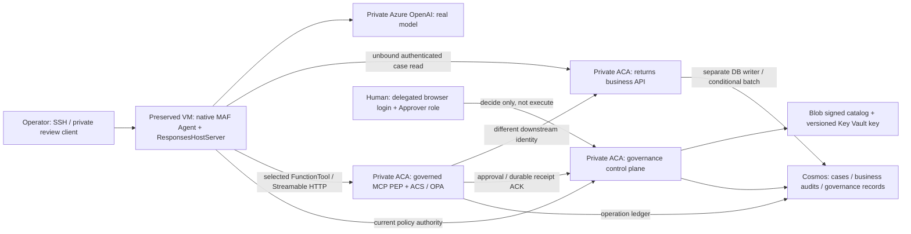

# Governed returns: scenario and execution record

**First execution: 2026-09-11.** This is the PR-facing record of what was built,
what actually ran, and what each observation establishes. It is not a deployment
certificate, a production-readiness verdict or an assertion that every agent
action is governed. Preserve this first scenario when adding subsequent ones.

Times below are **UTC**; Italian local time on this date is UTC+02:00. Tenant,
subscription, resource hostnames, principal IDs, operator addresses and login
artifacts are retained in the private operational capture, not in this document.
Resource aliases below identify responsibilities, not deployable example targets.
The separate delegated-token workstream is outside this record.

## Scenario status

| ID | Scenario | Last recorded status | Meaning |
|---|---|---|---|
| S1 | Native MAF in a Docker container on an operator VM; real private model, governed MCP, separate business API and Cosmos | Executed, with the bounded evidence below | Working functional baseline; not a Foundry hosted deployment |
| S2 | The same business boundary called by a real Foundry hosted agent and its observed platform identity | S2-REGISTERED-NOT-RUNNING: governed versions 1-3 failed; September 13 canonical startup-control versions 1-3 also failed | Project-identity registry access is now observed; registration, image acquisition and signed associations are not hosted business execution |
| S3 | Platform-managed prompt agent using an equivalent external governed action boundary | Applicability assessment only; not implemented or tested | Not interchangeable with the MAF client used in S1 |

**Reference direction:** S2 is the intended hosted reference. S1 is a useful
functional and diagnostic baseline, not the final hosting architecture.

## S1: VM-hosted native MAF and governed MCP

### Use case and scope

A retail returns assistant reads a synthetic case and records one recommendation:
`approve_refund`, `deny_refund`, `escalate_to_supervisor`, or `request_more_info`.
The consequential effect is a **Cosmos case replacement plus a decision-audit
creation in one partition transaction**. There is no payment or settlement API.

This is deliberately smaller than the
[canonical returns example](../examples/returns-triage-governed/README.md).
There are no live OMS/CRM integrations, order/customer correlation, Foundry IQ,
policy-document retrieval or citation verification in this scenario. No claim is
made that a model executed a named prose skill. The four synthetic cases carry
operator-seeded eligibility/risk facts; this is real infrastructure and real
model execution over synthetic business data.

### Deployed setup



All three ACA services run in the same **internal** environment. They are
separate processes and identities, not three names for a monolithic application.
External ACA ingress on that internal environment admits VNet clients; it does
not make the service internet-public.

| Component | Configuration used or observed | Role in the experiment |
|---|---|---|
| Dedicated resource group | Sweden Central; `preserve=true`, `cleanup=disabled`; `CanNotDelete` preservation lock observed | Contains the dedicated demonstration resources |
| Operator VM | Existing Ubuntu 24.04, `Standard_D2as_v5`; Linux amd64, Python 3.12, Docker | Build host, operator access and the initial agent host |
| VNet | Dedicated agent `/24`, ACA services `/24`, private-endpoint `/24`, operations `/27` subnets | Private service and data connectivity |
| Agent subnet | Delegated to `Microsoft.App/environments`; NAT associated with the preserved egress public IP | Prepared for Foundry network injection; does not prove hosted execution |
| Operator access | SSH restricted to the operator's `/32`; task-specific known-hosts file verified against the ARM-observed host key | No disabled host-key checking or broad SSH exposure |
| ACR | Premium; admin authentication off; public access disabled; private endpoint | Stores the actual runtime images |
| ACA control plane | 0.5 CPU, 1 GiB; one minimum/maximum replica; dedicated control identity | Signed bundle lookup, human decisions, one-use consumption and receipt ACKs |
| ACA gateway | 0.5 CPU, 1 GiB; one minimum/maximum replica; gateway plus downstream identities | Actual MCP PEP and native ACS/OPA evaluation |
| ACA business API | 0.5 CPU, 1 GiB; one minimum/maximum replica; separate business identity | Authorizes business operations and owns Cosmos effects |
| Key Vault | RBAC; purge protection; public access disabled; private endpoint; actual versioned RSA-3072 key | Signing and verification authority; no local signing-key substitute |
| Blob policy store | Standard LRS; no shared-key or public blob access; private endpoint | Immutable/create-only policy and digest indexes |
| Cosmos | Strong consistency; one writable region; local auth disabled; public access disabled; private endpoint | Durable governance and business state |
| Cosmos database | Shared 400 RU/s declared by the deployed foundation | Contains three separate containers below |
| Private inference account | `OpenAI`, S0; public access and local auth disabled; private endpoint | Model-only fallback, not an agent hosting resource |
| Model deployment | `gpt-4.1-mini`, version `2025-04-14`, GlobalStandard capacity 10 | Actual inference through Azure `/openai/v1/` Responses |
| Log Analytics | Existing dedicated workspace; ACA environment configured for Azure Monitor | Provisioned telemetry dependency, not the source of the business verdict |
| Original Foundry account | `AIServices`, S0; network injection declared on first creation; keyless/private | Preserved hosted attempt; see S2 |

Private DNS was established for ACR, Key Vault, Blob, Cosmos, the internal ACA
domain and the inference endpoint. The attempted original Foundry private
endpoint must not be counted as operational solely because its DNS zones exist.
No ingress bypass or public data-plane fallback was introduced for the working
three-service path.

The Blob retention policy declaration used 365 days. **A locked immutability
retention policy was not verified** in this experiment; create-only publication
by the application is not equivalent to locked retention.

### Identity and authorization boundaries

There are three distinct Entra API audiences: control, gateway and business.
API registrations use v2 access tokens and the optional `idtyp` claim.
Workload validation requires signed Entra claims, the correct tenant/audience,
`idtyp=app`, `Governance.Workload`, and an exact object-ID/client-ID allowlist.
Decoded diagnostic claims are not used as authentication.

| Identity / principal role | Authority exercised in S1 | Authority not given to that role |
|---|---|---|
| Agent UAMI, attached to the VM | Model inference; control/gateway app roles; key verification; business case reads | No Cosmos role; no authorized POST business writer |
| Control UAMI | Blob catalog read, key read/verify, governance-record item access and account metadata | No policy publishing or business-case writer role |
| Gateway UAMI | Control API workload calls, key verification, gateway operation-ledger access | Not the credential used to authorize the downstream business POST |
| Downstream UAMI, attached to the gateway service | Business API app role; exact POST decision / GET outcome routes | No direct Cosmos write role |
| Business UAMI | Cosmos metadata and case-container item read/create/replace; image pull | Does not act as the human approver |
| Publisher UAMI | Created by the existing foundation with publication rights | Its use was **not** the publication path exercised here |
| Operator VM system identity | Actual policy publication, create-only seed, image push and independent evidence reads | Not presented as the agent's application identity |
| Human reviewer | Real browser login from the dedicated review client; delegated `Governance.Approve`; allowlisted subject; `Approver` app role | No business execution or grant consumption in the review client |

The operator VM system identity had key-vault-scoped **Key Vault Crypto Officer**,
container-scoped catalog publication rights, registry-scoped image push rights,
case seed/write permissions and later database-scoped read-only evidence access.
This is broader operational authority than a production publisher-only identity.
It is an explicit limitation, not a claim of final least-privilege operator design.

**The VM is a trusted host boundary.** Distinct Entra principals do not establish
hostile-process isolation when the operator and agent share a VM with managed
identities available through IMDS. The model was exposed only to the two declared
FunctionTools, with no shell or direct database tool. No hostile-container escape,
IMDS credential isolation or comprehensive network/IAM bypass test was performed.

### Runtime and artifact association

The runtime used the repository's current exact pins:

| Package / engine | Version |
|---|---|
| `agent-framework-core` | `1.14.0` |
| `agent-framework-foundry` | `1.11.0` |
| `agent-framework-foundry-hosting` | `1.0.0b260813` |
| `agent-control-specification` | `0.3.1b0` |
| `agent-governance-toolkit-core` | `5.0.0` |
| `agent-hooks-sdk` | `0.1.0a5` |
| `mcp` | `1.29.1` |
| `azure-ai-projects` | `2.3.0` |
| `azure-ai-agentserver-core` | `2.1.0` |
| `azure-ai-agentserver-responses` | `2.2.0b1` |
| `azure-ai-agentserver-invocations` | `1.2.0b1` |
| Control plane / gateway packages | `0.2.0` / `0.2.0` |
| OPA | `1.18.2`, Linux amd64 static binary checked against the shared SHA-256 pin |

Source of truth:
[governance upstream pins](../skills/_shared/governance-upstream-pin.json) and
[MAF dependency project](../skills/threadlight-deploy/references/governance/pyproject-maf.toml).
Installing/importing these packages is not itself native CTK or live proof.
No installed SDK or native verifier was patched.

| Artifact | Observed digest / identifier |
|---|---|
| Inherited repository baseline | `4427c2d67a1c12abf3288e7ec8ca7ab928235b8e` |
| First runtime image, retained and used by control plane | `sha256:205fb424159e975a25ba6099410fee78e973f14fe2e88485d596f49bf6cadb0c` |
| OPA-corrected runtime image, used by gateway, business and VM execution | `sha256:b78c838b1a6205cb3bb49268243c46c416d63fe8da378216a9fbef4013c928d2` |
| Selected bundle | `returns-write-v1`, version `1` |
| Native intervention policy | `returns-safe`, `pre_tool_call`, target `$.tool_call.args` |
| Signed bundle content digest | `sha256:29eb9710becbe74767d05d9bfee16d955da301e3101c42d610bd4ccfb5951291` |
| Declared agent/version in the S1 registry | `returns-demo` / `vm-demo-1` |
| Signed policy expiry | `2026-09-12T11:29:11.420855+00:00` |

`vm-demo-1` is an **operator-declared VM version**, not a Foundry-observed agent
version. The first VM run used a digest-pinned runtime image with read-only
mounted runner/configuration files. Those mounts are outside that image digest.
Do not call this a self-contained hosted-image attestation or infer that the
inherited Git baseline contains all subsequent uncommitted demo additions.
The later source packager includes the runner in its standalone image; that
new build was checked separately and was not substituted into S1's live binding.

### Policy, approval and storage semantics

The signed bundle contains an exact gateway registry and operator-observed
case revision/eligibility/risk snapshots. An argument carrying an `_etag` is not
trusted by itself: the policy compares it with the signed snapshot, and the
backend separately reads current Cosmos state and applies ETag CAS.

This is **static, signed case-snapshot governance**, not a dynamic ERP evidence
adapter. Case changes require a new authorized snapshot/policy path. It does not
prove the richer ordered-read evidence contract of the canonical returns example.

The selected write tool accepts only `case_id`, `expected_etag`, `decision`,
`reason`. It returns only `case_id`, `decision`, `audit_id`. It fixes the business
POST `/decisions`, GET `/outcomes`, tenant, requesting agent, application scope,
policy digest and deployment hash. The separate business API reconstructs the
action hash and independently authenticates the downstream caller.

`returns_get_case` is an unbound local MAF FunctionTool that calls the authenticated
business read endpoint. That read does not invoke ACS. The actual PEP for the
selected write is the remote gateway; installing Agent Hooks in the common
image does not mean a local Hooks bundle mediated this VM agent's internal loop.

| Store | Partition / operation | What was actually retained |
|---|---|---|
| `governance-records` | `/scope`; conditional create/replace | Payload-free decision receipts and immutable-intent approval state |
| `gateway-idempotency` | `/scope`; scoped operation reservation and CAS | Completed operation linkage, hashes and downstream outcome reference |
| `returns-cases` | `/case_id`; conditional replace + audit create batch | Current synthetic cases and business decision audits |
| Blob signed catalog | Create-only policy/version and digest indexes | The actual Key Vault-signed envelope |
| VM response/evidence files | Operator files and container-local SDK response store | Native responses and operational captures; not central audit durability |

The registry declares `approval_mode: deferred`, `approval_requirement: policy`,
role `Approver`, timeout 3600 seconds. Both services allow that window and the
intent is also bounded by policy expiry. An ACS `allow` can execute autonomously;
an ACS escalation requests human approval and returns without a business effect.
The operation selector is not consent.

The human client validates the displayed action hash and requires explicit
terminal confirmation. It obtains a separate delegated browser token and calls
the existing `review.decide` function through a loopback SSH HTTPS proxy. It does
not persist/forward that token to MCP or execute the business action. The first
incomplete confirmation (`APPROVE` without the nonce) submitted no decision.

Resume uses the original operation ID and arguments. The control plane atomically
consumes the real grant; the gateway reserves execution and requires a durable
pre-effect receipt ACK. The business backend then checks current facts and uses
the existing `CosmosEffectTransport` for the exact conditional transaction.
Authorization rechecks at credential/transport boundaries are implemented by
the reused runtime. This live run did **not** inject every possible expiry,
revocation, retry, TLS wait or concurrent-writer race.

### Executed cases

Initial cases were explicitly seeded by the operator with create-only semantics:

| Case | Amount (synthetic units) | Eligible | High-risk flag | Initial state | Intended exercise |
|---|---:|---|---|---|---|
| `RMA-ALLOW` | 40 | true | false | `in_triage` | Model-driven ordinary recommendation |
| `RMA-DENY` | 80 | false | false | `in_triage` | Forbidden refund-approval attempt |
| `RMA-SUPERVISOR` | 1200 | true | false | `in_triage` | Amount threshold triggers human review |
| `RMA-REJECT` | 900 | true | true | `in_triage` | Reserved but not executed as a human-rejection case |

The threshold was amount **greater than 500**, or `high_risk=true`.
The seed did not define a currency. The model's final prose used a dollar sign;
that is not authoritative currency data or proof of output-policy enforcement.

| Execution ID | Driver and observed interval | Observed outcome | What it establishes |
|---|---|---|---|
| S1-MCP-DENY | Direct native MAF FunctionTool, 11:34:09-11:34:15 | Attempted `approve_refund` for ineligible `RMA-DENY`; `threadlight:gateway_denied`; central deny receipt; original case ETag and zero business audits retained | Real MCP/ACS denial, not merely model refusal; not a model-initiated negative test |
| S1-HUMAN-REQUEST | Direct native MAF FunctionTool, 11:34:18-11:34:25 | `pending_approval` for supervisor handoff; operation `363c754aa12a47768333c1d443105c4c`; no immediate effect | Real durable deferred request, not a blocking fake approval |
| S1-HUMAN-RESUME | Actual delegated browser decision, then native FunctionTool resume at 11:46:10-11:46:18 | Grant approved by allowlisted human and consumed; case becomes `escalated`; one business audit | Genuine human authority and exact resume into a real Cosmos effect; request/resume were not initiated by a model |
| S1-MODEL-ALLOW | Real model + native MAF Agent, 11:50:06-11:50:15 | Model selected `returns_get_case`, then `returns_apply_decision`; case becomes `closed` with `approve_refund` recommendation and one audit | Full model-to-business vertical; no settlement |
| S1-SERVED-READ | Later HTTP POST to the running native `/responses` server | Native response `completed`; real model called only `returns_get_case` for `RMA-DENY` and reported ineligible/in-triage | The preserved server is usable over its Responses interface; not a second served write proof |
| S1-COMPLETED-REPLAY | Native FunctionTool resume at 11:58:33-11:58:38; independent read at 11:58:40 | Same supervisor audit returned; still one audit for that case, same post-effect case revision | Completed-result replay without another business effect; not a concurrent exactly-once test |

The model-run window was approximately 8.794 seconds, excluding agent
construction/initial readiness. Native usage reported 1687 input and 185 output
tokens, 1872 total. This single short run is not a latency, cost or quality benchmark.

### Evidence chain

The model response was not accepted as proof on its own. The operator used real
Cosmos SDK reads, with read-only evidence permissions, to inspect the stores
independently of the model and the tool's returned JSON.

For each successful business write the check joined:

1. The current case's `audit_id` to exactly one decision-audit document.
2. The audit's original expected ETag to the operator's pre-effect case capture.
3. The audit's provenance receipt ID to a central `allow`/`execution_authorized`
   receipt for the same policy and action hash.
4. That receipt and audit to one `completed` gateway operation whose
   `outcome_reference` is the same audit ID.
5. For the supervisor case, the exact pending intent to one stored approval in
   `consumed` state, with `approved=true`, the allowlisted human and `Approver`.
6. For the model case, actual native function-call/result messages to the
   independently observed business audit.

| Association | Actual captured identifier |
|---|---|
| Model response | `resp_03a911d8372bf570016aa3eaf5a71c81938e3b1dce499c5fc9` |
| Model case-read call | `call_BiGS2FHV6GtuWrTWNdet0oJB` |
| Model business-write call | `call_MhPP5jaExzEwkBrCkJMPVnIg` |
| Model-case business audit | `decision-6a46b83114ebbe273af558bfebcf791b7b3c2b32fadb188d39cd4f46fb3db58a` |
| Supervisor business audit | `decision-c2879e3e127c579dd31bfea44f5b10fd0b591ac350269ed605dbdda276ff4af5` |
| Central deny receipt | `4a78ef84a6de4d12aa4b254111d4386e` |
| Central supervisor allow receipt | `e4cb9f2b492b4252940117c5467f5aa2` |
| Central model-case allow receipt | `c9ea21f43255483c8bb828fd9c0f9335` |
| Served read response | `caresp_f8e21eb0830a324d005aFtK4Bq2hI2xjNLXYj54c0ERQ6GNPGS` |

The supervisor receipt is timestamped `11:46:17.452030`; its business audit is
timestamped `11:46:18.849242`. The model receipt is timestamped
`11:50:13.299457`; its business audit is timestamped `11:50:13.467116`.
These timestamps support the observed sequence but are **not an atomicity or
timing proof by themselves**. Before-effect ACK and batch atomicity also depend
on the executed protocol/code and Cosmos transaction semantics; no adversarial
distributed-clock experiment was conducted.

Independent captures at 11:53:53 and 11:58:40 observed exactly two business
audits, two completed gateway operations, one consumed approval and three
central receipts (one deny, two allow). `RMA-DENY` and `RMA-REJECT` had no business
audit. The latter is unused, not a tested rejection.

The full private capture includes tenant/principal associations and therefore
is not committed. These hashes identify the retained bytes; hashes alone do
not let a PR reader inspect those private artifacts or authenticate their origin.

| Retained artifact | SHA-256 |
|---|---|
| `model-agent-allow-1.json` | `f3d6bf5c9c386f12ca7fd5ac779ebf80e9c220c64f42dc9994ac3306cf056ac4` |
| `human-review-result.json` | `bb042e4cb809315b8f51938f55c9b143162de72f4e868001f8d608013cd8b5e7` |
| `served-responses-read.json` | `61889ce2a2781474261c71b816ef6beb108e3a40b96a5a499d148957e045b662` |
| `live-business-proof.json` | `9fffd6f5881dea9138a7a86ecbf455d22b418cdac0b838e5116911c81b103436` |
| `live-business-replay-proof.json` | `03ce6b83708193e8d15510098a39fd2b09cbc463cb3a34ff7431ded85943edba` |

Private access/configuration records, original signing envelope, case snapshots,
review result, build logs and source packages are preserved alongside these
captures and on the operator VM. No previous noop receipts or archived v2 green
verdicts were imported as evidence for this write.

### Failures encountered and corrections

| Observed failure | Correction actually made | Evidence / boundary |
|---|---|---|
| Missing operator Bicep compiler | Installed Bicep in the isolated CLI context | Existing foundation compiled and completed; not a new framework |
| Missing Python service dependencies | Isolated Python 3.12 environments; actual portable packages installed | No test-only protocol replacements |
| Private Cosmos DNS not ready at initial service startup | Completed actual private endpoint/DNS deployment; reinitialized the same control revision | Subsequent authenticated control health and real Cosmos operations succeeded |
| Legacy Docker builder silently skipped a Python heredoc; OPA file absent despite build success | Explicit installer script with shared release checksum; a new image retained alongside the old one | Actual binary presence/version checked before policy execution |
| Initial native MCP client returned a generic availability error | Diagnosed actual token claims, authenticated health, initialize and key access; explicitly primed current policy authority before the test client connected | Subsequent native client worked; initial underlying exception was not conclusively isolated |
| First review confirmation omitted the nonce | Submitted nothing; reran exact confirmation and genuine browser login | No auto-approval or weakened confirmation |
| Initial model attempt returned 404 using an old dated Azure API with the Responses client | Selected Azure `/openai/v1/` through the actual SDK with managed identity | Successful model/function-call transcript; old attempt caused no credited business effect |
| Native server tried to write `/.agentserver` under a UID without a home | Explicit operator-owned state path via public `AGENTSERVER_STATE_ROOT` contract | Same preserved server recovered and completed an HTTP Responses request |
| Foundry account reads and dependent writes reported inconsistent provisioning state | Kept the account intact; used a separate private inference-only account and VM runtime for S1 | Detailed hosted limitation below, not reported as hosted success |

### Code and focused local checks

The existing gateway/control-plane/MAF adapters were reused. New source files:

| File | Purpose |
|---|---|
| [returns_mcp_backend.py](../skills/threadlight-deploy/references/governance/returns_mcp_backend.py) | Strict business boundary and conditional Cosmos case/audit transaction |
| [returns_mcp_agent.py](../skills/threadlight-deploy/references/governance/returns_mcp_agent.py) | Native model-driven MAF agent, selected gateway tool and unbound case read |
| [package_returns_mcp.py](../skills/threadlight-deploy/references/governance/package_returns_mcp.py) | Source-closure materializer; refuses overwriting an existing package |
| [returns-mcp.Dockerfile](../skills/threadlight-deploy/references/governance/returns-mcp.Dockerfile) | Standalone Linux amd64/Python 3.12 image build |
| [install_opa.py](../skills/threadlight-deploy/references/governance/install_opa.py) | Explicit hash-checked native OPA installation |
| [returns-mcp-demo.md](../skills/threadlight-deploy/references/governance/returns-mcp-demo.md) | Reproduction and preservation instructions linked from the deployment skill |

The new [test module](../skills/threadlight-deploy/tests/test_returns_mcp_backend.py)
ran **14 focused tests** in the Linux environment. RED was observed before the
corresponding implementation/wording changes, then the focused suite passed:

| Area | Coverage | Scope |
|---|---|---|
| Conditional business batch | Replace/create shape, exact `if_match_etag`, unchanged input object, case/audit association | Local function contract |
| Invalid/stale case | Changed ETag, foreign case ID/partition, closed case, high amount, ineligible refund, risk flag | Seven parametrized local negative cases |
| Supervisor disposition | High value records escalation, not refund finalization | Local business invariant |
| Strict schema | Settlement decision, model approval flag and model amount rejected | Local Pydantic validation |
| Agent contract | Only the selected gateway write and unbound case read | Real shared contract validator |
| Model client | Correct Azure v1 Responses base URL, retries disabled | Actual SDK construction; no model call in this unit test |
| Native server state | Public state-root configuration resolves to the selected directory | Actual hosting SDK helper |
| Materializer | Real source copies, import dependencies present, overwrite refusal, no heredoc installer, scoped documentation | Local packaging contract |

A standalone package was then materialized and Docker-built on Linux. Its actual
runtime/backend/MAF imports and OPA binary were checked. **That build was not
deployed as a new live scenario.** It does not replace S1's image/mount history.
The broad native/CTK suite and Task15 were not rerun or credited by these tests.

### Positive consequences and remaining boundaries

The experiment moved the selected business path beyond a checklist or noop:
actual model tool selection reached an authenticated independent writer, denial
prevented the selected mutation, genuine human authority unlocked a scoped
handoff, and replay recovered a durable prior outcome without duplication.
The reusable source package captures concrete fixes found during execution.

It also separates problems that had been conflated: application/protocol
behavior can work while the intended hosting resource is not usable. That
reduces the unresolved work for S2, but does not eliminate the need to exercise
platform identity, network reachability, immutable hosted configuration and
public agent-endpoint routing.

Not established by S1: production readiness, hostile-host resistance,
whole-agent/output governance, exhaustive bypass testing, rejection/expiry
and concurrent-resume live matrices, disaster recovery, durable agent session
storage, immutable retention lock, load/latency SLOs, cost forecasts or automatic
policy refresh. Native server `/readiness` is not a substitute for gateway
per-binding and authenticated control-plane health.

Preservation remains mandatory: do not remove the lock, delete/reset cases,
consume a new approval on behalf of a human, remove grants/keys/images, or stop
the working demo to make a new scenario easier. Policy expiry at the time above
ends the selected authorization lease, not resource preservation.

## S2: Foundry hosted agent

### Why S1 did not use the intended hosted runtime

The intended account was created as `AIServices` S0, with project management,
local auth disabled, public access disabled and the agent subnet supplied in
`networkInjections` **on its first creation**:
`scenario=agent`, `useMicrosoftManagedNetwork=false`.

The first create operation was accepted around 11:13 UTC. Subsequent operations
returned these concrete errors, at different stages:

| Operation | Actual observed response | What may be concluded |
|---|---|---|
| Foundry model deployment PUT | `AccountIsNotSucceeded`: current state `Accepted` | That request could not create the model at that time |
| Foundry project PUT | `BadRequest`: parent account did not provision correctly; retry creating account | That request did not establish a usable project |
| Foundry private endpoint creation | `AccountProvisioningStateInvalid`, first `Creating`, later an empty state in the message | The attempted private connection was not verified operational |
| Same-account reconciliation PUT using the skill's API version | `InternalServerError` | Reconciliation did not establish success; no deletion/recreation followed |

ARM reads eventually reported `Succeeded`, and a model catalog read also worked,
while dependent writes still returned `Accepted`/invalid-state failures.
The later read-only documentation check again observed `Succeeded` and **an
empty project list**. Read success alone did not establish that a subsequent
write or hosted deployment would succeed.

**No hosted agent version was registered in S1.** There is therefore no observed
Foundry agent identity, hosted cold start, hosted business invocation or signed
hosted-bootstrap acceptance to claim from this experiment. The VM UAMI cannot
stand in for that missing evidence.

The provider-side root cause was **not established**. These observations do not
prove regional lack of support, a MAF incompatibility, a permanent platform
restriction or a required role/network change. Do not remove the preservation
lock, relax private networking or change identity design based on speculation.

### Hosted reference: what must change and what stays

The user selected S2 as the next reference scenario after this record was written.
It must preserve S1 and use the existing
[signed remote bootstrap/create-once contract](../skills/threadlight-deploy/references/governance/README.md)
and [hosted operator CLI](../scripts/ci/hosted_bootstrap.py).

Keep the separate MCP PEP, control plane, business authorization boundary, real
Cosmos effect, authenticated human review and exact resume semantics. Replace
the VM-specific execution assumptions: explicit VM UAMI selection, loopback-only
operator entrypoint, mounted executable runner and operator-declared VM version
are not the target hosted identity/packaging model.

The hosted attempt needs a frozen self-contained agent image; a usable private
project/model endpoint; a single recorded create intent; independently observed
hosted version, image, principal and client; scoped app-role/service allowlists;
a newly signed registry/bootstrap association; and a verified Entra-only public
agent route pinned to that version. Do not invent reserved `FOUNDRY_*` values or
recreate agent versions after binding merely to resolve a configuration cycle.

Use new synthetic cases and fresh evidence for the actual hosted identity.
S1's receipts, completed operations, case revisions and human grant cannot certify
S2. Add a dated S2 execution section only as real operations complete; record
failures with the same precision rather than promoting provisioning to success.

### S2 attempt 1: parent resource still inconsistent

After completing the S1 record on 2026-09-11, the operator attempted a **separate
hosted-reference project** in the preserved, originally injected Foundry account.
No VM case, S1 policy binding or running S1 application was changed.

| Check / operation | API / result |
|---|---|
| Read original account and project collection | `2025-06-01` account read: `Succeeded`; project collection: empty |
| Create separate hosted-reference project | `2025-06-01`: `BadRequest`, parent account did not provision correctly |
| Create model inside that Foundry account | `2025-06-01`: `AccountIsNotSucceeded`, internal state `Accepted` |
| Discover currently supported account API versions | Provider listed stable `2026-07-01` and preview `2026-07-15-preview` |
| Read the original account through `2026-07-01` | `Succeeded`; original agent network-injection configuration still present |
| One same-account PUT through `2026-07-01`, after 12:11 UTC | `InternalServerError`; original private/keyless/injection configuration was submitted unchanged |

The same-resource recovery did not establish a usable parent. **The create-once
hosted-agent SDK operation has not been called:** no usable project was observed,
so its parent-observation precondition was not satisfied. No hosted version,
platform identity or hosted business receipt is claimed.

At that boundary the operator was asked whether to authorize a second isolated
Foundry account or investigate the original provider state without new resources.
A fresh account is not assumed to fix the underlying issue; it is a separate
attempt, not a destructive reset or a relabeling of the VM.

### S2 attempt 2: explicitly authorized separate account

The user explicitly approved the second private account and a separate injection
subnet. The original account, original subnet, inference-only fallback and all
working S1 services/data remain preserved.

At `2026-09-11T12:55:18.528837+00:00`, the new account creation returned HTTP 201,
`provisioningState=Creating`. The new `/24` subnet was delegated to
`Microsoft.App/environments` and associated with the existing NAT gateway.
Account creation used supported stable API `2026-07-01`, `AIServices` S0,
system-assigned identity, project management enabled, local auth disabled, public
access disabled, and **first-create** agent injection into the new subnet.

The operator persisted an exclusive create-intent record before the PUT and
captured the actual ARM asynchronous-operation header and request/correlation
identifiers. The signed operation URL is private operational data, not included
here. Its status was `Creating` at 12:56:28 UTC. Following that exact operation,
rather than inferring readiness from an unrelated GET, is part of this attempt.

At that point this was **account provisioning in progress**, not a created or
running hosted agent. The subsequent observations below are additional evidence;
they do not turn the initial `Creating` response into execution proof.

### S2 version 1: registration recovered, provisioning failed

**Status: S2-REGISTERED-NOT-RUNNING.** The separate account operation reached
`Succeeded` at `12:59:55.980852` UTC. Its project and model were then successfully
created, and its private endpoint/DNS configuration completed. This overcame
the original account's project/model blocker without deleting or changing it.

S2 uses separate control, gateway, downstream and business UAMIs, separate ACA
service names, and separate `s2-governance-records`, `s2-gateway-idempotency` and
`s2-returns-cases` containers. It reuses the dedicated VNet, registry and signing
authority. The original S1 services, configurations, cases and receipts were not
replaced. Three new synthetic cases (`S2-RMA-ALLOW`, `S2-RMA-DENY`,
`S2-RMA-SUPERVISOR`) were seeded create-only and their actual ETags captured.

#### Build, create and recovery sequence

The existing `generate.py generate` path produced the real
`maf-gateway-container.py` factory, portable dependencies, frozen remote-bootstrap
configuration and service source contexts. An extracted `build_read_tools`
helper uses the credential supplied by that host; it does not select the VM
UAMI. Its added local regression uses an HTTP fixture to verify credential
threading and the absence of a policy dependency on the unbound read. That test
is not hosted token proof.

The self-contained agent image was built and pushed before registration. The
create input fixed its source/image, CPU `1`, memory `2Gi`, Responses protocol
`2.0.0` and allowed environment values. No reserved `FOUNDRY_*` variable or
invented hosted identity was supplied.

| Step | Actual observation / action |
|---|---|
| First native SDK create | HTTP 403, `Traffic is not from an approved private endpoint`; protected attempt retained |
| Private-path diagnosis | VM and explicit SSH proxy resolved/reached the private project; a subsequent authenticated native agent inventory was empty |
| Reconciliation before retry | Authenticated GET of the selected agent returned 404; retained a reconciliation record and left the failed attempt intact |
| Second create with unchanged frozen input | SDK read timeout at 30 seconds; the timeout was not treated as cancellation or proof of absence |
| Independent recovery | SDK `list_versions` returned exactly one actual version, `returns-hosted-reference:1`, initially `active`, with instance identity and the expected image |
| Protected state reconciliation | Compared actual version/image/environment/CPU/memory with the frozen input; preserved the pre-reconciliation attempt and recorded the returned version/identity; no additional create was issued |
| Identity check | Microsoft Graph independently returned `@odata.type=#microsoft.graph.agentIdentity`, `servicePrincipalType=ServiceIdentity`; in this observation its app ID equaled its object ID |
| Scoped external permissions | Assigned the observed identity the control/gateway/business application roles and key verification; no Cosmos role assigned to it |
| Final policy and bootstrap | Signed new case snapshots and registry against that actual image/version/identity; staged and built the gateway; the separate publisher UAMI published the real hosted bootstrap binding |
| Endpoint configuration gate | Refused with `observed_hosted_definition_mismatch`; a fresh version read showed `status=failed` |

The first network rejection's underlying timing/registration cause was not
conclusively established. The successful authenticated reads do not retroactively
make that first request successful. Likewise, the second create's lost ACK did
not justify blindly creating another version.

Graph and RBAC assignments demonstrate configuration of the actual Agent
Identity, but **container token use was not observed**. They must not be reported
as a successful hosted call to a custom API or Key Vault.

#### Final associations and the runtime failure

| Artifact | Recorded value |
|---|---|
| Shared-reader source commit | `081762a2147ec21840112f3af56dc46775a230af` |
| Actual agent source-tree digest | `sha256:f13de22da6c7119380f1c6f9bcf33c8b3ddfa96ca7a6ff60164dcae756b8d42f` |
| Hosted agent version | `returns-hosted-reference:1` |
| Actual hosted image digest | `sha256:b5affd8ee4deaa1971fdbb129057e9d80bb899d7ca5ddcf6a0bdc41e42044e78` |
| Bootstrap policy | `returns-hosted-v1`, version `1`; digest `sha256:7b021ac19246ff8e44dc69f88257e0f85452e4c7bad67affdedfc9fd4636084d` |
| Final gateway policy | `returns-hosted-v1`, version `2`; digest `sha256:32d5c44d43d4bb1d89ec347aa56ac1e743ea4a65fcc33f67f02383a271b24994` |
| Staged gateway source digest | `sha256:b29235f3652c547694423aa631e3685bd185492cf1ade21d260c0fadbaa28222` |
| Actual gateway image digest | `sha256:4489b09ed56e2311129e5cd44ff7919a034a3054ef7a25e659e7431e8338ff67` |
| Signed hosted reference | `returns-hosted-s2-20260911` |
| Signed hosted binding expiry | `2026-09-12T13:06:05.433720+00:00` |

The later native version response contained:

```json
{
  "status": "failed",
  "error": {
    "code": "ProvisioningError",
    "message": "Agent version provisioning failed. Please retry. For troubleshooting, see https://aka.ms/hostedagents/tsg/provisioning"
  }
}
```

The endpoint validator was not weakened to accept a failed version. Image,
environment, CPU/memory and the typed `protocol_versions` still matched; the
version's failed status was sufficient to block configuration. The response
also retained an unmodeled `container_protocol_versions: []` beside the typed
protocol declaration. This observation was retained, but was **not** established
as the provisioning cause and did not justify patching the SDK or changing the
protocol contract speculatively.

All three S2 service health endpoints subsequently returned 200, including
gateway per-binding readiness for the final digest and its real receipt/approval
dependencies. S2 control had initially returned 503; it recovered after the
observed hosted workload was added and its configured initialization/request
window increased from 5 to 15 seconds. Those changes were not isolated in a
controlled experiment, so the original startup cause is not claimed as proven.

These healthy services and the signed binding do **not** prove that the failed
hosted container started, loaded the binding, minted credentials or invoked a
tool. No S2 business invocation is credited.

#### Bounded diagnostics and evidence of non-execution

The operator checked the concrete prerequisites named by the platform's
[provisioning troubleshooting link](https://learn.microsoft.com/en-us/azure/foundry/agents/how-to/deploy-hosted-agent#troubleshooting):

| Check | Observation / limit |
|---|---|
| Private-registry eligibility | The current first-party page says projects created after June 25, 2026 support private registries; this project was created September 11. The older blanket restriction in a cached companion reference was not treated as current evidence. |
| Registry permission mode | `LegacyRegistryPermissions`; project managed identity has registry-scoped `AcrPull` |
| ARM-token authentication | Dedicated `az acr config authentication-as-arm show` returned `enabled` |
| Registry network setting | Public access remained disabled; it was not opened to work around an unproven diagnosis |
| Native session diagnostics | Authenticated GET of the documented `.../endpoint/sessions` API returned `data=[]`, `has_more=false`; no session ID existed from which to fetch container session logs |
| Diagnostic CLI | Installed/used the agents extension in an isolated azd configuration. Its session command required a separate azd login; this diagnostic-tool authentication failure was not treated as the cause of the hosted failure. Existing authenticated SDK credentials successfully performed the session read. |
| Current version | Repeated authenticated reads still reported `failed`; no endpoint-check or business-run success was substituted |

At `2026-09-11T13:42:24.681282+00:00`, independent Cosmos queries found:

| S2 store / query | Count |
|---|---:|
| `s2-governance-records` documents | 0 |
| `s2-gateway-idempotency` documents | 0 |
| `s2-returns-cases` documents with `kind=decision-audit` | 0 |

The last row counts business audits, **not the three seeded cases**. This is
consistent with registration and policy publication but no hosted business
execution. No approval, noop or S1 receipt is borrowed to fill the gap.

| Private retained artifact | SHA-256 |
|---|---|
| `s2-reconciled-versions.json` | `ea35caf962cc5db4aa2b0c018a9f055c855ce6f106ba51f8e1e826459637c278` |
| `s2-signed-hosted-binding.json` | `d9fab81ee482fd894b84ad211aa9c8d1fe57fc9639ee63c11ded64a20bbd2c3f` |
| `s2-final-signed-policy.json` | `a92123e24987c2491aa87ef36cd63edff07f2fe3f7af84f21c1d836f252594b0` |
| `s2-failed-version.json` | `f933161f7d2f2e3c7e3ac34853998a14316da7d50a9bdaed40073c6eb28729cc` |
| `s2-store-observation.json` | `b234c8211892f043d901b90cb6f139d4ff3839fb7f549c6975ab97b068cf1c68` |

The provisioning root cause remains unresolved. A further attempt must preserve
version 1, both create-attempt records, all roles/resources and this failed
association. If a new version/image/reference is used, it requires a new exact
observation and signed association; the existing binding is not overwritten or
reused as if it covered that version. Neither a prompt agent nor a VM is silently
substituted for S2.

### Comparison with the user's working hosted deployment

The user identified a separately tested Hosted/Toolbox deployment in
`aiappsgbb/awesome-gbb`. Its current source at comparison time was commit
`06400fd7`; its maintained validation record reports fresh successful Hosted
identity output on September 11. That repository/worktree and its Azure
environment were inspected read-only, not modified.

The comparison exposed two distinct omissions rather than proving that private
hosted agents are unsupported:

| Difference / comparison | Evidence and action |
|---|---|
| Basic project capability host | The working private setup explicitly added an `Agents` Basic project host with platform-managed stores. Our S2 project returned `capabilityHosts: []`. |
| Conflicting guidance | The generic `foundry-hosted-agents` warning against manually creating Capability Hosts was applied without reconciling it with `foundry-vnet-deploy`'s Basic **project** host module. This was an operator interpretation/preflight error as well as an instruction conflict. |
| Minimal setup correction | Deployed the exact working `add-project-capability-host.bicep` module against S2 only. The missing-host check failed before creation and passed after the host reported `Agents`/`Succeeded`. No existing host, account or store was recreated. |
| Result of that correction alone | Version 1 remained failed. A controlled version 2 using unchanged application/runtime code and SDKs, with a fresh binding reference and policy version 3, also failed with the same `ProvisioningError`. The missing project host was therefore not established as the sole provisioning cause. |
| Protocol/image shape | The working service readback also contains `container_protocol_versions: []`, typed `protocol_versions` with Responses `2.0.0`, and nested `container_configuration.image`. Those fields were not changed speculatively. |
| Container identity | The working image uses the default container identity. The generated S2 image likewise has no fixed non-root UID; the other session's historical UID permission failure is a different signature. |
| SDK cohort | The working deployment uses a different tested runtime cohort. S2's existing exact runtime pins were retained while investigating the creation contract; no blanket SDK upgrade/downgrade was performed. |
| Registration metadata | The working deployed version has `metadata.enableVnextExperience: "true"`; both of our failed versions were created without it. |

The other session did **not** retain an outbound azd HTTP request body. Its
YAML is a creation input and its saved JSON is service readback, not proof of
every field azd sent. The missing metadata was independently traced to the
public azd implementation:
[`service_target_agent.go`](https://github.com/Azure/azure-dev/blob/main/cli/azd/extensions/azure.ai.agents/internal/project/service_target_agent.go)
unconditionally calls `applyAgentMetadata(request)`, whose comment identifies
`enableVnextExperience` as a **server-side API contract**, then sets its value
to the string `"true"`. The call is not conditional on a Toolbox.

The direct SDK operator did not match that contract. Its actual SDK
serialization regression first failed because the outgoing JSON had no
`metadata` object. The helper now supplies the same metadata through the
SDK's supported `create_version` argument, and independent observation rejects
missing, false or non-string values. It does not patch the installed SDK,
loosen the endpoint validator or mark a failed version active.

Seven targeted RED failures covered emission, lost-ACK behavior, missing/changed
metadata and the declared operator SDK extra. After correction, the complete
two-file lifecycle/credential selection ran **97 passing tests** with the real
pinned SDK and explicit external HTTP fixtures. These are local contract checks,
not a successful hosted business run.

The corrected enrollment created actual version `3`, with
`metadata.enableVnextExperience: "true"` independently read back. Its image was
`sha256:65698a5c959915ccd3de6e9a32ff6bab131a3f3b9abbf34ee91a71d6097740d1`;
the new reference was `returns-hosted-s2-native-20260911`, and its final policy
version `4` had digest
`sha256:b88353e1c02f2912bfb2937ba5dc8dcf516f3a23b8bcadabf3634326fc2d05b9`.
The old images, versions and bindings were retained.

**This did not establish a working hosted runtime.** A direct version GET
transitioned from `creating` to `failed` at `16:03:23.823606` UTC with the same
generic `ProvisioningError`. The missing creation metadata was a confirmed
contract divergence, but its correction was not sufficient to resolve the
observed failure.

A further diagnostic found a material service-read discrepancy: three raw
authenticated LIST `/versions` responses at 16:11:54, 16:11:59 and 16:12:04
reported all versions `active`, while the raw authenticated GET of version 3
still returned `failed` with `ProvisioningError`. These were response-body
values, not SDK defaults. The native CLI polls the direct version GET and
requires repeated terminal observations. LIST is not accepted as readiness
evidence here. Instrumenting every endpoint guard showed that all configuration
checks passed except the direct version status; that guard was not bypassed.

The actual generated version-3 image was also started in a network-disabled
local container, using the observed configuration values solely as test inputs.
It served `/liveness` with `alive` and correctly returned 503 for readiness with
no reachable authority. This excludes an immediate import/listen failure in
that local setup; it does not reproduce platform credential injection, image
pulling or hosted activation, and is not identity or business proof.

The remaining comparison includes the actual private image-pull route, image
reference handling and the difference between an ordinary protocol host and
this externally authorized bootstrap gate. Those are hypotheses to investigate,
not grounds to relax authentication, expose the registry, swap SDK cohorts or
declare provisioning successful.

### September 13: complete canonical private startup control

The published canonical baseline is awesome-gbb commit
`2ef44f6b47803a0166956cc668e5f429c1c1f8cb`
([aiappsgbb/awesome-gbb#489](https://github.com/aiappsgbb/awesome-gbb/pull/489)).
Its preflight/publication checks did not certify this private environment.
The separate reviewed bootstrap-deferral candidate `067d7e` is unpublished;
it was not needed for this control, which has **no governance bootstrap and
no remote/business tools**.

The complete canonical `Dockerfile`, `container.py`, `pyproject.toml` and
`azure.yaml` were used, not just a replacement entrypoint on the governed image.
The only manifest adaptations were the diagnostic agent's name and the documented
private build transport: `docker.remoteBuild: false`, `platform: linux/amd64`.
Ordinary native `azd deploy` built through the preserved VM's Docker daemon over
an owner-only, strictly verified SSH Unix socket and pushed to the private ACR.
No public Docker listener, shared Docker context change or SDK create override
was used. The earlier `--from-package` attempt with an image digest failed during
local Docker tagging, before registration; that failure is not a Foundry verdict
on digest references. A local keychain-helper stall was also resolved before the
complete native deployment.

Actual image inspection, imports and network-disabled native startup confirmed
the canonical Agent Server cohort `2.1.0b1 / 2.1.0b1 / 1.1.0b1`, alongside
MAF core `1.14.0`, Foundry `1.11.0` and hosting `1.0.0b260813`.
The local `/readiness` response was 200. This is a local-candidate observation,
not a hosted session or its mounted home. Global Threadlight pins were unchanged.
The final tags emitted by both ordinary azd deployments independently resolved
to the same image:
`sha256:53e02ab62b0be348717de32f4df755aef919f1eb90019374cbd1e23602a7cd5d`.

| Controlled observation | Actual result and limit |
|---|---|
| Canonical startup control, version 1 | Native azd registered the version with `enableVnextExperience: "true"`, then failed after 2m55 with `ProvisioningError`; request `48d5f42c591742f4aaa99f159f08cbd6`. Direct version GET confirmed failure. |
| Exact Basic-private account difference | The canonical `ai-account-identity.bicep` sets `networkAcls.bypass=AzureServices`; this account had `None`. A conditional PATCH changed only that field. GET subsequently confirmed `Succeeded`, with public network access still disabled, local authentication still disabled, and the same account identity and injection subnet. |
| Meaning of the network change | This enables the template's trusted-Azure-services network exception on the Foundry account, not data-plane permission. Neither the account nor ACR had public access enabled. ACR already had its separate trusted-service exception. No role, caller allowlist or registry access mode changed. |
| Same-image control, version 2 | After fresh setup observations and the actual account change, ordinary azd registered version 2 with the same image content and agent identity. It failed after 2m54; request `22916e9c9d55fd30d5bf313d9c8dd891`. Thus this alignment was **not sufficient to resolve provisioning**. |
| Pull versus publication | ACR metrics during 08:26-08:29 showed successful token exchanges, manifest reads and 67 successful `GetBlob` operations. These registry metrics do not identify the caller; they are not yet an independently attributed project-MI platform-pull receipt. Publishing from the VM is also not such a receipt. |
| Session versus registration | A diagnostic native invocation of failed control version 1 returned HTTP 409 `agent_version_failed` during session creation, request `6ae2b83c0ffb14e0066aa79c36a44e76`. The successful session-list response was empty. No model response or runtime log was fabricated from this failure. |
| Native diagnostic limitation | The failed deployment did not persist the agent name into azd's local environment: `show`/`monitor` reported name-resolution failure, and `doctor` called the registered agent undeployed. Direct authenticated version GET, not that local cache or LIST `active`, supplies the recorded terminal state. Native monitor additionally requires a real session ID; none was created. |
| Retained infrastructure diagnostics | Enabled only registry login/repository diagnostics into the existing Log Analytics workspace. No historical events can be inferred from newly enabled logs, and no event is credited until actually retrieved. |

The working Hosted/Toolbox comparator was also clarified: its Foundry account
and authenticated ACR had public network access enabled, while its agent
injection and MCP path were private. It is therefore **not an equivalent
fully private account/image-pull experiment**. Its build used native ACR remote
build; no retained image manifest established a Docker-versus-OCI difference.
The control here has an OCI manifest with gzip layers; format alone is not a
demonstrated failure cause.

Both index-derived CLI state directories and the exact tenant/subscription
assertions were used for this experiment. A diagnostic azd command outside the
project initially selected a home-tenant token despite the isolated cache.
Running it in the complete project's context corrected that diagnostic 403;
no login cache was copied and no role was granted to the wrong principal.
The actual deployments already used the complete project context. This
diagnostic correction does not explain their provisioning failure.

The result rules out the claim that our governance bootstrap or our different
Agent Server cohort is the sole explanation: the complete canonical control
fails without either. It does not yet distinguish platform snapshot preparation
from another private provisioning dependency. The supported session diagnostic
cannot expose runtime logs before a session exists.
**No hosted business result or native session-home success is claimed.**
S1's earlier authority has expired; its preserved successful receipts remain
historical proof, not a current authorization lease.

| Private retained artifact | SHA-256 |
|---|---|
| `canonical-full-startup-control/native-direct-readback.json` | `a3240dd1d086825e91e518ba22fc6f2f8465ae40f00d9cc35320260ce06ba034` |
| `canonical-bypass-attempt-0913/direct-version-2.json` | `318b349171df38f040abfca1237d8c6a8d4e9e83f8883c3f9a86f979343b119b` |
| `canonical-bypass-attempt-0913/acr-transactions.json` | `fb95ab856bd2e5ed3397a3ea18ab62c39ab788bce0cfeb70a272f43bb1751b99` |
| `canonical-pull-diagnostics-0913/account-alignment-poll.json` | `6e73e95de0030064310fec4e5f2790d8bf2c072fbf4f25fc6eff0398a6a893e4` |

The private capture also retains both native deploy logs, fresh preflight inputs
and results, registry manifests, the actual account PATCH and its before/after
states, and the failed diagnostic request. No old artifact, failed version,
signed association, image, identity or resource was removed. The remaining
manual work is private operational evidence collection and the unresolved hosted
provisioning diagnosis, followed by a fresh exact business binding and real
hosted invocation. Repeated registration without a justified delta is not a
reproduction procedure.

### Instrumented retry: project-identity registry access observed

After registry diagnostic ingestion was verified with real operator events,
the user authorized **one instrumentation-only repeat**, not a proposed fix.
The prior failed version was reconciled first. Ordinary azd deployment ran from
`2026-09-13T08:38:38Z` to `08:41:44Z`, registering control version `3`.
The image digest, application, dependencies, model, identity, network and roles
were unchanged. The direct GET again returned `failed`/`ProvisioningError`;
native request ID: `aa794464706678e9b2d477a30886bedb`.

Actual registry events now separate three callers:

| Caller | Independently observed registry activity |
|---|---|
| Operator publisher | VM-addressed Docker `Push` HTTP 201 at `08:38:47.293482`, with the new native tag and the same frozen digest |
| Container security scanner | A different identity with `MDCContainersSecurity/1.0` performed HTTP 200 pulls; these are explicitly excluded from Foundry acquisition proof |
| Foundry project managed identity | At least six paired `Login`/`Pull` HTTP 200 events, `08:39:16.298236` through `08:41:15.581495`, for the exact native tag/repository/digest; caller identity matches the ARM project's managed identity, UserAgent is `Buildah/1.42.1`, and each source address belongs to the selected injected subnet |

This is an attributed service-side registry observation, unlike the previous
aggregate metrics or VM publication. It demonstrates that the project's actual
acquisition component reaches and authenticates to the private registry and
obtains the registered image manifest. It is **not proof of successful layer
unpacking**, complete image preparation, snapshot creation or application startup.
The same-window metrics include successful `GetManifest` and `GetBlob`
operations, but do not provide **per-caller blob completion**. No stronger claim
is inferred by joining aggregate counters to a single identity.

Remote manifest bytes matched the frozen digest. The separately downloaded
config blob also matched its descriptor hash and declared Linux/amd64, `/app`
working directory and the canonical CMD. There was no image index, and the
referrer-list response was empty; no unobserved provenance/attestation artifact
is assumed. A successful local Docker start remains different from the
platform's Buildah acquisition/preparation path.

A native post-attempt session list was empty. The only observed ARM failure
in the window was a separate diagnostics-policy deployment targeting a
**missing organization-managed Log Analytics workspace**. Its exact deployment
error was retained; it is not established as the hosted provisioning cause,
and neither that external scope nor the organization policy was changed.

The new private evidence is under
`canonical-instrumented-attempt-0913/registry-events-final.json`,
`direct-version.json`, `registration-summary.json`, `remote-config.json`,
`remote-manifest-before.json`, `acr-transactions.json` and
`diagnostic-policy-deployment-error.json`. A private minimal reproduction pack
contains the canonical source, compared configuration, timestamps, request IDs
and original evidence. It contains no CLI caches, registry tokens or SSH keys.
No support request or public issue was submitted. The remaining blocker is
the unexposed internal provisioning/snapshot error: **backend involvement is
suspected with evidence, not a proven backend defect**. No additional
unchanged registration, public-access exception or business execution followed.

## S3: Prompt-agent applicability

**Assessment only:** a prompt agent is not a drop-in replacement for this MAF
container. It does not execute this repository's Python `GovernedMCPTools`,
`GatewayAuthority`, local read FunctionTool or Responses host inside a container
owned by this implementation.

An external MCP PEP could still be useful to a prompt-agent architecture. Whether
the complete **same contract** is realizable must be demonstrated separately:

| Required behavior in S1/S2 | Question for a prompt-agent scenario |
|---|---|
| Refresh app-only credentials on initialize/list/call and enforce exact caller identity | Which platform identity/authentication mechanism reaches this gateway, with which actual token audience and roles? |
| Per-operation `Idempotency-Key` supplied by trusted client code | What trusted platform/client mechanism generates, retains and reuses it for the exact action? Static copied headers are not equivalent. |
| Deferred operation selector removed before business arguments are sent | Where does the current MAF-specific `governance_operation_id` adaptation live? |
| Same identity/arguments/policy/facts on resume; authentic one-use grant | Can the prompt-agent path resume that exact operation rather than issue a new unrelated call? |
| Unbound case read implemented as a local MAF FunctionTool | Which separately authorized read tool replaces it, without accidentally binding or dropping the read? |
| Declared tool inventory and no alternate business effects | Which other platform/provider tools exist, and can any bypass the selected external boundary? |

These are integration/evidence requirements, **not a claim that prompt agents
can never support governed external actions**. No prompt agent was created and
no prompt-agent enforcement, approval or identity behavior was tested here.
S3 must not delay or dilute the chosen S2 hosted reference.
