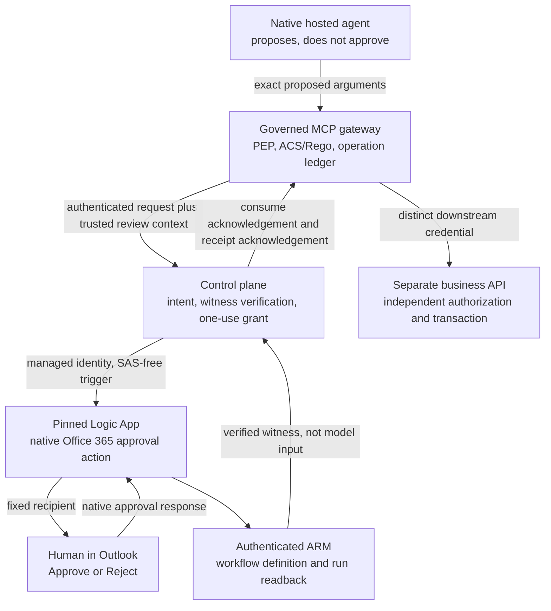
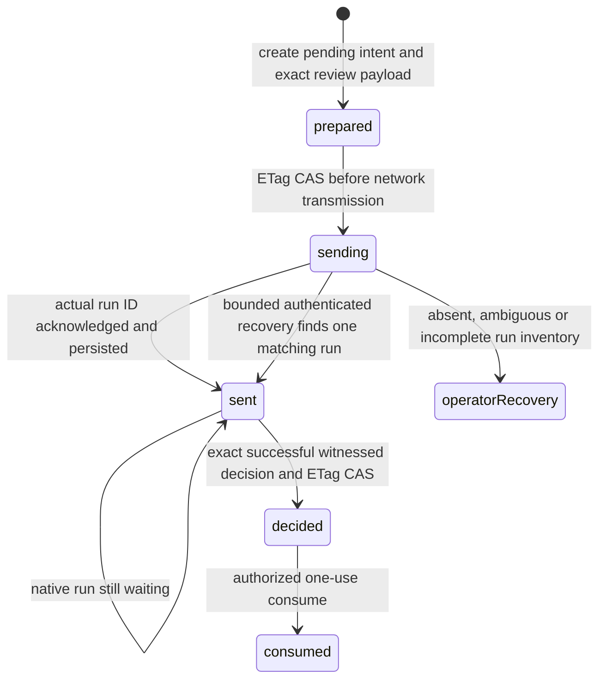
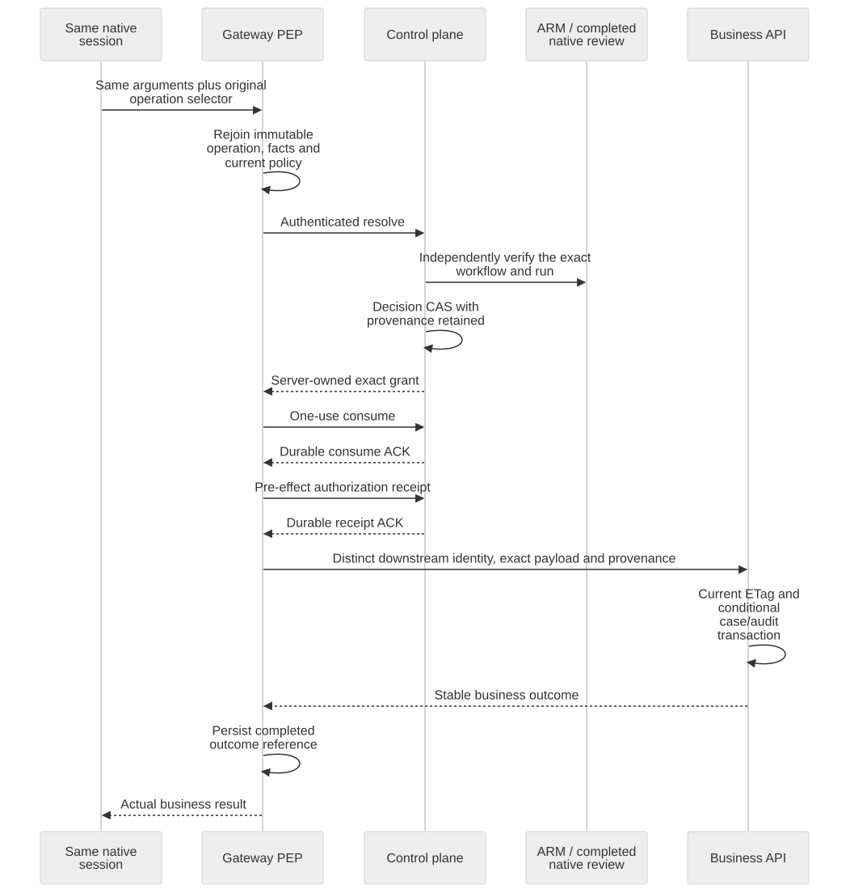
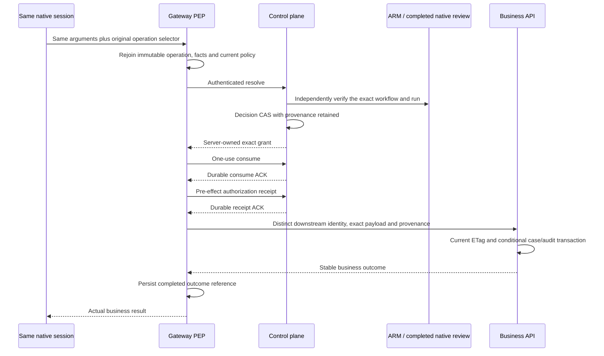

# Native Outlook approval at the governed effect boundary

**Engineering reference, September 15, 2026.** This document explains the implemented
authority channel, its operating contract, and its limits. The
[execution record](governed-returns-validation.md#september-15-native-outlook-human-approval-exact-resume-and-replay)
owns the dated private demonstration. The broader
[governance deep dive](agent-governance-deep-dive.md) covers native hosting, signed
policy, backend authorization, and evidence. Neither document is a production
certificate or whole-agent attestation.

## 1. The business contract

An agent may propose a consequential action. A human may approve or reject that
**specific proposal** in Outlook. Neither the model nor the email workflow can
execute the business operation. A separately authenticated gateway must recover
the original intent, verify the decision through the control plane, consume its
one-use authorization, obtain a central audit acknowledgement, and call the
independently authorizing business API.

In the returns reference, the effect is a conditional Cosmos case replacement
and one decision-audit creation in the same partition transaction. It is **not a
refund payment or financial settlement**. An approved supervisor handoff is not
permission to change the amount, revise the reason, choose a different case,
use a newer ETag, or execute another tool.

The user experience is native Office 365 `SendApprovalMail`, not an ordinary
notification with an instruction to run a terminal command. Repository-generated
communications use **English**: **Approve**, **Reject**, a readable action label,
case reference, reason, and timezone-qualified deadline. Protocol hashes and
raw JSON stay in the protected technical record rather than the email body.

The September 15 live capture used **Italian** labels before the English
repository correction. Its original messages, exact workflow pin, images and
decision are preserved. English defaults and generator changes are separately
tested source changes; they do not retroactively turn that capture into an
English-mail execution.

## 2. Responsibilities and trust boundaries



<details>
<summary>Diagram source</summary>

<!-- diagram: outlook-boundaries -->

</details>

| Component | Authority it owns | Authority it does not acquire |
|---|---|---|
| Hosted agent | Authenticated reads and proposals through its selected tools | No grant fabrication, business database write, or policy signing |
| Gateway identity | Control-plane requests, grant consumption, receipt delivery, operation ledger | Not the human approver or downstream caller |
| Control-plane identity | Governance store, signed reads, workflow invocation and ARM verification | No business execution; no human identity fabricated from an app token |
| Logic App and Office 365 connection | Deliver one native review and expose its result | No `decide`, `consume`, or business API action |
| Human reviewer | A witnessed decision for the proposal shown | No general grant or change to the proposed transaction |
| Downstream identity | The registered business action/outcome routes | No forwarding of the user's Outlook identity as a business credential |
| Business writer | Validate trusted provenance, current record revision and conditional transaction | No policy publication or approval creation |
| Publisher/operator | Reviewed configuration, signing lifecycle and independently scoped collection | Not a model tool; not an automatic human substitute |

The trusted computing base includes the native host and gateway, their credential
and transport code, the control plane and stores, Entra, Microsoft Logic Apps,
the Office 365 connector and connection administrators, authorized configuration
publishers, the business writer, and their clocks. A malicious administrator who
can replace these components or change their trusted configuration is outside
this cooperative enforcement boundary.

**SAFE is the method; ACS/Rego is the PDP; the native host/gateway is the PEP.**
Agent Hooks is a host/interceptor contract, AGT is the toolkit, and ASSERT is
assurance. The email channel supplies required human authority; it does not
replace policy evaluation, backend facts, or effect-boundary interception.

## 3. Two explicit human-authority channels

### Delegated review

The existing `decide` operation authenticates a real delegated Entra token:
configured UI client, allowlisted human object ID, `Governance.Approve` scope,
and the relevant role in the signed token, service configuration and intent.
That channel remains available for workloads that have not selected native
Outlook. The review client cannot consume a grant or call the business API.

<details>
<summary>Delegated decision request schema example</summary>

This complete shape uses placeholders, not executable authority. The caller
must supply the exact registered live intent and a real delegated credential;
it must not reconstruct the values from model text.

<!-- contract: approval-decision -->
```json
{
  "operation": "decide",
  "intent": {
    "principal": "<gateway-object-id>",
    "agent_id": "returns-example",
    "tenant": "<tenant-id>",
    "allowed_roles": ["Approver"],
    "action_hash": "sha256:<64-hex-action-hash>",
    "policy_hash": "sha256:<64-hex-policy-digest>",
    "session_id": "<gateway-operation-key>",
    "context_identity": "sha256:<64-hex-facts-hash>",
    "nonce": "<32-lowercase-hex-nonce>",
    "expires_at": "<exact-UTC-intent-expiry>",
    "policy_expires_at": "<exact-UTC-policy-expiry>"
  },
  "approved": true,
  "approving_role": "Approver"
}
```
</details>

### Native Outlook witness

The new channel is explicitly selected by `outlook_approval` in the control
plane and `approval_channel: "outlook"` in the gateway. It uses a different,
documented source of authority:

1. The control plane sends its own already-registered intent to its pinned
   workflow using its managed identity.
2. Office 365 returns the selected option, responder email, **home tenant** and
   **home subject** identifiers.
3. The control plane reads the actual workflow/run through authenticated ARM;
   it does not accept a callback body or an operator-supplied decision as proof.
4. An explicit trusted mapping binds that responder tuple to an allowlisted
   approver and role in the deployment tenant.
5. Only after every binding and freshness check passes does the service create
   a grant with `authority.kind = "outlook-native/v1"`.

This is **not OBO**, a new delegated token, or an app-only principal masquerading
as a human. The mapped role is a trusted configuration entitlement, **not a role
claim extracted from a fresh delegated JWT or a live Graph membership query**.
Its operational owner must manage and revoke that mapping. Cross-tenant email
address matching alone is insufficient: both immutable home identifiers and
the fixed recipient must match.

Missing responder identifiers, an unknown mapping, an unexpected option or a
removed entitlement fail closed. Some HTML fallback clients can omit identity
fields; those responses are rejected rather than promoted using the email
address alone. Workloads selected for native Outlook cannot fall back to
delegated `decide` when native review is unavailable.

## 4. Workflow contract and permissions

The [Bicep template](../skills/threadlight-deploy/references/governance/review-approval.bicep)
creates or updates **one workflow**, referencing an **existing** Office 365
connection. It does not provision another connection, consent to a mailbox,
create identities or grant roles. It defaults to `Disabled`; enabling and
deploying it are explicit operator actions.

The trigger policy requires the deployment tenant issuer, the exact ARM
audience `https://management.azure.com/`, and the control-plane managed
identity's object ID. SAS trigger authentication stays disabled. For this
audience the SDK adapter requests `https://management.azure.com//.default`;
the extra slash preserves the resource audience's trailing slash. This is a
specific Azure scope-to-resource requirement, not permission to accept arbitrary
audiences.

The control identity needs **Reader scoped to that workflow** to retrieve its
definition, versions and runs. Reader supplies verification access; the
workflow's separate Entra trigger policy controls invocation. The demonstrated
change did not grant directory-wide Graph permissions, make a service identity
a human approver, or add business-write permissions.

The real connector action is `ApiConnectionWebhook` at
`/approvalmail/$subscriptions`, with `NotificationUrl: @listCallbackUrl()`.
It sends to a fixed configured recipient with two explicit options.
`ShowHTMLConfirmationDialog: true` requires deliberate confirmation for the
HTML experience; it is not a substitute for checking returned identity.
The action waits at most `PT15M`. Its inputs/outputs use secure-data settings.

The workflow echoes the entire original request and native response into
protected run output. Consequently, **workflow Reader access is sensitive**:
run-level output still contains review data and identity information. Secure
action inputs/outputs do not imply that every workflow output is redacted.
Generated callback/content URLs are operational secrets and must not be copied
to a public issue, example, log or evidence page.

The Consumption trigger is an Entra-authenticated notification companion to a
private business plane. **A private endpoint for that trigger was not proved.**
SAS-disabled does not mean network-private, and private business endpoints do
not establish isolation of every connector service.

## 5. Exact proposal binding

The gateway computes and preserves the immutable intent. The control plane
receives optional `ReviewMetadata` on `request`/`resolve`; it is mandatory when
the native channel is selected. Legacy callers keep their smaller request
shape rather than automatically attaching full review data.

| Field or association | Verification |
|---|---|
| Workload principal and tenant | Authenticated caller and configured workload mapping |
| Original agent subject/client | Exact trusted mapping in `review_context`, not a display name |
| Agent deployment | Version, image digest, environment, subscription and resource group |
| Action hash | Canonical hash of the trusted facts and exact business arguments |
| Context identity | Canonical hash of the trusted facts |
| Operation selector | Canonical hash of the operation ID equals the intent's gateway session key |
| Policy | Exact signed digest and expiry; no unsigned `approved` flag |
| Case and ETag | Same case in both payload locations and original expected revision |
| Nonce and timestamps | Exact immutable intent, current clock and policy lifetime |
| Reviewer authority | Home tuple, recipient, configured local approver and allowed role |

The gateway session key is **not** the native Foundry session ID. The latter
preserves the hosted session and is carried independently in the native API
requests. Both matter: a native session alone is not a business idempotency key,
and an operation ID alone is not permission to resume.

The workflow version is pinned separately from its canonical digest. The digest
covers the actual ARM `definition`, `parameters` and `accessControl`. Health
checks compare the live resource/version/digest, Enabled state, trigger URL
binding, SAS setting, required identity claims, native approval action, fixed
recipient/options, confirmation setting and exact request/response output
bindings. Changing labels, workflow parameters or trigger policy requires a new
observed pin; compilation is not deployment or verified readback.

## 6. Durable send and decision state machines

The notification outbox lives **inside the same persisted approval record** as
the immutable intent. There is no independent queue write whose loss can leave
an email detached from its authority.



<details>
<summary>Diagram source</summary>

<!-- diagram: outlook-outbox -->

</details>

The control plane attaches `x-ms-client-tracking-id` equal to the intent nonce.
The native run ID returned by the trigger is persisted before the caller is told
that dispatch succeeded. If the HTTP acknowledgement is lost after transmission,
the record remains `sending`. Recovery reads at most 100 authenticated workflow
runs and requires exactly one matching nonce. Missing results, multiple matches
or pagination require explicit operator reconciliation. **It never blindly
resends an ambiguous notification.**

The HTTP adapter bounds ARM response bodies to 256 KiB, uses TLS, refuses
redirects, and rechecks freshness before and after credential and transport
waits. Polling occurs during authenticated requester exchanges, not in an
untracked operator-side background process.

Before minting a grant, the service checks the run's resource and version,
correlation, successful terminal status, complete echoed request, native
response, identity mapping and timestamps. It rechecks the workflow and signed
policy before the decision CAS. The persisted authority includes workflow
resource/version/digest, run ID, responder tuple, mapped approver/role, decision
time and response digest.

The main control-plane record states remain `pending`, `decided`, `consumed`.
Expired records are retained; there is no automatic tombstone deletion or
timestamp renewal. Approval rejection also produces a one-use decision. A
pending `consume` cannot poll the workflow or turn an unfinished review into
permission. Existing pre-channel records cannot be retroactively upgraded by
turning native Outlook on.

## 7. Resume, authorization ACK and effect



<details>
<summary>Diagram source</summary>

<!-- diagram: outlook-execution -->

</details>

Resume must use the **same native session**, exact original business arguments,
and original `governance_operation_id`. `previous_response_id` separately
preserves conversational continuity. The selector is a lookup handle, not a
credential. Never obtain a newer ETag and silently reuse the old approval.

The gateway still owns policy re-evaluation, trusted backend facts, the actual
one-use consume, central receipt acknowledgement and pre-send authorization
checks. The business API still authenticates the distinct downstream caller and
performs its own conditional transaction. No email response bypasses them.

The gateway ledger and control-plane nonce ledger have different purposes.
After successful execution, replay resolves the completed operation and stable
outcome rather than consuming a second grant or issuing another effect.
Losing a successful consume acknowledgement can burn authorization without
permitting execution: the system does not fabricate a replacement grant for
availability. Unknown downstream outcomes require the registered outcome lookup,
not a new idempotency key.

## 8. Reusable configuration and readiness

At bind time, an explicit `outlook_approval` object supplies the observed workflow
resource/version/digest, SAS-free URL, sender principal, recipient, requesting
principals, responder mappings and decision options. The generator validates the
real `OutlookConfiguration` and both service schemas. It writes native selection
to both control and gateway configuration, preserves an existing selected
profile during rebinding, and rejects null, mismatched requester/sender/role or
one-sided selection instead of silently returning to delegated mode.

The channel requires a current workflow deployment and appropriately scoped
permissions; the generator does not grant them or invent a workflow pin.
Preserve the hosted image/configuration when only the companion services need
updating. Any actual changed deployment still needs fresh association and
appropriately scoped evidence.

Authenticated approval-context health returns
`approval_review_required: true` for a native-selected requester. The gateway
requires that capability; an older service that ignores metadata cannot report
native-channel readiness. Outlook availability is checked for the selected
approval context, not used to disable unrelated control-plane bundle or receipt
services. Invalid configuration is still rejected; unavailable native review
is not interpreted as governance being off.

Defaults are English in the catalog. A retained localized workflow requires
explicit matching `approved_option` / `rejected_option` and its own observed
pin. Do not deploy English defaults against an old localized workflow without
coordinating the configuration. Label translation is not a renewed human intent.

## 9. Failure handling and operating ownership

| Condition | Behavior and required response |
|---|---|
| Mailbox connection is not authorized | No approval proof; read current connection state before asking for consent |
| Mail delivery or callback fails | No successful native witness and no grant; diagnose the actual run |
| Reviewer does not respond within the webhook window | No automatic approval or human rejection; retain records |
| Mailbox identity is missing or mismatched | Reject authority; do not infer identity from a button or email address |
| Workflow version/digest or entitlement changes | Unused authority is blocked; reconcile and publish explicit configuration |
| Credential/transport wait exceeds intent lifetime | Fail closed before further effect authorization |
| Duplicate or concurrent request | Create-only/CAS ownership, one notification outbox, one consume winner |
| Lost notification acknowledgement | Bounded run reconciliation; no automatic duplicate send |
| Lost consume acknowledgement | No invented replacement authorization; explicit recovery |
| Case revision or facts change | Original approval cannot authorize changed arguments or a new ETag |
| Native session/conversation is lost | Retain original operation; do not reconstruct a grant in model text |
| Completed operation is replayed | Return verified stable outcome without an additional business effect |
| Audit or business response is uncertain | Inspect authoritative stores and outcome endpoint, not assistant prose |

A service operator owns workflow/version changes and configuration mappings.
A business owner owns approval policy and reviewers. A platform owner owns
identity, reachability, retention and monitoring. Their duties must remain
separate from the model's proposed action.

Clocks, one writable Cosmos region, retained records, protected configuration,
connector/client compatibility, throttling, continuity/recovery objectives and
data retention need production-specific assessment. This reference does not
prove high availability, instantaneous directory revocation, hostile-host
isolation, every possible mail client, or arbitrary-framework integration.

## 10. Evidence and what it means

For the recorded private operation, a fresh native version-pinned session
returned a real pending intent; the actual human chose the native Outlook
option; ARM returned the expected responder; the control plane persisted native
authority and a consumed grant; the same native session produced one business
audit; replay returned the same audit ID. Independent before/after/replay reads
showed no replay changes in any of the four observed stores.

Three native responses were independently retrieved. Their four tool calls
were joined to the signed hosted binding, read ACK, immutable approval,
completed operation, central receipt and business audit. Four payload-minimized
call records were then created and read back. A historical pending call remains
`pending` in that post-run ledger even when its operation has since completed;
the retained consumed intent supplies the independent join. It is not relabelled
as an immediately successful write.

The evidence layers remain distinct:

- Portable protocol/locale tests do not prove Azure delivery or a person.
- Exact published native-runtime tests exercise real ACS/OPA/gateway integration,
  not cloud networking or a human.
- The dated private business capture establishes this selected operation and
  deployment, not the richer canonical returns binding or all agent behavior.
- Post-run ledger writes are evidence collection, not additional business
  effects or pre-effect authorization.
- A source translation, compilation, image build, healthy service or retained
  historical receipt does not establish a new live human execution.

### Implementation references

- [Native authority adapter](../skills/threadlight-govern/references/control-plane/outlook.py),
  [control plane](../skills/threadlight-govern/references/control-plane/app.py),
  [gateway](../skills/threadlight-govern/references/gateway/receipts.py).
- [Native approval template](../skills/threadlight-deploy/references/governance/review-approval.bicep),
  [generation](../skills/threadlight-deploy/references/governance/generate.py),
  [reconciliation](../skills/threadlight-deploy/references/governance/returns_reconcile.py).
- [Native authority regressions](../skills/threadlight-govern/tests/test_outlook_approval.py),
  [actual deferred gateway tests](../skills/threadlight-govern/tests/test_deferred_gateway_approval.py),
  [generation tests](../skills/threadlight-deploy/tests/test_deferred_gateway_generation.py),
  [reconciliation tests](../skills/threadlight-deploy/tests/test_returns_reconcile.py).
- [Office 365 Outlook connector / SendApprovalMail](https://learn.microsoft.com/en-us/connectors/office365/).
- [Logic Apps correlation and diagnostic data](https://learn.microsoft.com/azure/logic-apps/monitor-workflows-collect-diagnostic-data).
- [Native hosted sessions](https://learn.microsoft.com/azure/foundry/agents/how-to/manage-hosted-sessions).
