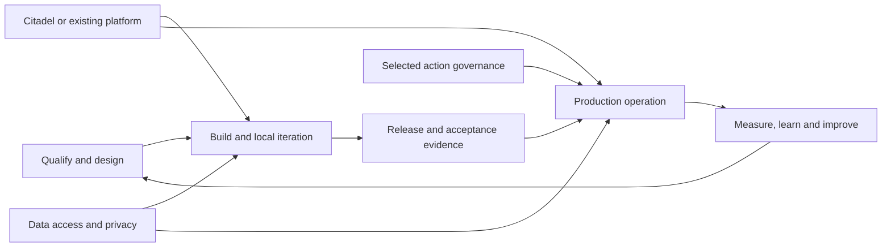

# Threadlight: solution and adversarial review

**Decision brief, September 15, 2026.** Reviewed baseline:
[`212f037`](https://github.com/aiappsgbb/threadlight-skills/commit/212f037223081506cdda5e2bc7217a926ba47361).
This is an architecture, implementation-boundary and assurance review, not a
penetration test or production certification. No website, runtime, deployment or
cloud configuration was changed for this review.

## Contents

- [Executive verdict](#executive-verdict)
- [What the offering actually is](#what-the-offering-actually-is)
- [Capability and ownership map](#capability-and-ownership-map)
- [Ranked findings](#ranked-findings)
- [Adversarial scenarios](#adversarial-scenarios)
- [Recommended implementation sequence](#recommended-implementation-sequence)
- [What to explain better, not rebuild](#what-to-explain-better-not-rebuild)
- [Checkpoint and review evidence](#checkpoint-and-review-evidence)

## Executive verdict

**The solution has a credible core and a useful end-to-end delivery method.
It is not yet a turnkey production operating platform.** Its strongest
differentiator is executable, selected-action governance: policy, trusted
business facts, authenticated approval where required, durable authorization
audit and independently enforced business transactions. This is substantially
more than policy files or an assessment checklist.

Three complementary propositions now make sense:

| Proposition | Business problem | Actual contribution |
|---|---|---|
| Shared platform | Multiple teams need controlled model access, attributable consumption and a common network/telemetry foundation. | Citadel is the external platform solution; Threadlight integrates the application with that foundation. |
| AgentOps and delivery | A changed prompt, model, dependency or tool can regress before anyone notices in production. | Threadlight supplies release scaffolds, evaluation/evidence integration and readiness assessment. The default generated pipeline still needs important production wiring. |
| Runtime action governance | A plausible agent proposal is not authority to make a business change. | The selected host/gateway checks authority before the effect. Backend authorization and transaction semantics remain indispensable. |

**The main missing work is industrialization around that core**, particularly
release acceptance and recovery from uncertain outcomes. Some apparent gaps are
instead visibility problems: qualification, scope-bound cost reconciliation,
grounding assessment and customer-onboarding runbooks already exist.

The private human-approval demonstration is complete within its documented
scope. It does **not** establish current readiness of every deployment, the
richer canonical returns example, every framework/channel, or payment settlement.
Its expired policy/bootstrap remain historical evidence, not reusable authority.

Recommendation: preserve the current public page and accepted governance guide.
Do not restart a general redesign or rebuild working approval services.
Prioritize findings F1-F3, make supported profiles explicit, then close the
customer-specific gaps for a deliberately bounded production candidate.

## What the offering actually is

Threadlight is a **skill catalog plus executable reference components**. It
combines deterministic tools, generated application scaffolds, evidence
assessors, agent-guided procedures and integrations with separately owned
services. Those delivery forms are legitimate, but not interchangeable.



This is the responsibility map, **not a claim that one command executes and
verifies every arrow**.

Data access and privacy cut across the map. A model gateway cannot decide
whether an employee may retrieve a particular HR document. An action policy
cannot retrospectively remove sensitive content already sent to a model,
approval email or diagnostic store. Source authorization, identity propagation,
data classification, retention and approved telemetry destinations need their
own application/platform owners.

Likewise, a green resource inventory, a valid evaluation report and a successful
business transaction answer different questions. They must remain distinguishable.

## Capability and ownership map

All 24 catalog skills are represented below. "Implemented" describes available
code or artifacts, **not a fresh live acceptance result for every customer**.
Skill names link to their current contracts; detailed findings cite the
implementations that matter.

| Skill | Delivery form and value | Boundary the customer must understand |
|---|---|---|
| [qualify](../skills/threadlight-qualify/SKILL.md) | Deterministic interview-to-sizing, assumptions ledger, MVP/production profiles and optional ROI. | Declared assumptions are not observed demand or realized business savings. Hub and application cost remain separate. |
| [design](../skills/threadlight-design/SKILL.md) | Agent-guided specification and artifact generation, with executable selector/contract support. | Industry realism and business rules still need SME approval; a generated specification is not an implemented process. |
| [local-test](../skills/threadlight-local-test/SKILL.md) | Runnable quickstart and several local iteration patterns. | Stub data/local execution do not prove hosted behavior, identity, network or real backend integration. An LLM endpoint can still incur cost. |
| [deploy](../skills/threadlight-deploy/SKILL.md) | Runtime/IaC templates, real governance generators and deployment procedures. | Platform prerequisites and compatible runtime choices matter; successful provisioning is not business readiness. |
| [safe-check](../skills/threadlight-safe-check/SKILL.md) | Executable design/pre/post-deploy completeness checks and scoped governance collection. | The reserved noop collector is not a business-write test or whole-agent certification. |
| [demo-data-factory](../skills/threadlight-demo-data-factory/SKILL.md) | Agent-guided synthetic data, seed/reset script generation and domain realism guidance. | Synthetic cases are not customer integration evidence; several industry canons remain aspirational. |
| [event-triggers](../skills/threadlight-event-triggers/SKILL.md) | Receiver scaffolding for scheduled/event-driven workloads, with deduplication and dead-letter guidance. | Generated receivers need application-specific idempotency, authorization and deployed verification. Continuous streaming is not covered by this skill. |
| [connect](../skills/threadlight-connect/SKILL.md) | Executable contract extraction, conformance checks and transactional mock-to-real configuration update. | Consumes captured response/OBO/role evidence; does not itself call the endpoint or implement OAuth exchange. |
| [ground](../skills/threadlight-ground/SKILL.md) | Executable assessment of ACL, citation, refusal and freshness evidence. | Not a retrieval engine, ACL enforcement service or live probe producer. |
| [hitl-patterns](../skills/threadlight-hitl-patterns/SKILL.md) | Seven interaction patterns, an inline approval card, handler/router/audit generation guidance. | The seven advertised standalone card JSON files are placeholders; this is not the native runtime approval bridge. See F5. |
| [workspace-ui](../skills/threadlight-workspace-ui/SKILL.md) | Real reusable decision/action/audit panels and guidance for a customer-rebuilt workspace. | A UI callback is not authorization; seed data and a read-only audit view do not establish immutable backend enforcement. |
| [consumption-iq](../skills/threadlight-consumption-iq/SKILL.md) | Forecasting, read-only settled actuals collection, scope-bound reconciliation and unit economics. | Not a real-time spending limiter. Evidence maturity and cost-target attainment are separate judgments. |
| [evals](../skills/threadlight-evals/SKILL.md) | Executable assessor plus procedures integrating evaluation producers, including optional bound AgentOps evidence. | The assessor alone does not invoke/score every scenario. A threshold miss can produce `partial`, not a pipeline failure. |
| [redteam](../skills/threadlight-redteam/SKILL.md) | Executable scan-evidence validator and scanner integration procedure. | The validator does not run an Azure attack campaign. Harmful-content evidence cannot substitute for missing injection/exfiltration coverage. |
| [govern](../skills/threadlight-govern/SKILL.md) | Policy bundle tooling, native host/gateway references and authenticated control-plane services. | Coverage is selected-path and runtime-specific; trusted host/backend assumptions remain. |
| [governed-actions](../skills/threadlight-governed-actions/SKILL.md) | Action/mediation assessment, evidence pack and real generator/native-proof integration. | An assessment is not enforcement. Local native proof and hosted business proof are different artifacts. |
| [production-ready](../skills/threadlight-production-ready/SKILL.md) | Multi-area assessor, ownership/remediation output and explicit evidence gate. | An advisory scorecard installs no controls and grants no production certification. |
| [loadtest](../skills/threadlight-loadtest/SKILL.md) | Guarded single-run adapter orchestration, sample validation and performance summaries. | Needs an instrumented harness and explicit approval. Its budget gate checks projected cost, not a live expenditure ceiling. See F7. |
| [upgrade](../skills/threadlight-upgrade/SKILL.md) | Executable offline compatibility/drift assessment and migration plan. | No apply operation; source corroboration is supplied evidence, not an automatic package-registry lookup. |
| [cicd](../skills/threadlight-cicd/SKILL.md) | GitHub Actions/Azure DevOps generators, topology boundaries and optional AgentOps composition. | Base evidence producers remain instructions and readers run after deployment. See F1. |
| [customize](../skills/threadlight-customize/SKILL.md) | Customer intake, overlay/fork map and private-environment onboarding runbooks. | Deliberately instruction-backed, not automated customer onboarding. |
| [router-bench](../skills/threadlight-router-bench/SKILL.md) | Existing-run learnings and optional paired cost/quality analysis. | Default retrospective analysis is not online monitoring or automatic remediation; optional validation dispatch is a separate operation. |
| [auto](../skills/threadlight-auto/SKILL.md) | State planner and worker-driven execution contract, with resume/invalidation and selected-governance gates. | The planner is not the worker. Manual, production-handoff and separately approved operations stay outside automatic execution. |
| [agentops](../skills/threadlight-agentops/SKILL.md) | Opt-in native evidence normalization, independent run binding and approved runtime composition. | Not another platform owner or readiness certificate; unsigned/local provenance assumes a trusted runner, and unknown evidence is not a pass. |

Citadel and the relevant `awesome-gbb` specialists are **external dependencies**,
not 25th/26th Threadlight implementations. This review assesses the integration
boundary, not the entire upstream accelerator or every external service.

## Ranked findings

Priority means order of engineering/acceptance work, not a vulnerability rating.
**P1** matters before the corresponding broad production claim; **P2** improves
adoption or covers a conditional requirement. Not every customer needs every
optional capability.

| ID | Priority | Classification | Finding |
|---|---|---|---|
| F1 | P1 | Implementation/integration | Generated base CI is not a complete production release gate. |
| F2 | P1 | Integration, evidence and documentation | The governed release route needs one clear supported contract and acceptance story. |
| F3 | P1 | Missing operational capability | Uncertain business outcomes fail closed, but have no supplied reconciliation API. |
| F4 | P1 when required | Operating-contract decision | Signed expiry and configured approver mappings are not universal immediate revocation. |
| F5 | P2; P1 for a Teams/default-runtime commitment | Partial implementation and communication | Human interaction patterns, runtime authority and framework resume support are different products today. |
| F6 | P1 for promotion of this example | Portability and missing evidence | The canonical returns example needs customer adaptation and its own live proof. |
| F7 | P2 | Contract accuracy; conditional implementation | Load-test budget admission is projection-based, not an enforced spending cap. |
| F8 | P2 | Communication and ownership | Existing capabilities are obscured by stale claims and incomplete responsibility mapping. |

### F1. Complete the release gate, not another scorecard

Both base pipeline templates deploy first, then run evaluation, red-team and
MCP evidence readers. Their producer steps are `echo` instructions. Defaults
are soft; hard mode still accepts evaluation/red-team `partial`. The MCP reader
defaults absent `summary.must_fix` to zero.

**Direct offline reproduction:** in each template, the actual reader exited
zero for a minimal old-dated positive verdict, for `partial` accompanied by a
contradictory `must_fix` list, and for an empty MCP document. Missing files
correctly exited one. These are reader results, not an executed cloud release.

This also matters without fabricated input: the eval assessor classifies a
below-threshold pass rate as `should-fix`, which can yield `partial`. Merely
selecting "hard" does not enforce that business quality threshold.

**Needed:** real producers, required-domain acceptance rules, validated and
current deployment-bound evidence, explicit staging/production boundaries and
an approved promotion mechanism. A failed release gate after deployment is not
rollback. Define protected branches/environments separately. Reuse existing
validators and the working optional AgentOps producer rather than building a
second evidence system; do not assume every existing validator supplies full
source provenance for every evidence family.

Sources: [GitHub template](../skills/threadlight-cicd/references/github-actions/azd-deploy-prod.yml.tmpl),
[Azure DevOps template](../skills/threadlight-cicd/references/azure-devops/azure-pipelines.yml.tmpl),
[eval aggregation](../skills/threadlight-evals/scripts/evals_check.py),
[existing AgentOps guide](agentops-deep-dive.md).

### F2. Make the governed release route unambiguous

The old protected `bind -> azd deploy` route is intentionally blocked: its
version/activation assumptions do not preserve the required immutable binding.
That is a correct fail-closed behavior, not a reason to reuse a version or
invent successful activation.

**An alternative already exists.** `runtime_readiness_remote.py` implements
`resume-signed-bootstrap/v1` for an explicitly pre-created SDK version. It
checks source/image/version/identity associations and publishes the exact
frozen configuration. Operator preparation and prior SDK creation remain
prerequisites. The readiness document's broad statement that protected
deployment cannot succeed does not explain this alternative.

**Needed:** select and document the supported route end to end, make its
prerequisites discoverable, and obtain acceptance evidence for the exact chosen
application/attempt. Keep the generic noop collector separate from an explicitly
authorized application-specific business proof. The private demonstration is
valuable but is not closure of the broader native/CTK/Task15 acceptance gate.
This is not a request to reinvent the signed-bootstrap implementation.

Sources: [blocked/default dispatch](../scripts/ci/runtime_readiness.py),
[implemented remote path](../scripts/ci/runtime_readiness_remote.py),
[readiness contract](production-readiness.md).

### F3. Finish the recovery story for uncertain effects

The gateway correctly reserves an operation, obtains a central receipt before
dispatch and refuses to reopen a pending key after cancellation, crash or lost
acknowledgement. Completed replay retrieves the existing downstream outcome
instead of executing again.

But an uncertain/pending operation returns `outcome_unknown`; the README
explicitly supplies **no reconciliation API**. "Do not retry" protects the
business, but is not sufficient for an on-call team trying to restore service.
Native email-send ambiguity has separate recovery logic; that does not solve
business-effect reconciliation.

**Needed:** an authenticated operator recovery procedure/tool with independent
downstream evidence, authorized state transitions and an audit trail. It must
distinguish completed, proven-not-executed and still-unknown outcomes. Never
delete pending records or invent a new operation ID to get around uncertainty.
Exercise lost-ACK and crash recovery, not only successful replay. Agree ownership
and recovery objectives for the business store, control plane and gateway.

Sources: [dispatch state machine](../skills/threadlight-govern/references/gateway/dispatcher.py),
[recovery limits](../skills/threadlight-govern/references/gateway/README.md).

### F4. Decide the revocation and human-response contract

Gateway/control-plane policy snapshots remain valid until signed expiry;
automatic bundle refresh and immediate revocation of already-issued snapshots
are not generally provided. Native Outlook uses a trusted configured mapping
from the witnessed responder to the local approval role, not a fresh Graph
membership query.

These are explicit design boundaries, not evidence that signatures or identity
checks are absent. Removed mappings, changed workflow contracts and expired
authority are checked. Some remote-bootstrap/key-health paths have stronger
reauthorization; they must not be generalized to every path.

**Needed:** agree the allowed revocation delay, policy-rotation owner, entitlement
source and maximum review duration. If the business requires an immediate
per-action stop, implement and verify that mechanism on the relevant path.
Documented deferred approval has a default 300-second service limit and a
supported 3,600-second ceiling, also capped by policy expiry. It is not a
multi-day case-management workflow; longer-lived approvals need a distinct
workflow that obtains fresh authority before the eventual effect.

Sources: [gateway policy/approval limits](../skills/threadlight-govern/references/gateway/README.md),
[control-plane authority](../skills/threadlight-govern/references/control-plane/README.md).

### F5. Separate human UX from trusted authority and resume support

The seven Teams patterns are useful generation guidance. However,
`references/cards/` contains a placeholder index, not the seven named JSON
templates, and the canonical handler skeleton raises `NotImplementedError`.
The workspace panels are actual reusable UI artifacts, but their callback must
be connected to an authenticated application authority.

The newer Outlook/control-plane path is implemented and has a scoped historical
live proof. It is not automatically the implementation of those Teams patterns.
Similarly, the catalog's default GHCP route supports registered gateway effects
but generation explicitly rejects **deferred** approval until its own resume
adapter exists. MAF's deferred gateway path is separate.

**Needed:** publish a compact framework x enforcement x approval-channel/resume
matrix at design time. Finish the advertised card pack or consistently call it
generation guidance. Build a Teams authority bridge or GHCP deferred adapter
only if that product commitment is required; never treat an `Action.Submit` or
UI `approved` flag as the grant.

Sources: [card index](../skills/threadlight-hitl-patterns/references/cards/README.md),
[handler contract](../skills/threadlight-hitl-patterns/SKILL.md),
[runtime policy](../skills/threadlight-design/references/runtime-policy.json),
[generator rejection](../skills/threadlight-deploy/references/governance/generate.py),
[native Outlook architecture](native-outlook-approval-architecture.md).

### F6. Promote the right business reference with the right proof

The richer canonical returns example implements meaningful checks: ordered
backend reads, case/order/customer correlation, current revision, constrained
dispositions, conditional Cosmos update and a decision audit. Its OMS/customer
inputs remain immutable mocks. There is no payment connector.

It is explicitly a locally proven, live-unverified template. The private
two-tool hosted reference's human-resume result does not certify this different
application. In addition, its deployment validator fixes one Citadel hostname,
so another customer's hub cannot be selected by configuration alone.

**Needed for this example's adoption:** approved configurable proxy constraints
without weakening target validation, real connector/state-consistency contracts
where needed, and a fresh, separately authorized application-specific live
acceptance run. Do not turn mock-to-real conformance evidence into an assertion
that the backend transaction is correct.

Sources: [canonical example](../examples/returns-triage-governed/README.md),
[deployment validator](../examples/returns-triage-governed/src/agent/deployment_config.py),
[private execution record](governed-returns-validation.md#september-15-native-outlook-human-approval-exact-resume-and-replay).

### F7. Be precise about a load-test budget cap

The load runner refuses missing/over-ceiling projected cost and bounds command
duration. This is useful admission control. It does not independently stop on
observed spending. The adapter constructs commands from concurrency/duration
and an operator-provided script; `request_count`, peak request rate and projected
cost do not themselves constrain the engine command.

**Direct offline observation:** changing those projection fields left both
k6 and locust argument lists unchanged. Neither engine was invoked.
The harness might impose its own limits, but the adapter does not prove that.

**Needed:** call this a projected-budget gate. If a hard workload ceiling is
required, bind the approved profile to a verified harness and enforce conservative
request/token limits. Do not equate delayed billing data or a forecast with
real-time expenditure enforcement.

Sources: [skill contract](../skills/threadlight-loadtest/SKILL.md),
[adapter construction](../skills/threadlight-loadtest/scripts/adapters.py).

### F8. Repair the explanation and ownership map without expanding the website

Two clear documentation defects exist: the README still calls private
human-resume/email unproved, and the protected-readiness narrative omits the
implemented remote-bootstrap alternative. Both should be corrected without
rewriting earlier historical captures.

Other capabilities are present but easy to miss: qualification/ROI assumptions,
actuals reconciliation, ACL/citation/refusal assessment, customer intake and
overlay maintenance. Keep the public page concise and link to their technical
contracts rather than reinserting the removed catalog/scorecard appendix.

**Needed:** one maintained capability/ownership/support matrix and a separate
data-access/privacy explanation. For each adopted application assign owners
for identity/OBO, backend ACLs, prompts/results and email content, retention,
telemetry capture, recovery and cost. Existing assessors can identify missing
evidence; neither Citadel nor the new action policy automatically implements all
those customer controls.

Sources: [README](../README.md),
[readiness narrative](production-readiness.md),
[cost reconciliation](../skills/threadlight-consumption-iq/scripts/reconcile.py),
[connect](../skills/threadlight-connect/SKILL.md),
[ground](../skills/threadlight-ground/SKILL.md),
[customer intake](../skills/threadlight-customize/SKILL.md).

## Adversarial scenarios

The review challenged the following failure cases. "Source" is a code/contract
inspection; "local" is executed without live cloud authorities. Neither is
silently promoted to a live result.

| Challenge | Observed protection or weakness | Evidence / conclusion |
|---|---|---|
| A pipeline receives an old/minimal green-looking report. | Base readers accept the verdict without validating the complete evidence contract. | Actual reader execution; F1 confirmed. |
| Required quality is below threshold but the result is `partial`. | Base hard readers accept `partial`; the assessor can use it for a threshold shortfall. | Source plus targeted eval cases; "hard" is not sufficient acceptance policy. |
| Evidence belongs to an old deployment or another CI attempt. | Protected readiness binds current attempt, inputs and collected evidence; legacy green cannot substitute. | Local readiness tests; keep these stronger gates and close F2. |
| A caller alters approval scope, expiry, grant fields or identity. | Control-plane validation rejects mismatches; approval cannot self-authorize or be consumed twice. | Local real-model/RSA/JWT/CAS protocol tests; not new Entra live proof. |
| Two consumers race, or successful consume loses its ACK. | One-use consumption remains closed; losing an ACK does not reopen authority. | Local control-plane tests. Business recovery still needs F3. |
| Native email is sent but the send ACK is lost. | Existing outbox/run-witness recovery avoids blind duplicate email. | Local Outlook tests; do not confuse notification recovery with effect recovery. |
| A user changes workflow, responder mapping or decision provenance. | Native channel checks its selected contract and witnessed authority; no delegated fallback for native-selected records. | Local Outlook tests and source; directory freshness remains the F4 boundary. |
| Backend state changes while a human decides. | Gateway rechecks trusted context; backend revision/CAS guards the transaction. | Source and scoped historical private proof; no claim of a cross-system transaction. |
| A write succeeds but its outcome is uncertain. | Pending keys remain closed; there is no supplied business reconciliation API. | Source; availability gap F3, not a duplicate-effect success. |
| An unbound function or independently credentialed route bypasses the selected path. | Selected governance is not a hostile-host sandbox; backend credentials/routes and action inventory must close the boundary. | Explicit runtime trust contract; never claim whole-agent coverage. |
| Retrieval leaks an unauthorized document or evidence omits a principal. | Grounding assessment detects supplied ACL-evidence failures/gaps. | Targeted local tests; actual source ACL enforcement still belongs to the application/backend. |
| A default GHCP pilot requests long-lived human resume. | Deferred generation is rejected rather than silently claiming support. | Source; correct rejection, incomplete product profile if promised. |
| A load profile understates actual request volume. | Projected-cost admission does not independently enforce that volume. | Local command-construction comparison; F7, no spend performed. |

## Recommended implementation sequence

Do not implement this entire backlog indiscriminately. The sequence is for a
chosen production candidate, with conditional features explicitly selected.

| Order | Work package | Ownership / dependency | Acceptance criterion |
|---|---|---|---|
| 1 | Production release contract, F1-F2 | Delivery owner with runtime owner | Real required producers run against the intended artifact/target; malformed, stale, mis-bound or below-required-threshold evidence blocks production promotion. Supported signed-bootstrap path is explicit and independently verified. |
| 2 | Outcome recovery, F3 | Gateway and business API owners | Lost ACK/crash scenarios resolve only from independent durable backend evidence; authorized transitions are audited; no duplicate effect or deletion-based retry. |
| 3 | Runtime operating profile, F4-F5 | Runtime, identity and application owners | Supported framework/channel/resume duration and revocation objectives are declared before generation; unsupported combinations fail early; required stop/rotation behavior is demonstrated. |
| 4 | Customer application acceptance, F6 | Application/data owners | Approved target configuration, real-data authorization/consistency where selected, and fresh business-specific evidence for the actual deployment. No borrowing the private demonstration or noop receipts. |
| 5 | Focused adoption corrections, F5/F7/F8 | Catalog/docs and relevant adapter owners | Card availability matches instructions; budget language matches enforcement; human-proof/readiness statements are current; data/privacy ownership and strong existing capabilities are discoverable. |

Keep release evidence, active runtime authority and operations recovery as
separate responsibilities with shared identifiers. Do not replace them with a
single score, another unverified dashboard or an extra orchestrator.

## What to explain better, not rebuild

- **Citadel:** give the external accelerator clear ownership for the shared
  model/network/telemetry/cost foundation. Threadlight does not need its own
  competing hub. An existing simpler platform is a supported architectural
  choice, not an obligation to add more services.
- **Action governance:** retain the approved returns explanation and technical
  guide. The real value is the authority boundary before a selected effect,
  not the existence of an AGT dependency.
- **Evaluation and red-team:** existing domain assessors and optional bound
  execution are reusable. Missing production pipeline composition is not the
  absence of every evaluation capability.
- **Business value:** qualification estimates and observed cost reconciliation
  already serve different lifecycle moments. Promote that distinction without
  claiming realized ROI from projected savings.
- **Data/privacy:** Connect and Ground are evidence mechanisms, not replacement
  identity or retrieval products. Show the source authorization boundary and
  customer controls explicitly.
- **Customer onboarding:** the existing manual intake/overlay approach is
  reasonable. A generated deployment cannot infer private DNS, organizational
  entitlements, legal retention or an on-call owner.

Intentional non-goals should remain non-goals unless specifically commissioned:
payment settlement, universal whole-agent containment, arbitrary HTTP/2/native
client coverage, multi-day approval case management, automatic customer
onboarding and autonomous paid validation.

## Checkpoint and review evidence

### Recoverable baseline

The accepted version is preserved by the local annotated tag
`checkpoint-production-20260915-212f037` and a self-contained Git bundle,
`threadlight-212f037.bundle`, with complete history and no repository prerequisites.
Bundle verification, recovery into an independent bare repository and
`git fsck --no-dangling` succeeded at the exact baseline commit.

Bundle SHA-256:

```text
c0d5690d0200fbddbf8df7087bef5bce43ecb362a3dfcbee6c1e9f680dc989f1
```

The bundle and private recovery instructions are retained in this session's
`solution-review-checkpoint-20260915` artifact directory. It preserves tracked
source/history, not Azure state, credentials, installed packages or private
operational evidence. The tag was not pushed. The draft remains separate from
production Pages.

### Evidence levels and limits

- **Source review:** all 24 skill contracts and their major delivery/ownership
  boundaries; deeper code traces for the ranked findings. This is not an
  exhaustive line-by-line audit of every generator, template or upstream.
- **Fresh local execution:** Python 3.12.13, existing isolated environment;
  **359 passed, 10 skipped** across the focused runs below. Skips are
  native-dependent cases, not passes. No missing native dependency was replaced
  with a mock wire model.
- **Additional deterministic observations:** 16 executions of the actual
  inline CI readers: 10 accepted insufficient/contradictory documents and
  6 rejected missing files. Two load command-construction comparisons and the
  seven absent standalone card files were also checked. Script/results are
  retained privately as `solution-review-probes.py` and `.json`.
- **Historical live evidence:** the September 15 private two-tool reference
  recorded a real human approval, same-native-session resume, one conditional
  case update/decision audit and replay with unchanged documents. The
  [execution record](governed-returns-validation.md#september-15-native-outlook-human-approval-exact-resume-and-replay)
  contains the association and limits. No fresh live run was made for this review.
- **Previous presentation checks:** the preserved page had 176 browser cases
  and 15 Node contracts passing. They were not rerun as runtime proof.

| Focused run | Result |
|---|---|
| CI/CD GitHub/Azure DevOps generation, central boundary and protected readiness | 91 passed; 4 native-preparation-dependent cases skipped |
| Control-plane and native Outlook protocol | 130 passed; 6 native-runtime-dependent cases skipped |
| Remote readiness and evidence export | 45 passed |
| Selected empty/stale/role/ACL/future/below-threshold Connect, Ground, eval and red-team cases | 93 passed; 479 unrelated cases deselected |

The local protocol tests use actual control-plane models and cryptography with
local HTTP/storage authority doubles. They test logic; they do not establish
Azure RBAC, private reachability, native Linux runtime conformance or service
availability. Broader native/CTK/Task15 acceptance remains separate.

No new cloud resource, RBAC grant, network change, live load/attack campaign,
expired-authority reuse, merge, release or production Pages publication was
performed. Findings are recommendations; implementation has not been silently
applied to the accepted baseline.
