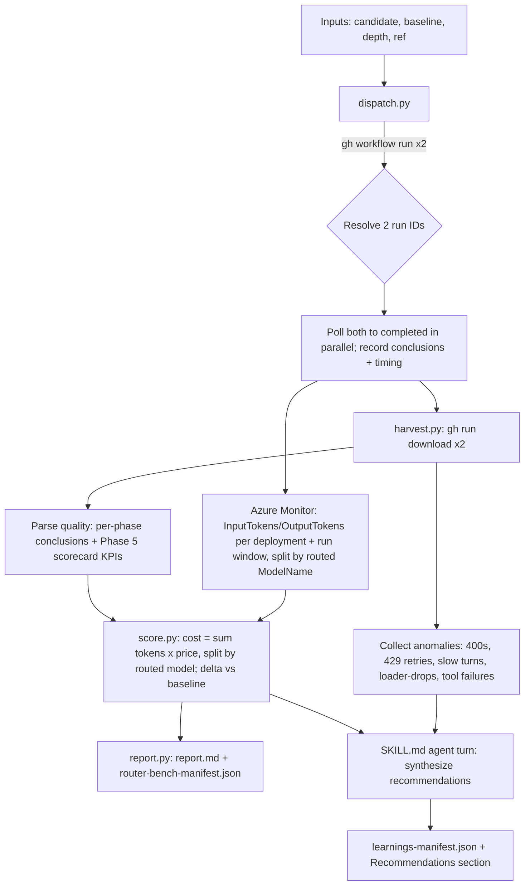

# threadlight-router-bench — Design Spec

- **Status:** Draft (awaiting user review)
- **Date:** 2026-06-30
- **Author:** brainstormed with Copilot CLI
- **Related work:** PR #59 (CI hotfix), `wire_api` workflow input (commit `a3a3bb9`), `.github/workflows/threadlight-e2e-foundry.yml`

## 1. Problem & motivation

Azure AI Foundry **model-router** auto-routes each request to the cheapest capable
underlying model. We empirically proved (this session) that the GitHub Copilot CLI
**can** drive a model-router deployment through the full Threadlight e2e pipeline —
but only over the **chat-completions** wire (`COPILOT_PROVIDER_WIRE_API=completions`);
its Responses v1 route returns `HTTP 400 "operation unsupported"`.

That unlocks three opportunities the team wants to capture:

1. **Customer-facing efficiency proof.** Show prospects that running our agentic
   pipeline on model-router costs materially less than a fixed standard model, *at
   equal-or-better quality*.
2. **Quality + cost comparison.** The efficiency claim is only credible if measured
   against a baseline (e.g. `gpt-5.4-mini`) on both **quality** and **token cost**.
3. **Self-improving cold-path.** An offline harvester that inspects the CI logs
   (especially the GitHub Copilot agent logs) for learnings and improvement points.

This spec designs **one offline, advisory skill** — `threadlight-router-bench` — that
delivers all three via two outputs: an **efficiency scorecard** (model-router vs
baseline) and a **learnings digest** (observations + recommendations).

### Non-goals (v1)

- Replacing `threadlight-evals` (we *read* its scorecard, not re-implement evals).
- Replacing `threadlight-consumption-iq` (that projects *resource/SKU* infra cost;
  this measures per-run *token* cost).
- Dashboards, scheduled automation, auto-PR of fixes, multi-baseline matrices —
  noted as Future Work.

## 2. Boundary with existing skills

| Concern | Owner | This skill |
|---|---|---|
| Offline batch quality evals, champion-challenger A/B gate | `threadlight-evals` | Reads its emitted scorecard/KPIs |
| Resource/SKU monthly infra cost projection | `threadlight-consumption-iq` | Out of scope; complementary |
| Prod CI/CD pipeline generation | `threadlight-cicd` | Out of scope |
| Per-run **token** cost + router efficiency + CI-log learnings | — (new) | **`threadlight-router-bench`** |

## 3. Decisions (locked during brainstorming)

| # | Decision | Choice |
|---|---|---|
| D1 | Shape | **One** offline skill, two outputs (efficiency scorecard + learnings digest) |
| D2 | Orchestration | **Orchestrator** — skill dispatches both e2e runs, polls, downloads, compares (with a consumer-only `analyze` subcommand as a bonus) |
| D3 | Quality axis | Reuse existing e2e per-phase pass/fail + Phase 5 govern/evals/redteam scorecard KPIs (no new model calls) |
| D4 | Learnings | Deterministic observations + **LLM-synthesized recommendations** + findings manifest |
| D5 | Build approach | Skill (`SKILL.md`) + **tested Python core** under `references/` |
| D6 | Baseline default | candidate = `model-router` / `wire_api=completions`; baseline = `gpt-5.4-mini` / `wire_api=responses` |

## 4. Architecture & components

New skill, advisory + cold-path (never in the hot CI path):

```
skills/threadlight-router-bench/
  SKILL.md                      # flow, when-to-use, guardrails, the recommendations prompt
  references/
    router_bench/
      __init__.py
      cli.py                    # `python -m router_bench` entrypoint (run / analyze / prices)
      dispatch.py               # gh workflow run x2 (router+baseline), resolve run IDs, poll, record run start/end windows
      harvest.py                # gh run download (phase logs + scorecard manifests + finding taxonomy); Azure Monitor token metrics per deployment+window
      metrics.py                # az monitor metrics list: InputTokens/OutputTokens by routed ModelName, scoped to deployment + run window (poll until stable)
      score.py                  # cost (tokens x price, split by routed model) + quality (pass/fail + KPI deltas) + verdict
      prices.py                 # maintained per-model $/1M-token table (+ provenance, last_validated); optional Retail Prices API refresh
      report.py                 # render router-bench-report.md + emit manifests
    tests/
      test_score.py
      test_metrics.py             # routed-model token aggregation + cost math against recorded metric JSON
      test_harvest.py
      test_findings.py
    fixtures/                   # captured real artifact bundle (from a full e2e run) for deterministic tests
  __init__.py
```

### Outputs (written to a caller-chosen `--out` dir)

- `router-bench-report.md` — human/Cx-facing efficiency + quality scorecard + learnings section.
- `router-bench-manifest.json` — structured cost/quality/routing data (machine-readable).
- `learnings-manifest.json` — findings + recommendations (the cold-path digest).

## 5. Data flow



### Flow notes

1. **Run-ID resolution:** `gh workflow run` does not return a run ID. `dispatch.py`
   records a pre-dispatch UTC timestamp, then polls `gh run list --json
   databaseId,event,headBranch,createdAt,status` for the newest `workflow_dispatch`
   run on the ref created after that timestamp (one per config). Retry until it
   appears (bounded).
2. **Serialized, not parallel:** because Azure Monitor token metrics have no run-id
   dimension, the two configs are isolated by `(deployment, time window)`. If both
   configs share a deployment, dispatch them **sequentially** so their windows don't
   overlap. (Default baseline `gpt-5.4-mini` and candidate `model-router` are
   *different* deployments, so those can overlap — but the orchestrator records each
   run's start/end window regardless and only widens to serialize when the two
   configs resolve to the **same** deployment.)
3. **Metric window capture:** `dispatch.py` records each run's first/last
   model-calling step timestamps (start of design phase → end of last invoked phase)
   as the `[start,end]` passed to `metrics.py`. Pad ±2 min for metric lag.
4. **Depth modes:** `smoke-paired` (~$0, ~3 min, plumbing/quality-gate parity only)
   and `full-paired` (~$2, the real efficiency proof). Depth just sets the `mode`
   input on both dispatches.
5. **teardown forced:** both dispatches always pass `teardown=true` — no leaked
   Azure resources.

## 6. Scoring model

### 6.1 Cost axis (deterministic) — Azure Monitor metrics

> **Empirically revised 2026-06-30.** The Copilot CLI does **not** expose token
> usage for BYO providers. Its `--output-format json` `usage` object contains only
> `premiumRequests` (0 for BYO), `totalApiDurationMs`, `sessionDurationMs`,
> `codeChanges`; the `copilot-logs` (`--log-level info`) and phase text logs carry
> no token counts; and the CLI reports `model: "model-router"`, never the routed
> sub-model. **The cost axis therefore comes from Azure Monitor, not the CLI.**

`harvest.py` queries **Azure Monitor metrics** on the Foundry/AOAI account for each
run's deployment over that run's start→end window:

- Metrics `InputTokens` and `OutputTokens`, aggregation `Total`.
- Filter `ModelDeploymentName eq '<deployment>' and ModelName eq '*'`.
- The **`ModelName`** dimension is the **routed underlying model** — distinct from
  `ModelDeploymentName`. This is what yields the routing mix for a single
  `model-router` deployment.

Verified query (today's run window) returned the routed-model split directly:

```
ModelDeploymentName='model-router', split by ModelName:
  InputTokens:  gpt-5.4 = 7,048,336 ; gpt-5.5 = 313,389
  OutputTokens: gpt-5.4 =   111,473 ; gpt-5.5 =  13,201
```

Cost = Σ over routed models `in[model]×price_in[model] + out[model]×price_out[model]`.

`prices.py` holds a maintained `$/1M-token` table (input + output) per model with
**provenance + `last_validated`** in-file. Default static (deterministic, auditable).
Optional `prices --refresh` cross-checks the Azure Retail Prices API.

**Attribution caveat.** Azure Monitor token metrics have no run-id dimension, so a run
is isolated by `(deployment, time window)`. On a **shared** CI account, two benches
hitting the same deployment concurrently would cross-contaminate. The orchestrator
therefore **serializes** benches on a given deployment and pads the query window to
the run's actual first/last model-call timestamps.

**RBAC.** Whoever runs the skill (CI federated identity or the human) needs
**Monitoring Reader** on the Foundry resource. Metrics lag ≈1–3 min, so `harvest.py`
polls the metric until it is non-zero / stable before scoring.

Three reported numbers (separate routing savings from token-volume noise):

1. **Actual $** — candidate total vs baseline total.
2. **Routing mix** — % of tokens and % of $ per routed model (the headline Cx story).
   Derived from the `ModelName` split; per-turn attribution is **not** available
   (the CLI exposes no per-turn token data for BYO), so the mix is token/$-weighted,
   not turn-weighted.
3. **Counterfactual** — candidate's *same token volume* priced at the baseline model,
   isolating "what routing alone saved."

### 6.2 Quality axis (reuses existing signals; no new model calls)

- **Phase parity:** for each phase (smoke, design, pattern, deploy, invoke, legs) did
  both runs pass? Candidate must be **≥** baseline.
- **Phase 5 KPIs:** parse the govern/evals/redteam scorecard manifest; diff KPI
  values candidate vs baseline where both present.
- **Latency (secondary):** per-phase wall time from step timing.

### 6.3 Verdict logic (explicit thresholds; serialized in manifest)

| Verdict | Condition |
|---|---|
| ✅ Efficiency win | phase-parity(candidate) ≥ baseline **and** cost(candidate) < cost(baseline) |
| ➖ Neutral | parity equal, cost within ±10% |
| ⚠️ Regression | candidate failed a phase the baseline passed, **or** a Phase-5 KPI regressed beyond tolerance (defined below) |

**KPI regression tolerance:** any pass/fail KPI that flips from pass (baseline) to
fail (candidate), **or** any scored/numeric KPI that drops more than **5%** relative
to baseline. The 5% (scored) threshold is configurable via `--kpi-tolerance`.

A **Regression** verdict makes the skill exit non-zero (advisory by default, but can
gate if wired).

### 6.4 `router-bench-manifest.json` (versioned)

```jsonc
{
  "schema_version": "1.0",
  "generated_at": "<iso8601>",
  "depth": "full-paired",
  "candidate": {
    "label": "model-router",
    "wire_api": "completions",
    "run_id": 0,
    "conclusion": "success",
    "phases": [{"name": "design", "passed": true, "wall_s": 0}],
    "tokens": {"input": 0, "output": 0},
    "cost_usd": 0.0,
    "routed_model_mix": [
      {"model": "gpt-5.4", "input": 0, "output": 0, "cost_usd": 0.0, "cost_pct": 0},
      {"model": "gpt-5.5", "input": 0, "output": 0, "cost_usd": 0.0, "cost_pct": 0},
      {"model": "gpt-5.4-mini", "input": 0, "output": 0, "cost_usd": 0.0, "cost_pct": 0}
    ]
  },
  "baseline": { "label": "gpt-5.4-mini", "wire_api": "responses", "...": "..." },
  "deltas": {
    "cost_usd": 0.0, "cost_pct": 0.0,
    "counterfactual_routing_savings_usd": 0.0,
    "phase_parity": "equal"
  },
  "verdict": "efficiency_win",
  "price_table_provenance": {"source": "static", "last_validated": "2026-06-30"}
}
```

## 7. Learnings digest

### 7.1 Observations (deterministic, evidence-linked)

`harvest.py` scans both runs' artifacts + step metadata against a **finding
taxonomy**. Each finding:

```jsonc
{ "id": "F-001", "category": "wire_protocol", "severity": "high",
  "run_id": 0, "phase": "smoke",
  "evidence": {"file": "copilot-logs/…", "line": 0, "excerpt": "HTTP 400 …"} }
```

Categories (initial): `wire_protocol` (e.g. 400 operation unsupported), `auth`
(401/403), `rate_limit` (429 / CAPIError exceeded rate limit), `retry` (phase retry
counts), `slow_turn` (> 720s "real work" boundary), `tool_failure`,
`skill_loader` (discovery anomalies / fallback-to-Read regression),
`router_fallback`, `deploy` (azd errors), `quota`.

### 7.2 Recommendations (LLM, prompted by SKILL.md)

The agent receives the **structured findings + cost/quality deltas** (not raw logs —
grounded and cheap) and synthesizes concrete, actionable recommendations. Each
recommendation cites the finding IDs that motivated it.

Examples this session would have produced: *"model-router requires
`wire_api=completions`"*, *"raise gpt-5.4-mini deployment capacity"*, *"bump
agent-framework pin floor"*.

### 7.3 Self-improving loop (lightweight)

`learnings-manifest.json` files are timestamped and accumulate. A finding signature
recurring across N runs is flagged `persistent — prioritize`; a recommendation may
cite that flag to escalate. **No auto-apply** (recommendations only, per D4).

### 7.4 `learnings-manifest.json`

```jsonc
{ "schema_version": "1.0", "generated_at": "<iso8601>",
  "run_ids": [0, 0],
  "findings": [ /* §7.1 */ ],
  "recommendations": [
    {"id": "R-001", "text": "…", "motivated_by": ["F-001"], "persistent": false}
  ] }
```

## 8. CLI surface & SKILL.md

`python -m router_bench …` (wrapped by `SKILL.md`):

- `run` — orchestrator:
  `--candidate model-router:completions --baseline gpt-5.4-mini:responses
   --depth full-paired|smoke-paired --ref <branch> --out <dir>`
- `analyze` — consumer-only: `--candidate-run <id> --baseline-run <id> --out <dir>`
  (same pipeline minus dispatch; re-score historical runs for free).
- `prices --refresh` — validate/refresh the price table.

`SKILL.md` covers: when-to-use triggers (router efficiency proof; CI cold-path
learnings; router-vs-baseline), orchestration steps, the recommendations agent turn,
output locations. Guardrails: cost/time warning before `full-paired`;
`teardown=true` forced on both dispatches; advisory-only by default.

## 9. Testing

pytest under `references/tests` (mirrors `threadlight_quickstart`):

- `test_score.py` — cost math + verdict logic on fixture token data (deterministic).
- `test_metrics.py` — routed-model token aggregation + cost rollup against a recorded
  `az monitor metrics list` JSON (the gpt-5.4 + gpt-5.5 split); no network.
- `test_harvest.py` — phase-log/scorecard-manifest parsing against the captured real
  fixture bundle (`threadlight-e2e-28437323962`).
- `test_findings.py` — taxonomy classification on synthetic signatures (400, 429,
  loader-drop).

No network in tests (fixtures only). Dispatch/poll is integration-only (mocked in
unit tests).

## 10. Error handling & guards

- **Dispatch:** fail fast if `gh` unauthed or workflow/ref invalid; bounded run-ID
  resolution with timeout.
- **Poll:** overall timeout (default 90 min) → partial report + clear error.
- **Harvest:** if a run failed early, parse what exists; mark missing phases.
- **Cost-axis (Azure Monitor):** primary source is `InputTokens`/`OutputTokens`
  metrics split by routed `ModelName` (§6.1). Guards: (a) require **Monitoring
  Reader** on the Foundry resource — fail fast with a clear RBAC message if the
  metric query 403s; (b) poll the metric until non-zero / stable (≈1–3 min lag),
  bounded; (c) if metrics are still empty after the bound, fall back to **Azure Cost
  Management** actuals scoped to each run's RG/time-window, flagged "estimated"; (d)
  validate against the captured real artifact bundle + a recorded metric JSON fixture
  before `score.py` ships.
- **Price staleness:** warn if `last_validated` older than a threshold.

## 11. Open items (resolve during implementation)

> **Items 1 & 2 were resolved empirically on 2026-06-30** (a full e2e run +
> artifact-bundle inspection). Recorded here as settled findings.

1. **Cost-axis source — RESOLVED.** The Copilot CLI exposes **no** token usage for
   BYO providers (verified: `result.usage` has only `premiumRequests`/durations/
   `codeChanges`; `copilot-logs` and phase logs carry no token counts). Cost axis
   uses **Azure Monitor** `InputTokens`/`OutputTokens` metrics instead (§6.1). The
   captured bundle (`threadlight-e2e-28437323962`) is the harvest/quality test
   fixture.
2. **Routed-model visibility — RESOLVED.** The CLI reports `model: "model-router"`
   only. The routed underlying model comes from the Azure Monitor **`ModelName`**
   metric dimension (verified split: gpt-5.4 + gpt-5.5 for this workload). A recorded
   `az monitor metrics list` JSON becomes the `test_metrics.py` fixture.
3. **Empirical routing insight (motivation, not open):** for the hard agentic e2e
   workload model-router routed almost entirely to **gpt-5.4** (7.05M in / 111K out)
   and **gpt-5.5** (313K in / 13K out) — **zero** to gpt-5.4-mini. So "efficiency" is
   per-turn right-sizing (it *will* pick premium models for hard tasks), not blanket
   savings; the bench must measure **actual $**, never assume the router is cheaper.
4. **Price table seeding (open):** initial `$/1M-token` values + provenance for the
   models the router actually routes to — **gpt-5.4, gpt-5.5, gpt-5.4-mini** (not the
   earlier gpt-4.1-* placeholders) plus the baseline.
5. **Skill name:** `threadlight-router-bench` is provisional.

## 12. Future work (explicitly deferred)

- Scheduled automation (nightly bench) + trend dashboards.
- Auto-file recommendations as GitHub issues / auto-PR fixes.
- Multi-baseline matrices (router vs several fixed models).
- Wiring the regression verdict as a hard CI gate.
