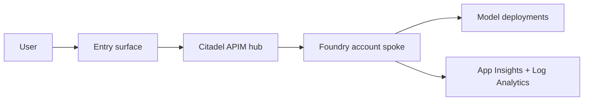

# Production-Readiness Report

*Generated by `threadlight-production-ready` v0.8.0 at 2026-07-07T13:13:36Z*

## 1. Executive summary

- **Go-live recommendation:** 🔴 NOT READY
- **Raw score:** 31%   **With waivers:** 31%
- **Verification coverage:** 81/157 checks verified (51%) — the rest are `not-verified`
- **Evidence confidence:** MEDIUM — `HIGH` ≥80%, `MEDIUM` 50–79%, `LOW` <50%. See Appendix for permission-tier breakdown.
- **Resolved posture:** `citadel-spoke` (declared: `unset`, detected: `citadel-spoke`)
- **Mode:** static   **AGT profile:** none
- **Would fail a hard gate?** YES
- **Not-verified findings:** 76 (live probes that could not run — see Appendix)
- **Verification debt:** 58 not-verified findings (top pillars: sre-handover=9, secrets=7, supply-chain=7). `not-verified` no longer earns partial score credit in v0.3.0.

**Top gaps:**
- ❌ `COST-001` (cost) — SPEC sec 10 declares pricing plan (PAYG vs PTU). SPEC sec 10 (Cost) missing — pricing plan undocumented
- ❌ `EVAL-001` (continuous-evals) — SPEC sec 9 declares eval scenarios. SPEC sec 9 missing — no eval scenarios declared
- ❌ `EVAL-002` (continuous-evals) — evals/ folder with foundry-evals run files. No evals/ folder with eval files
- ❌ `HITL-002` (hitl-audit) — HITL gate implementations referenced in src/. SPEC declares HITL but no implementation in src/
- ❌ `HITL-003` (hitl-audit) — Audit trail destination configured. No durable storage for audit trail in infra

## 2. Posture diagram

## 3. Hard-gate preview

❌ **Would fail a hard gate.** 18 must-fix finding(s):

- `NET-001` (network-posture): infra references network module
- `IAM-002` (identity-access): User-assigned managed identity declared in Bicep
- `SEC-001` (secrets): Key Vault declared in infra
- `SEC-005` (secrets): Bicep declares soft-delete + purge protection
- `OBS-001` (observability): App Insights declared in infra
- `OBS-002` (observability): Log Analytics workspace declared
- `EVAL-001` (continuous-evals): SPEC sec 9 declares eval scenarios
- `EVAL-002` (continuous-evals): evals/ folder with foundry-evals run files
- `RAI-001` (responsible-ai): Content filters declared on model deployments
- `HITL-002` (hitl-audit): HITL gate implementations referenced in src/
- `HITL-003` (hitl-audit): Audit trail destination configured
- `SUP-001` (supply-chain): Container images pinned by digest
- `COST-001` (cost): SPEC sec 10 declares pricing plan (PAYG vs PTU)
- `REL-001` (reliability): SPEC sec 12 declares RTO / RPO
- `REL-003` (reliability): Backup / restore runbook present
- `REL-007` (reliability): Restore drill artefact present and dated within 90 days
- `SRE-001` (sre-handover): SPEC sec 12 names incident owner / on-call
- `SRE-002` (sre-handover): Runbook present in docs/

## 4. Pillar scorecard

| Pillar | Status (with waivers) | Status (raw) | Raw % | With waivers % |
|---|---|---|---|---|
| 1. Network posture | 🔴 red | 🔴 red | 16% | 16% |
| 2. Agent governance (AGT) | 🟡 amber | 🟡 amber | 71% | 71% |
| 3. Identity and access | 🔴 red | 🔴 red | 29% | 29% |
| 4. Secrets | 🔴 red | 🔴 red | 19% | 19% |
| 5. Observability | 🔴 red | 🔴 red | 23% | 23% |
| 6. Continuous evals | 🔴 red | 🔴 red | 50% | 50% |
| 7. Responsible AI | 🔴 red | 🔴 red | 60% | 60% |
| 8. HITL and audit | 🔴 red | 🔴 red | 32% | 32% |
| 9. Supply chain | 🔴 red | 🔴 red | 26% | 26% |
| 10. Cost | 🔴 red | 🔴 red | 21% | 21% |
| 11. Reliability | 🔴 red | 🔴 red | 8% | 8% |
| 12. SRE handover | 🔴 red | 🔴 red | 5% | 5% |
| 13. Model lifecycle | 🟡 amber | 🟡 amber | 43% | 43% |

## 5. Pillar deep-dives

### 1. Network posture

| Finding | Severity | Status | Detail |
|---|---|---|---|
| `NET-001` | must-fix | ❌ must-fix | No Microsoft.Network/virtualNetworks resource declared in compiled ARM (comments don't count) |
| `NET-002` | must-fix | ✅ pass | 1 privateEndpoints declared in compiled ARM |
| `NET-003` | must-fix | ⚠️ should-fix | publicNetworkAccess not explicitly set on 1/1 AI/Foundry accounts |
| `NET-004` | should-fix | ⚠️ should-fix | No subnet delegation found on any declared VNet (and no ACA env / App Service plan that would require one) |
| `NET-101` | must-fix | ❓ not-verified | Skipped — running in --static mode (tier: T1 Reader) |
| `NET-102` | must-fix | ❓ not-verified | Skipped — running in --static mode (tier: T1 Reader) |
| `NET-103` | should-fix | ❓ not-verified | Skipped — running in --static mode (tier: T1 Reader) |
| `NET-501` | must-fix | ❓ not-verified | Skipped — running in --static mode (tier: T5 APIM Service Reader on hub) |
| `NET-502` | must-fix | ❓ not-verified | Skipped — running in --static mode (tier: T5 APIM Service Reader on hub) |
| `NET-503` | should-fix | ❓ not-verified | Skipped — running in --static mode (tier: T5 APIM Service Reader on hub) |
| `POS-001` | should-fix | ❓ not-verified | Skipped — running in --static mode (tier: T1 Reader) |

### 2. Agent governance (AGT)

| Finding | Severity | Status | Detail |
|---|---|---|---|
| `AGT-001` | must-fix | ❓ not-verified | threadlight-govern manifest (verdict: partial, 0.0d old): middleware_wired_at_boundary=not-verified |
| `AGT-002` | must-fix | ✅ pass | threadlight-govern manifest (verdict: partial, 0.0d old): policy_artefact_present=pass |
| `AGT-003` | should-fix | ✅ pass | threadlight-govern manifest (verdict: partial, 0.0d old): asi_reference_present=pass |
| `AGT-004` | should-fix | ✅ pass | threadlight-govern manifest (verdict: partial, 0.0d old): policy_versioned=pass |
| `AGT-005` | must-fix | ✅ pass | threadlight-govern manifest (verdict: partial, 0.0d old): rai_policy_present=pass |
| `AGT-006` | should-fix | ✅ pass | Telemetry sink wired |
| `AGT-101` | should-fix | ❓ not-verified | Skipped — running in --static mode (tier: T1 Reader) |
| `AGT-102` | should-fix | ❓ not-verified | Skipped — running in --static mode (tier: T2 Monitoring + LA Reader) |

### 3. Identity and access

| Finding | Severity | Status | Detail |
|---|---|---|---|
| `IAM-001` | must-fix | ✅ pass | No literal client secrets in src/ |
| `IAM-002` | must-fix | ❌ must-fix | No Microsoft.ManagedIdentity/userAssignedIdentities resource in compiled ARM (comments don't count) |
| `IAM-003` | must-fix | ✅ pass | RBAC declared and not at subscription scope |
| `IAM-004` | should-fix | ✅ pass | No SAS token usage detected |
| `IAM-005` | should-fix | ⚠️ should-fix | No EasyAuth / authConfigs on declared compute (ACA / Web sites) in compiled ARM |
| `IAM-006` | must-fix | ❓ not-verified | agent_identity producer unavailable |
| `IAM-007` | should-fix | ❓ not-verified | agent_identity producer unavailable |
| `IAM-008` | must-fix | ❓ not-verified | agent_identity producer unavailable |
| `IAM-009` | should-fix | ❓ not-verified | agent_identity producer unavailable |
| `IAM-101` | must-fix | ❓ not-verified | Skipped — running in --static mode (tier: T1 Reader) |
| `IAM-102` | must-fix | ❓ not-verified | Skipped — running in --static mode (tier: T1 Reader) |
| `IAM-103` | should-fix | ❓ not-verified | Skipped — running in --static mode (tier: T1 Reader) |

### 4. Secrets

| Finding | Severity | Status | Detail |
|---|---|---|---|
| `SEC-001` | must-fix | ❌ must-fix | No Microsoft.KeyVault/vaults resource declared in compiled ARM |
| `SEC-002` | must-fix | ✅ pass | No literal secrets in repo |
| `SEC-003` | must-fix | ⚠️ should-fix | No Key Vault references detected — settings may use raw values |
| `SEC-004` | should-fix | ⚠️ should-fix | No secret rotation policy in SPEC |
| `SEC-005` | must-fix | ❌ must-fix | No Key Vault declared in compiled ARM — cannot check soft-delete/purge |
| `SEC-006` | should-fix | ⚠️ should-fix | No Key Vault declared in compiled ARM — cannot check enableRbacAuthorization |
| `SEC-007` | must-fix | ✅ pass | No secrets in committed .azure envs |
| `SEC-101` | must-fix | ❓ not-verified | Skipped — running in --static mode (tier: T4 Key Vault Reader (control plane)) |
| `SEC-102` | must-fix | ❓ not-verified | Skipped — running in --static mode (tier: T4 Key Vault Reader (control plane)) |
| `SEC-103` | must-fix | ❓ not-verified | Skipped — running in --static mode (tier: T4 Key Vault Reader (control plane)) |
| `SEC-104` | should-fix | ❓ not-verified | Skipped — running in --static mode (tier: T4 Key Vault Reader (control plane)) |
| `SEC-105` | should-fix | ❓ not-verified | Skipped — running in --static mode (tier: T4 Key Vault Reader (control plane)) |
| `SEC-106` | should-fix | ❓ not-verified | Skipped — running in --static mode (tier: T4 Key Vault Reader (control plane)) |
| `GOV-102` | should-fix | ❓ not-verified | Skipped — running in --static mode (tier: T1 Reader) |

### 5. Observability

| Finding | Severity | Status | Detail |
|---|---|---|---|
| `OBS-001` | must-fix | ❌ must-fix | No Microsoft.Insights/components resource declared in compiled ARM |
| `OBS-002` | must-fix | ❌ must-fix | No Microsoft.OperationalInsights/workspaces resource declared in compiled ARM |
| `OBS-003` | must-fix | ✅ pass | OTel SDK wired in src/ |
| `OBS-004` | should-fix | ✅ pass | Foundry observability emit wired |
| `OBS-005` | should-fix | ⚠️ should-fix | No workbook scaffold found |
| `KPI-001` | should-fix | ⚠️ should-fix | Outcome KPI baseline(s) not declared: cost-per-interaction, success-rate. Declare target latency, cost-per-interaction, and success-rate so deviation can be measured. |
| `KPI-002` | should-fix | ⚠️ should-fix | No deviation alert wired for a KPI baseline — add a metric/log alert on latency, cost-per-interaction, or success-rate drift (see recipe KPI-002). |
| `KPI-003` | should-fix | ⚠️ should-fix | Partial outcome scorecard (traces present). Join all three (eval pass-rate + cost-per-interaction + traces) for a measurable outcome view. |
| `OBS-101` | must-fix | ❓ not-verified | Skipped — running in --static mode (tier: T1 Reader) |
| `OBS-102` | must-fix | ❓ not-verified | Skipped — running in --static mode (tier: T2 Monitoring + LA Reader) |
| `OBS-103` | should-fix | ❓ not-verified | Skipped — running in --static mode (tier: T2 Monitoring + LA Reader) |
| `OBS-104` | must-fix | ❓ not-verified | Skipped — running in --static mode (tier: T1 Reader) |
| `OBS-105` | must-fix | ❓ not-verified | Skipped — running in --static mode (tier: T1 Reader) |
| `OBS-106` | must-fix | ❓ not-verified | Skipped — running in --static mode (tier: T1 Reader) |

### 6. Continuous evals

| Finding | Severity | Status | Detail |
|---|---|---|---|
| `EVAL-001` | must-fix | ❌ must-fix | SPEC sec 9 missing — no eval scenarios declared |
| `EVAL-002` | must-fix | ❌ must-fix | No evals/ folder with eval files |
| `EVAL-003` | must-fix | ✅ pass | Eval scheduling plan referenced |
| `EVAL-004` | should-fix | ✅ pass | Eval thresholds present |
| `EVAL-005` | should-fix | ✅ pass | Grader strategy named |
| `EVAL-006` | should-fix | ✅ pass | Dataset versioning hinted |
| `EVAL-101` | must-fix | ❓ not-verified | Skipped — running in --static mode (tier: T2 Monitoring + LA Reader) |
| `EVAL-102` | must-fix | ❓ not-verified | Skipped — running in --static mode (tier: T2 Monitoring + LA Reader) |
| `EVAL-103` | should-fix | ❓ not-verified | Skipped — running in --static mode (tier: T2 Monitoring + LA Reader) |
| `EVAL-104` | should-fix | ❓ not-verified | Skipped — running in --static mode (tier: T1 Reader) |
| `EVAL-105` | should-fix | ❓ not-verified | Skipped — running in --static mode (tier: T2 Monitoring + LA Reader) |

### 7. Responsible AI

| Finding | Severity | Status | Detail |
|---|---|---|---|
| `RAI-001` | must-fix | ❌ must-fix | 1 model deployment(s) declared but 1 have no raiPolicyName and no raiPolicies child resource present |
| `RAI-002` | must-fix | ✅ pass | threadlight-govern manifest: rai_policy_present=pass |
| `RAI-003` | must-fix | ✅ pass | threadlight-govern manifest: RAI block declares prompt shields |
| `RAI-004` | should-fix | ✅ pass | PII redaction strategy documented |
| `RAI-005` | should-fix | ⚠️ should-fix | No groundedness check planned |
| `RAI-006` | should-fix | ✅ pass | RAI/incident owner named in SPEC |
| `RAI-101` | must-fix | ❓ not-verified | Skipped — running in --static mode (tier: T1 Reader) |
| `RAI-102` | should-fix | ❓ not-verified | Skipped — running in --static mode (tier: T2 Monitoring + LA Reader) |

### 8. HITL and audit

| Finding | Severity | Status | Detail |
|---|---|---|---|
| `HITL-001` | should-fix | ✅ pass | SPEC sec 8 (HITL) present |
| `HITL-002` | must-fix | ❌ must-fix | SPEC declares HITL but no implementation in src/ |
| `HITL-003` | must-fix | ❌ must-fix | No durable storage for audit trail in infra |
| `HITL-004` | should-fix | ✅ pass | Escalation channel referenced |
| `HITL-005` | should-fix | ⚠️ should-fix | No HITL decision SLA documented |
| `HITL-101` | must-fix | ❓ not-verified | Skipped — running in --static mode (tier: T1 Reader) |
| `HITL-102` | should-fix | ❓ not-verified | Skipped — running in --static mode (tier: T1 Reader) |
| `HITL-103` | should-fix | ❓ not-verified | Skipped — running in --static mode (tier: T2 Monitoring + LA Reader) |

### 9. Supply chain

| Finding | Severity | Status | Detail |
|---|---|---|---|
| `SUP-001` | must-fix | ❌ must-fix | :latest tags found and no digest pins — prod images must be pinned |
| `SUP-002` | must-fix | ✅ pass | No floating bicep module refs |
| `SUP-003` | must-fix | ✅ pass | Dependency manifest / lock present |
| `SUP-004` | should-fix | ⚠️ should-fix | No SBOM generation step documented |
| `SUP-005` | should-fix | ⚠️ should-fix | No vulnerability scan step documented |
| `SUP-006` | should-fix | ⚠️ should-fix | 1/1 ACR(s) NOT declared publicNetworkAccess=Disabled |
| `SUP-007` | should-fix | ⚠️ should-fix | No provenance/attestation documented |
| `SUP-008` | should-fix | ✅ pass | No force-published skill/tool commands in committed automation |
| `SUP-009` | should-fix | ⚠️ should-fix | Agent skills/tools referenced but no pinned version declared — pin an immutable SkillVersion / toolbox version for production and promote default_version in a staged rollout |
| `SUP-010` | must-fix | ❓ not-verified | mcp_sbom producer unavailable |
| `SUP-011` | should-fix | ❓ not-verified | mcp_sbom producer unavailable |
| `SUP-012` | must-fix | ❓ not-verified | mcp_sbom producer unavailable |
| `SUP-013` | must-fix | ❓ not-verified | mcp_sbom producer unavailable |
| `SUP-101` | must-fix | ❓ not-verified | Skipped — running in --static mode (tier: T1 Reader) |
| `SUP-102` | should-fix | ❓ not-verified | Skipped — running in --static mode (tier: T1 Reader) |
| `SUP-103` | should-fix | ❓ not-verified | Skipped — running in --static mode (tier: T1 Reader) |
| `GOV-103` | should-fix | ❓ not-verified | Skipped — running in --static mode (tier: T1 Reader) |

### 10. Cost

| Finding | Severity | Status | Detail |
|---|---|---|---|
| `COST-001` | must-fix | ❌ must-fix | SPEC sec 10 (Cost) missing — pricing plan undocumented |
| `COST-002` | must-fix | ✅ pass | Budget threshold(s) referenced |
| `COST-003` | should-fix | ⚠️ should-fix | No cost owner named in SPEC |
| `COST-004` | should-fix | ⚠️ should-fix | No scale-to-zero / idle scale-down in compute |
| `COST-005` | should-fix | ⚠️ should-fix | docs/cost-projection.md missing — run threadlight-consumption-iq to generate |
| `COST-006` | should-fix | ❓ not-verified | Run threadlight-consumption-iq to populate cost-manifest.json before scoring COST-006. |
| `COST-101` | must-fix | ❓ not-verified | Skipped — running in --static mode (tier: T3 Cost Management Reader) |
| `COST-102` | should-fix | ❓ not-verified | Skipped — running in --static mode (tier: T3 Cost Management Reader) |
| `COST-103` | should-fix | ❓ not-verified | Skipped — running in --static mode (tier: T3 Cost Management Reader) |
| `COST-104` | should-fix | ❓ not-verified | Skipped — running in --static mode (tier: T3 Cost Management Reader) |
| `COST-105` | should-fix | ❓ not-verified | Skipped — running in --static mode (tier: T3 Cost Management Reader) |

### 11. Reliability

| Finding | Severity | Status | Detail |
|---|---|---|---|
| `REL-001` | must-fix | ❌ must-fix | SPEC sec 12 missing RTO/RPO |
| `REL-002` | must-fix | ⚠️ should-fix | Single-region acceptable for declared RTO |
| `REL-003` | must-fix | ❌ must-fix | No backup/restore documented |
| `REL-004` | should-fix | ⚠️ should-fix | No capacity host lifecycle plan |
| `REL-005` | should-fix | ⚠️ should-fix | No failure modes catalogued |
| `REL-006` | should-fix | ⚪ not-applicable | No ACA or Web Sites declared in compiled ARM — no probes to configure |
| `REL-007` | must-fix | ❌ must-fix | No restore-drill artefact found under docs/, evidence/. Run `azqr restore-drill` (or your equivalent) and commit the report. |
| `REL-101` | should-fix | ❓ not-verified | Skipped — running in --static mode (tier: T1 Reader) |
| `REL-102` | must-fix | ❓ not-verified | Skipped — running in --static mode (tier: T1 Reader) |
| `REL-103` | should-fix | ❓ not-verified | Skipped — running in --static mode (tier: T1 Reader) |
| `REL-104` | should-fix | ❓ not-verified | Skipped — running in --static mode (tier: T1 Reader) |
| `REL-105` | should-fix | ❓ not-verified | Skipped — running in --static mode (tier: T1 Reader) |
| `REL-008` | should-fix | ❓ not-verified | Skipped — running in --static mode (tier: T1 Reader) |

### 12. SRE handover

| Finding | Severity | Status | Detail |
|---|---|---|---|
| `SRE-001` | must-fix | ❌ must-fix | SPEC sec 12 missing incident_owner |
| `SRE-002` | must-fix | ❌ must-fix | No runbook found in docs/ |
| `SRE-003` | should-fix | ⚠️ should-fix | No SRE Agent integration considered — see azure-sre-agent skill |
| `SRE-004` | should-fix | ⚠️ should-fix | No severity matrix documented |
| `SRE-005` | should-fix | ⚠️ should-fix | No postmortem template referenced |
| `SRE-101` | must-fix | ❓ not-verified | Skipped — running in --static mode (tier: T1 Reader) |
| `SRE-102` | should-fix | ❓ not-verified | Skipped — running in --static mode (tier: T1 Reader) |
| `SRE-103` | must-fix | ❓ not-verified | Skipped — running in --static mode (tier: T1 Reader) |
| `SRE-104` | should-fix | ❓ not-verified | Skipped — running in --static mode (tier: T1 Reader) |
| `GOV-104` | should-fix | ❓ not-verified | Skipped — running in --static mode (tier: T1 Reader) |
| `GOV-105` | informational | ❓ not-verified | Skipped — running in --static mode (tier: T1 Reader) |
| `GOV-201` | must-fix | ❓ not-verified | Skipped — running in --static mode (tier: T1 Reader) |
| `GOV-202` | should-fix | ❓ not-verified | Skipped — running in --static mode (tier: T1 Reader) |
| `GOV-203` | should-fix | ❓ not-verified | Skipped — running in --static mode (tier: T1 Reader) |

### 13. Model lifecycle

| Finding | Severity | Status | Detail |
|---|---|---|---|
| `MDL-001` | must-fix | ✅ pass | All 1 model deployment(s) pinned: [] |
| `MDL-002` | should-fix | ⚠️ should-fix | No deprecation plan mentioned |
| `MDL-003` | should-fix | ✅ pass | Upgrade canary/blue-green referenced |
| `MDL-004` | must-fix | ✅ pass | Capacity/quota considered in SPEC |
| `MDL-005` | should-fix | ✅ pass | Fallback model strategy referenced |
| `MDL-006` | should-fix | ⚠️ should-fix | No rate-limit / 429 handling detected |
| `MDL-007` | should-fix | ✅ pass | Residency / region policy mentioned |
| `MDL-008` | should-fix | ⚠️ should-fix | No knowledge index refresh cadence |
| `MDL-009` | should-fix | ✅ pass | 1 role assignment(s) scoped to Foundry accounts/projects |
| `MDL-010` | should-fix | ⚪ not-applicable | No Microsoft.Search/searchServices declared — no knowledge index to protect |
| `MDL-011` | should-fix | ⚠️ should-fix | No agent thread retention/policy mentioned in SPEC or docs |
| `MDL-101` | must-fix | ❓ not-verified | Skipped — running in --static mode (tier: T1 Reader) |
| `MDL-102` | should-fix | ❓ not-verified | Skipped — running in --static mode (tier: T1 Reader) |
| `MDL-103` | should-fix | ❓ not-verified | Skipped — running in --static mode (tier: T1 Reader) |
| `MDL-104` | should-fix | ❓ not-verified | Skipped — running in --static mode (tier: T2 Monitoring + LA Reader) |
| `MDL-110` | must-fix | ❓ not-verified | Skipped — running in --static mode (tier: T1 Reader) |
| `MDL-111` | should-fix | ❓ not-verified | Skipped — running in --static mode (tier: T1 Reader) |
| `GOV-101` | should-fix | ❓ not-verified | Skipped — running in --static mode (tier: T1 Reader) |

## 6. Uplift plan (suggested order)

1. **COST-001** — SPEC sec 10 declares pricing plan (PAYG vs PTU). See: `paygo-ptu-cost-analyzer`
2. **EVAL-001** — SPEC sec 9 declares eval scenarios. See: `foundry-evals`
3. **EVAL-002** — evals/ folder with foundry-evals run files. See: `foundry-evals`
4. **HITL-002** — HITL gate implementations referenced in src/. See: `threadlight-hitl-patterns`
5. **HITL-003** — Audit trail destination configured. See: `threadlight-hitl-patterns`
6. **IAM-002** — User-assigned managed identity declared in Bicep. See: `foundry-hosted-agents`, `azure-tenant-isolation`
7. **NET-001** — infra references network module. See: `citadel-spoke-onboarding`, `foundry-vnet-deploy`, `foundry-network-runbook`
8. **OBS-001** — App Insights declared in infra. See: `foundry-observability`
9. **OBS-002** — Log Analytics workspace declared. See: `foundry-observability`
10. **RAI-001** — Content filters declared on model deployments. See: `foundry-agt`
11. **REL-001** — SPEC sec 12 declares RTO / RPO. See: `foundry-vnet-deploy`, `foundry-caphost-lifecycle`
12. **REL-003** — Backup / restore runbook present. See: `foundry-vnet-deploy`, `foundry-caphost-lifecycle`
13. **REL-007** — Restore drill artefact present and dated within 90 days. See: `foundry-vnet-deploy`, `foundry-caphost-lifecycle`
14. **SEC-001** — Key Vault declared in infra. See: `azd-patterns`
15. **SEC-005** — Bicep declares soft-delete + purge protection. See: `azd-patterns`
16. **SRE-001** — SPEC sec 12 names incident owner / on-call. See: `azure-sre-agent` (recipe: `threadlight-pilot-handover`)
17. **SRE-002** — Runbook present in docs/. See: `azure-sre-agent` (recipe: `threadlight-pilot-handover`)
18. **SUP-001** — Container images pinned by digest. See: `azd-patterns`
19. **COST-003** — Cost owner documented. See: `paygo-ptu-cost-analyzer`
20. **COST-004** — Idle scale-down configured for ACA / Functions. See: `paygo-ptu-cost-analyzer`
21. **COST-005** — Cost-projection artefact present and fresh (docs/cost-projection.md + specs/cost-manifest.json). See: `paygo-ptu-cost-analyzer`
22. **HITL-005** — HITL decision SLA documented. See: `threadlight-hitl-patterns`
23. **IAM-005** — ACA / Functions auth enabled. See: `foundry-hosted-agents`, `azure-tenant-isolation`
24. **KPI-001** — Outcome KPI baselines declared (latency, cost/interaction, success-rate). See: `foundry-observability`
25. **KPI-002** — Deviation alert wired for an outcome KPI baseline. See: `foundry-observability`
26. **KPI-003** — Outcome scorecard joins eval pass-rate + cost/interaction + traces. See: `foundry-observability`
27. **MDL-002** — Deprecation plan referenced in SPEC. See: `foundry-skill-catalog`, `foundry-evals`
28. **MDL-006** — Rate limit handling in code. See: `foundry-skill-catalog`, `foundry-evals`
29. **MDL-008** — Knowledge index refresh cadence declared. See: `foundry-skill-catalog`, `foundry-evals`
30. **MDL-011** — Agent thread retention/policy declared in SPEC. See: `foundry-skill-catalog`, `foundry-evals`
31. **NET-003** — Public network access disabled on AI services. See: `citadel-spoke-onboarding`, `foundry-vnet-deploy`, `foundry-network-runbook`
32. **NET-004** — Subnet delegation correct for ACA / Functions. See: `citadel-spoke-onboarding`, `foundry-vnet-deploy`, `foundry-network-runbook`
33. **OBS-005** — Workbook scaffold present. See: `foundry-observability`
34. **RAI-005** — Groundedness check planned for RAG. See: `foundry-agt`
35. **REL-002** — Multi-region plan documented if RTO < 4h. See: `foundry-vnet-deploy`, `foundry-caphost-lifecycle`
36. **REL-004** — Capacity host lifecycle understood. See: `foundry-vnet-deploy`, `foundry-caphost-lifecycle`
37. **REL-005** — Failure modes catalogued in SPEC. See: `foundry-vnet-deploy`, `foundry-caphost-lifecycle`
38. **SEC-003** — appsettings reference KV references, not raw values. See: `azd-patterns`
39. **SEC-004** — Secret rotation policy documented in SPEC. See: `azd-patterns`
40. **SEC-006** — RBAC (not access policies) on Key Vault. See: `azd-patterns`
41. **SRE-003** — Azure SRE Agent integration considered. See: `azure-sre-agent` (recipe: `threadlight-pilot-handover`)
42. **SRE-004** — Severity matrix documented. See: `azure-sre-agent` (recipe: `threadlight-pilot-handover`)
43. **SRE-005** — Postmortem template referenced. See: `azure-sre-agent` (recipe: `threadlight-pilot-handover`)
44. **SUP-004** — SBOM generation step declared. See: `azd-patterns`
45. **SUP-005** — Vulnerability scan step declared. See: `azd-patterns`
46. **SUP-006** — ACR scoped to private network. See: `azd-patterns`
47. **SUP-007** — Provenance / attestation considered. See: `azd-patterns`
48. **SUP-009** — Agent skills/tools pinned to a version for production. See: `azd-patterns`

## 7. Cost projection

_v1: high-level reminders only. For deep PAYG vs PTU analysis, run `paygo-ptu-cost-analyzer`._

- Pricing plan declared in SPEC § 10: no
- Budget alerts wired: no / not-verified

## 8. Outcome KPI scorecard

Joins the three signals CAF asks teams to measure as a real outcome (eval quality + unit cost + live telemetry):

| KPI signal | Value | Source |
|---|---|---|
| Eval pass-rate | not-verified | `specs/evals-manifest.json` (threadlight-evals) |
| Cost-per-interaction | not-verified | `specs/cost-manifest.json` (threadlight-consumption-iq) |
| Traces emitting | ✅ yes | foundry-observability / OTel wiring |

| Baseline declared | Status |
|---|---|
| Latency | ✅ yes |
| Cost-per-interaction | ⚠️ no |
| Success-rate | ⚠️ no |
| Deviation alert wired | ⚠️ no |

_Scored as `KPI-001` (baselines), `KPI-002` (deviation alert), `KPI-003` (scorecard joinable) under pillar 5. Run `foundry-evals` and paste eval thresholds into SPEC § 9._

## 9. Residual risk, RACI, rollout / rollback / cutover

### Residual risk register

_No waivers accepted._

### RACI (template — fill before go-live)

| Activity | Responsible | Accountable | Consulted | Informed |
|---|---|---|---|---|
| Deploy / cutover | _TBD_ | _TBD_ | _TBD_ | _TBD_ |
| Incident response | _TBD_ | _TBD_ | _TBD_ | _TBD_ |
| Eval failures | _TBD_ | _TBD_ | _TBD_ | _TBD_ |
| Cost variance | _TBD_ | _TBD_ | _TBD_ | _TBD_ |

### Rollout / rollback / cutover (template)

1. **Rollout window:** _e.g. T0+0 → T0+2h business hours, low-traffic._
2. **Pre-cutover smoke:** rerun `safe-check --phase post-deploy`; rerun this skill `--quick`.
3. **Rollback trigger:** `must-fix` finding regression OR eval pass-rate drop > X%.
4. **Rollback steps:** `azd down --force --purge` on new RG OR DNS swap back to pilot RG.
5. **Comms:** owner notifies `#agent-prod` channel at T-1h, T0, T0+2h.

## 10. Appendix

### Evidence register

_No evidence captured (static mode or no Azure access)._

### What was not verified

| Finding | Pillar | Tier | Reason |
|---|---|---|---|
| `NET-101` | network-posture | T1 | Skipped — running in --static mode |
| `NET-102` | network-posture | T1 | Skipped — running in --static mode |
| `NET-103` | network-posture | T1 | Skipped — running in --static mode |
| `NET-501` | network-posture | T5 | Skipped — running in --static mode |
| `NET-502` | network-posture | T5 | Skipped — running in --static mode |
| `NET-503` | network-posture | T5 | Skipped — running in --static mode |
| `POS-001` | network-posture | T1 | Skipped — running in --static mode |
| `AGT-001` | agent-governance | T0 | threadlight-govern manifest (verdict: partial, 0.0d old): middleware_wired_at_boundary=not-verified |
| `AGT-101` | agent-governance | T1 | Skipped — running in --static mode |
| `AGT-102` | agent-governance | T2 | Skipped — running in --static mode |
| `IAM-006` | identity-access | T0 | agent_identity producer unavailable |
| `IAM-007` | identity-access | T0 | agent_identity producer unavailable |
| `IAM-008` | identity-access | T0 | agent_identity producer unavailable |
| `IAM-009` | identity-access | T0 | agent_identity producer unavailable |
| `IAM-101` | identity-access | T1 | Skipped — running in --static mode |
| `IAM-102` | identity-access | T1 | Skipped — running in --static mode |
| `IAM-103` | identity-access | T1 | Skipped — running in --static mode |
| `SEC-101` | secrets | T4 | Skipped — running in --static mode |
| `SEC-102` | secrets | T4 | Skipped — running in --static mode |
| `SEC-103` | secrets | T4 | Skipped — running in --static mode |
| `SEC-104` | secrets | T4 | Skipped — running in --static mode |
| `SEC-105` | secrets | T4 | Skipped — running in --static mode |
| `SEC-106` | secrets | T4 | Skipped — running in --static mode |
| `GOV-102` | secrets | T1 | Skipped — running in --static mode |
| `OBS-101` | observability | T1 | Skipped — running in --static mode |
| `OBS-102` | observability | T2 | Skipped — running in --static mode |
| `OBS-103` | observability | T2 | Skipped — running in --static mode |
| `OBS-104` | observability | T1 | Skipped — running in --static mode |
| `OBS-105` | observability | T1 | Skipped — running in --static mode |
| `OBS-106` | observability | T1 | Skipped — running in --static mode |
| `EVAL-101` | continuous-evals | T2 | Skipped — running in --static mode |
| `EVAL-102` | continuous-evals | T2 | Skipped — running in --static mode |
| `EVAL-103` | continuous-evals | T2 | Skipped — running in --static mode |
| `EVAL-104` | continuous-evals | T1 | Skipped — running in --static mode |
| `EVAL-105` | continuous-evals | T2 | Skipped — running in --static mode |
| `RAI-101` | responsible-ai | T1 | Skipped — running in --static mode |
| `RAI-102` | responsible-ai | T2 | Skipped — running in --static mode |
| `HITL-101` | hitl-audit | T1 | Skipped — running in --static mode |
| `HITL-102` | hitl-audit | T1 | Skipped — running in --static mode |
| `HITL-103` | hitl-audit | T2 | Skipped — running in --static mode |
| `SUP-010` | supply-chain | T0 | mcp_sbom producer unavailable |
| `SUP-011` | supply-chain | T0 | mcp_sbom producer unavailable |
| `SUP-012` | supply-chain | T0 | mcp_sbom producer unavailable |
| `SUP-013` | supply-chain | T0 | mcp_sbom producer unavailable |
| `SUP-101` | supply-chain | T1 | Skipped — running in --static mode |
| `SUP-102` | supply-chain | T1 | Skipped — running in --static mode |
| `SUP-103` | supply-chain | T1 | Skipped — running in --static mode |
| `GOV-103` | supply-chain | T1 | Skipped — running in --static mode |
| `COST-006` | cost | T0 | Run threadlight-consumption-iq to populate cost-manifest.json before scoring COST-006. |
| `COST-101` | cost | T3 | Skipped — running in --static mode |
| `COST-102` | cost | T3 | Skipped — running in --static mode |
| `COST-103` | cost | T3 | Skipped — running in --static mode |
| `COST-104` | cost | T3 | Skipped — running in --static mode |
| `COST-105` | cost | T3 | Skipped — running in --static mode |
| `REL-101` | reliability | T1 | Skipped — running in --static mode |
| `REL-102` | reliability | T1 | Skipped — running in --static mode |
| `REL-103` | reliability | T1 | Skipped — running in --static mode |
| `REL-104` | reliability | T1 | Skipped — running in --static mode |
| `REL-105` | reliability | T1 | Skipped — running in --static mode |
| `REL-008` | reliability | T1 | Skipped — running in --static mode |
| `SRE-101` | sre-handover | T1 | Skipped — running in --static mode |
| `SRE-102` | sre-handover | T1 | Skipped — running in --static mode |
| `SRE-103` | sre-handover | T1 | Skipped — running in --static mode |
| `SRE-104` | sre-handover | T1 | Skipped — running in --static mode |
| `GOV-104` | sre-handover | T1 | Skipped — running in --static mode |
| `GOV-105` | sre-handover | T1 | Skipped — running in --static mode |
| `GOV-201` | sre-handover | T1 | Skipped — running in --static mode |
| `GOV-202` | sre-handover | T1 | Skipped — running in --static mode |
| `GOV-203` | sre-handover | T1 | Skipped — running in --static mode |
| `MDL-101` | model-lifecycle | T1 | Skipped — running in --static mode |
| `MDL-102` | model-lifecycle | T1 | Skipped — running in --static mode |
| `MDL-103` | model-lifecycle | T1 | Skipped — running in --static mode |
| `MDL-104` | model-lifecycle | T2 | Skipped — running in --static mode |
| `MDL-110` | model-lifecycle | T1 | Skipped — running in --static mode |
| `MDL-111` | model-lifecycle | T1 | Skipped — running in --static mode |
| `GOV-101` | model-lifecycle | T1 | Skipped — running in --static mode |

### Warnings during this run

- safe-check checked_at missing
- safe-check manifest has no embedded deployment_manifest snapshot
- RDY-002: SPEC § 12 (Production Readiness) is missing or empty — posture, RTO/RPO, SLA, residency, incident owner could not be verified against the spec. Add § 12 from `skills/threadlight-design/references/speckit-template.md` and re-run for a full scorecard.

### Glossary

- **AGT** — Agent Governance Toolkit. In-process middleware that enforces policy on tool calls, prompts, and outputs.
- **Citadel spoke** — Foundry account fronted by an APIM-based AI Hub Gateway (Citadel). See `citadel-hub-deploy` and `citadel-spoke-onboarding`.
- **OWASP ASI 2026** — OWASP AI/Agentic Security Initiative top-N risks reference.

_End of report. Manifest: see `tests/production-readiness-manifest.json`._