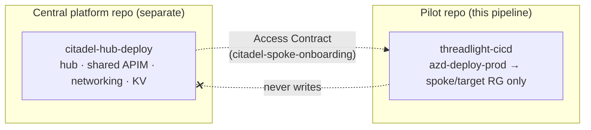

# Threadlight CI/CD — prod-deploy pipeline + env-setup runbooks

> The skill that answers "**how does this pilot actually deploy to production
> when the agent can't run `azd up` and has no standing rights?**" — by
> generating a federated-identity CI/CD pipeline plus the runbooks the
> customer's platform team runs to stand up the identity, permissions, and
> runners. Secret-free by construction; parallel-track-safe by design.

## When to use

- The pilot's prod environment is **locked down**: direct writes are restricted,
  deploys must go through a pipeline, and the agent has no deploy rights.
- You need a **GitHub Actions or Azure DevOps** prod-deploy pipeline that logs in
  with **OIDC / Workload Identity Federation** (no `AZURE_CREDENTIALS`, no client
  secret, no PAT).
- The platform team needs **ready-to-run `az` runbooks** for the UAMI, federated
  credentials, least-privilege RBAC, and (for private VNets) the runners.
- You must make the **central-platform boundary** explicit so the pilot pipeline
  never touches the Citadel hub.

**When NOT to use:** deploying the hub itself (`citadel-hub-deploy`), onboarding a
spoke onto an existing hub (`citadel-spoke-onboarding`), the permissive first-run
deploy (`threadlight-deploy`), or the readiness scorecard
(`threadlight-production-ready`). See the description's DO NOT USE FOR list.

## Onboarding-path decision gate (runs FIRST)

Before generating anything, resolve which track the pilot is on. `resolve_onboarding_path()`
branches on two questions and is the source of truth for posture + RBAC scope:

```
Is a central platform env required?  (Citadel hub / shared AI gateway /
                                      shared networking / platform Key Vault)
│
├─ no  ──────────────────► standalone        (validate target sub/RG, shared-resource
│                                             usage, network exposure FIRST)
│                                             posture: standard-ai-gateway | agt | direct
│                                             RBAC scope: target-rg
│
└─ yes ─► already deployed?
          │
          ├─ yes ─────────► spoke-onboard    (consume hub via Access Contract →
          │                                   citadel-spoke-onboarding)
          │                                   posture: citadel-spoke · RBAC scope: spoke-rg
          │
          └─ no  ─────────► hub-deploy-then-spoke
                                              (stand up hub on the SEPARATE central
                                               track → citadel-hub-deploy, THEN
                                               citadel-spoke-onboarding)
                                              posture: citadel-spoke · RBAC scope: spoke-rg
```

**Invariant:** a spoke pilot's deploy identity is scoped to the **spoke resource
group only** — never the hub, regardless of whether the hub already exists. The
resolved decision is written to `docs/threadlight-cicd/onboarding-path.json` so
the choice is auditable.

## Parallel-track boundary (the must-tell)

The pilot pipeline is a **separate repo and pipeline** from the central platform.

| Concern | Owner | Track / skill |
|---|---|---|
| Citadel hub, shared APIM AI gateway, shared networking, platform Key Vault | Central platform team | **`citadel-hub-deploy`** (awesome-gbb, separate repo) |
| Wire the pilot to consume the hub via an Access Contract | Platform / SE | **`citadel-spoke-onboarding`** |
| Deploy the pilot's **use-case** resources into the spoke/target RG | This pipeline | **`threadlight-cicd`** |

The generated `central-platform-boundary.md` states the pilot pipeline **must not**
deploy or modify the hub, and that its UAMI RBAC is **spoke-RG-scoped only**.



## Quick reference

| Goal | Command |
|---|---|
| Interactive onboarding-path gate + generate | `python scripts/generate_pipeline.py --onboard` |
| GitHub Actions, standalone (public) | `python scripts/generate_pipeline.py --platform github-actions --central-env-required no --repo-full-name owner/repo --target-sub <sub> --target-rg <rg> --tenant-id <tid>` |
| Azure DevOps, spoke onto existing hub | `python scripts/generate_pipeline.py --platform azure-devops --central-env-required yes --central-env-exists yes --ado-org <org> --ado-project <proj> --ado-service-connection <sc> --target-sub <sub> --target-rg <rg> --tenant-id <tid> --hub-sub <hsub> --hub-apim-id <apim-id> --access-contract-product <product>` |
| Private-VNet target (self-hosted / managed pool) | add `--private-network` (and `--ado-pool-name <pool>` for ADO) |
| Eval + red-team CI/CD gate mode | add `--eval-gate soft` (default, warn-only) or `--eval-gate hard` (block on a non-pass verdict) |
| MCP supply-chain CI/CD gate mode | add `--mcp-gate soft` (default, warn-only) or `--mcp-gate hard` (block on any must-fix MCP finding) |
| From a saved framing file | `--framing-file framing.json` |
| Run the test suite | `python -m pytest tests/ -v` |

> If `python` resolves to Python 2 on your machine, use `python3` (the generator
> is pure Python 3 stdlib).

**Spoke flags:** `--hub-sub` / `--hub-apim-id` / `--access-contract-product` surface
the hub coordinates the platform team needs to wire the Access Contract; they are
echoed into `central-platform-boundary.md` and the runbooks (never used to deploy
the hub).

## What it emits

Rendered deterministically (offline, no Azure calls, no secrets) into the pilot repo:

- **Pipeline** — `.github/workflows/azd-deploy-prod.yml` (GitHub, OIDC, `environment:`
  approval gate, seeds the azd env, then **separate** `azd provision` / `azd deploy`
  steps) **or** `azure-pipelines.yml` (Azure DevOps, WIF service connection, three
  `AzureCLI@2` tasks — install azd, provision, deploy — environment approvals, pool ref).
- **Eval + red-team CI/CD gate** — after the deploy stage, two gates run the
  threadlight Discover legs against the freshly deployed agent and enforce their
  verdict (CAF: standardized evaluation **and** dedicated AI red teaming,
  integrated into CI/CD):
  - GitHub: `eval-gate` + `red-team-gate` jobs (`needs: deploy`, OIDC login),
    each invoking `threadlight-evals` / `threadlight-redteam` then checking the
    leg manifest verdict.
  - Azure DevOps: `eval_gate` + `red_team_gate` stages (`dependsOn: deploy`).
  - Mode via `--eval-gate`: **soft** (default) is warn-only
    (`continue-on-error: true` / `continueOnError: true`); **hard** blocks the
    pipeline on a missing or non-pass `specs/{evals,redteam}-manifest.json`
    verdict. Soft is the default so a first onboarding isn't wedged before the
    legs have a baseline manifest.
- **Env-setup runbooks** — `docs/threadlight-cicd/env-setup/`:
  - `01-uami-federated-credentials.md` + `.sh` (UAMI + GH OIDC or ADO WIF — no secrets)
  - `02-rbac-role-assignments.md` + `.sh` (target-RG-scoped: deploy role **plus**
    *Role Based Access Control Administrator* so keyless `azd provision` can assign
    the app identity's data-plane roles; ensures the target RG exists)
  - `03-runners-private-vnet.md` + `.sh` (managed **and** self-hosted options, with
    subnet/egress/private-DNS prerequisites)
  - `README.md` (what to hand the dev team vs the platform team)
- **Boundary + decision record** — `central-platform-boundary.md`, `onboarding-path.json`.

Public targets default to hosted runners (`ubuntu-latest` / ADO `vmImage`); private
targets switch to `self-hosted` labels / a named ADO pool.

### `--mcp-gate soft|hard`

Adds an **MCP supply-chain gate** to the generated production pipeline, after
deploy, alongside the eval and red-team gates. It enforces the `mcp-sbom.json`
that `threadlight-production-ready` writes (`tests/mcp-sbom.json`): `soft`
(default) warns only and keeps the pipeline green; `hard` blocks the pipeline on
any must-fix MCP finding (an unpinned server, undocumented lock drift, or an
inline credential). OIDC / WIF only — no secret.

## Relationship to threadlight-production-ready

`threadlight-production-ready` Phase 3 (`--scaffold-cicd`) still ships a **basic**
GitHub-Actions-only scaffold for backward-compat. **This skill is the authoritative,
expanded home**: both platforms, the onboarding-path gate, the env-setup runbooks,
and the central-platform boundary. After the readiness scorecard is green, hand off
here for the production pipeline.

## Generator API (for tests / automation)

`scripts/generate_pipeline.py` exposes:

- `resolve_onboarding_path(framing) -> dict` — the decision gate (path, posture,
  rbac_scope, needs_validation, next_actions).
- `build_context(framing, resolved) -> dict` — template token context.
- `generate(framing, out_root) -> list[Path]` — render + write artifacts.
- `VERSION` — semver, matched against this file's `metadata.version` by `test_version.py`.

Templates live under `references/` as `{{TOKEN}}` files rendered by `_render` (pure
stdlib). Tests under `tests/` pin the artifact paths, the OIDC/WIF-only invariant
(no long-lived secrets), and the boundary content.

## Common mistakes

- **Widening RBAC scope.** Never scope the deploy role to the subscription or a
  central-platform RG. Target RG only.
- **Reaching for a secret.** If you find yourself adding `AZURE_CREDENTIALS` or a
  client secret, stop — use OIDC/WIF. The test suite fails the build if a secret
  or PAT lands in any emitted file.
- **Letting the pilot deploy the hub.** A missing central env is stood up on the
  `citadel-hub-deploy` track, not by this pipeline.
- **Skipping the gate.** Generating before resolving the onboarding path produces
  the wrong posture and RBAC scope. Run `--onboard` (or pass the flags) first.

## References

- [`references/onboarding-path-decision.md`](references/onboarding-path-decision.md) —
  the decision tree (standalone vs spoke-onboard vs hub-deploy-then-spoke) and when to
  engage `citadel-hub-deploy` vs `citadel-spoke-onboarding`.
- [`references/best-practices.md`](references/best-practices.md) — OIDC/WIF federation,
  least-privilege RBAC, environment gates, and private-VNet runners, with Microsoft
  Learn citations.
- [`references/pipeline-design-checklist.md`](references/pipeline-design-checklist.md) —
  operator hand-off checklist before giving a pipeline to the customer.
- `references/github-actions/`, `references/azure-devops/`, `references/env-setup/` —
  the `{{TOKEN}}` templates the generator renders.

## See also — official Azure Skills

Threadlight exists to make Microsoft's own platform **trivial to adopt** — never
to replace it. For first-party depth behind this CI/CD leg, reach for the official
**[Azure Skills](https://github.com/microsoft/azure-skills)** catalog. *Further
reading, not a dependency* — Threadlight's guidance stays the source of truth for
the pilot flow:

- **[`entra-app-registration`](https://github.com/microsoft/azure-skills/blob/main/skills/entra-app-registration/SKILL.md)** — **Entra app registration** + OAuth 2.0 / MSAL; first-party depth behind the OIDC / Workload-Identity-Federation federated-credential setup this generator scaffolds.
