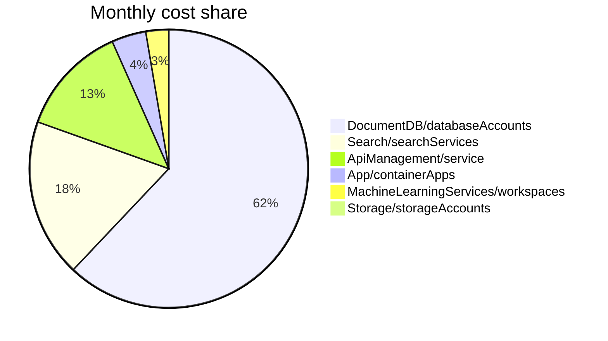

# Cost projection

> Generated `2026-06-12T12:00:00+00:00` against deploy `sample-pilot-consumption/deployment-test`.
> Load profile: `specs/SPEC.md#section-12-load-profile`. Currency: `USD`. Price basis: `retail`.

_Authoritative machine-readable manifest:_ [`specs/cost-manifest.json`](../specs/cost-manifest.json).

## Totals

| Metric | USD / month |
| --- | --- |
| Monthly cost (current) | $397.57 |
| Monthly cost (after applying recommendations) | $341.19 |
| **Monthly savings potential** | **$56.38 (14.2%)** |

## Cost share by resource kind

## Recommendations

_3 resource(s) have a cheaper SKU that satisfies declared constraints. Sorted by monthly savings descending._

| Priority | Resource | Current SKU | Recommended SKU | Monthly savings | % | Rationale |
| --- | --- | --- | --- | --- | --- | --- |
| 🟡 med | `apim` (ApiManagement/service) | BasicV2 capacity=1 | Consumption | $45.53 | 89.1% | Consumption tier: 1M free calls then $3.50/M overage. |
| ⚪ low | `foundry-agent` (MachineLearningServices/workspaces) | Standard capacity=1 | hosted-agent tier=Free | $10.56 | 100.0% | Switch to Free tier for 100% savings. |
| ⚪ low | `storage` (Storage/storageAccounts) | Standard_LRS tier=Standard | Standard_ZRS tier=Standard | $0.29 | 30.7% | ZRS cool storage at $0.0125/GB/month. |

## Per-resource breakdown

### `cosmos` — DocumentDB/databaseAccounts (eastus2)
- **Current cost:** $246.10/month (Standard tier=provisioned capacity=4000, `price_source: fallback`)
- **Monthly units consumed:**
  - `ru_provisioned`: 4,000
  - `storage_gb`: 50.0

| Variant | Monthly cost | Δ vs current | Satisfies constraints? | Caveats |
| --- | --- | --- | --- | --- |
| **Current** (Standard tier=provisioned capacity=4000) | $246.10 | — | — | — |
| serverless | $23.11 | $-222.99 (-90.6%) | ✅ | Serverless is limited to 50 GB storage per container.; No multi-region writes in serverless mode. |
| autoscale capacity=1000 | $65.06 | $-181.04 (-73.6%) | ✅ | — |
| provisioned capacity=1000 | $70.90 | $-175.20 (-71.2%) | ✅ | — |
| autoscale capacity=4000 | $222.74 | $-23.36 (-9.5%) | ✅ | — |
| provisioned capacity=4000 | $246.10 | $+0.00 (+0.0%) | ✅ | — |
| autoscale capacity=10000 | $538.10 | $+292.00 (+118.7%) | ✅ | — |
| provisioned capacity=10000 | $596.50 | $+350.40 (+142.4%) | ✅ | — |

### `ai-search` — Search/searchServices (eastus2)
- **Current cost:** $73.00/month (basic capacity=1, `price_source: fallback`)
- **Monthly units consumed:**
  - `replica_partition_hours`: 730
  - `indexed_documents`: 50,000

| Variant | Monthly cost | Δ vs current | Satisfies constraints? | Caveats |
| --- | --- | --- | --- | --- |
| **Current** (basic capacity=1) | $73.00 | — | — | — |
| free capacity=1 | $0.00 | $-73.00 (-100.0%) | ⚠️ | Tier doc cap (10,000) below declared ai_search_documents (50,000). |
| free capacity=2 | $0.00 | $-73.00 (-100.0%) | ⚠️ | Tier doc cap (10,000) below declared ai_search_documents (50,000). |
| free capacity=4 | $0.00 | $-73.00 (-100.0%) | ⚠️ | Tier doc cap (10,000) below declared ai_search_documents (50,000). |
| free capacity=9 | $0.00 | $-73.00 (-100.0%) | ⚠️ | Tier doc cap (10,000) below declared ai_search_documents (50,000). |
| basic capacity=2 | $146.00 | $+73.00 (+100.0%) | ✅ | — |
| S1 capacity=1 | $245.28 | $+172.28 (+236.0%) | ✅ | — |
| basic capacity=4 | $292.00 | $+219.00 (+300.0%) | ✅ | — |
| S1 capacity=2 | $490.56 | $+417.56 (+572.0%) | ✅ | — |
| basic capacity=9 | $657.00 | $+584.00 (+800.0%) | ✅ | — |
| S1 capacity=4 | $981.12 | $+908.12 (+1244.0%) | ✅ | — |
| S2 capacity=1 | $981.12 | $+908.12 (+1244.0%) | ✅ | — |
| S2 capacity=2 | $1,962.24 | $+1,889.24 (+2588.0%) | ✅ | — |
| S3 capacity=1 | $1,962.24 | $+1,889.24 (+2588.0%) | ✅ | — |
| S1 capacity=9 | $2,207.52 | $+2,134.52 (+2924.0%) | ✅ | — |
| S2 capacity=4 | $3,924.48 | $+3,851.48 (+5276.0%) | ✅ | — |
| S3 capacity=2 | $3,924.48 | $+3,851.48 (+5276.0%) | ✅ | — |
| S3 capacity=4 | $7,848.96 | $+7,775.96 (+10652.0%) | ✅ | — |
| S2 capacity=9 | $8,830.08 | $+8,757.08 (+11996.0%) | ✅ | — |
| S3 capacity=9 | $17,660.16 | $+17,587.16 (+24092.0%) | ✅ | — |

### `apim` — ApiManagement/service (eastus2)
- **Current cost:** $51.10/month (BasicV2 capacity=1, `price_source: fallback`)
- **Monthly units consumed:**
  - `tier_unit_hours`: 730

| Variant | Monthly cost | Δ vs current | Satisfies constraints? | Caveats |
| --- | --- | --- | --- | --- |
| **Current** (BasicV2 capacity=1) | $51.10 | — | — | — |
| Consumption | $5.57 | $-45.53 (-89.1%) | ✅ | No guaranteed capacity; throughput throttled under burst. |
| BasicV2 capacity=2 | $102.20 | $+51.10 (+100.0%) | ✅ | — |
| StandardV2 capacity=1 | $153.30 | $+102.20 (+200.0%) | ✅ | — |
| BasicV2 capacity=4 | $204.40 | $+153.30 (+300.0%) | ✅ | — |
| StandardV2 capacity=2 | $306.60 | $+255.50 (+500.0%) | ✅ | — |
| StandardV2 capacity=4 | $613.20 | $+562.10 (+1100.0%) | ✅ | — |
| Premium capacity=1 | $2,795.90 | $+2,744.80 (+5371.4%) | ✅ | — |
| Premium capacity=2 | $5,591.80 | $+5,540.70 (+10842.9%) | ✅ | — |
| Premium capacity=4 | $11,183.60 | $+11,132.50 (+21785.7%) | ✅ | — |

### `bot` — App/containerApps (eastus2)
- **Current cost:** $15.85/month (Consumption, `price_source: fallback`)
- **Monthly units consumed:**
  - `vcpu_seconds`: 633,600
  - `memory_gib_seconds`: 1,267,200
  - `requests`: 7,603,200

| Variant | Monthly cost | Δ vs current | Satisfies constraints? | Caveats |
| --- | --- | --- | --- | --- |
| **Current** (Consumption) | $15.85 | — | — | — |
| Consumption | $15.85 | $+0.00 (+0.0%) | ✅ | — |
| Consumption | $15.85 | $+0.00 (+0.0%) | ✅ | — |
| Consumption | $25.35 | $+9.50 (+60.0%) | ✅ | — |
| Dedicated tier=D4 | $146.00 | $+130.15 (+821.2%) | ✅ | Dedicated profile D4 is always-on; billed continuously.; Workload profiles require a managed environment. |
| Dedicated tier=E4 | $175.20 | $+159.35 (+1005.4%) | ✅ | Dedicated profile E4 is always-on; billed continuously.; Workload profiles require a managed environment. |
| Dedicated tier=D8 | $292.00 | $+276.15 (+1742.4%) | ✅ | Dedicated profile D8 is always-on; billed continuously.; Workload profiles require a managed environment. |
| Dedicated tier=E8 | $350.40 | $+334.55 (+2110.8%) | ✅ | Dedicated profile E8 is always-on; billed continuously.; Workload profiles require a managed environment. |

### `foundry-agent` — MachineLearningServices/workspaces (eastus2)
- **Current cost:** $10.56/month (Standard capacity=1, `price_source: fallback`)
- **Monthly units consumed:**
  - `agent_messages`: 8,800

| Variant | Monthly cost | Δ vs current | Satisfies constraints? | Caveats |
| --- | --- | --- | --- | --- |
| **Current** (Standard capacity=1) | $10.56 | — | — | — |
| hosted-agent tier=Free | $0.00 | $-10.56 (-100.0%) | ✅ | Free tier feature set differs from Standard; verify SLA, quota limits, and included capabilities. |
| hosted-agent tier=Premium | $208.80 | $+198.24 (+1877.3%) | ✅ | Premium tier feature set differs from Standard; verify SLA, quota limits, and included capabilities. |

### `storage` — Storage/storageAccounts (eastus2)
- **Current cost:** $0.96/month (Standard_LRS tier=Standard, `price_source: fallback`)
- **Monthly units consumed:**
  - `stored_gb_avg`: 50.0
  - `transactions`: 100,000
  - `egress_gb`: 50

| Variant | Monthly cost | Δ vs current | Satisfies constraints? | Caveats |
| --- | --- | --- | --- | --- |
| **Current** (Standard_LRS tier=Standard) | $0.96 | — | — | — |
| Standard_LRS tier=Standard | $0.09 | $-0.87 (-90.7%) | ⚠️ | Archive tier has hour-scale retrieval latency. |
| Standard_LRS tier=Standard | $0.22 | $-0.74 (-77.1%) | ✅ | — |
| Standard_LRS tier=Standard | $0.54 | $-0.42 (-43.7%) | ✅ | — |
| Standard_ZRS tier=Standard | $0.67 | $-0.29 (-30.7%) | ✅ | — |
| Standard_GRS tier=Standard | $1.04 | $+0.08 (+8.3%) | ✅ | — |
| Standard_ZRS tier=Standard | $1.19 | $+0.23 (+24.0%) | ✅ | — |
| Standard_GRS tier=Standard | $1.88 | $+0.92 (+95.8%) | ✅ | — |

### `aoai-chat` — CognitiveServices/deployments (eastus2)
- **Current cost:** $0.00/month (gpt-4o tier=PAYG, `price_source: fallback`)
- **Monthly units consumed:**
  - `input_tokens`: 7,413,120,000
  - `output_tokens`: 3,991,679,999

| Variant | Monthly cost | Δ vs current | Satisfies constraints? | Caveats |
| --- | --- | --- | --- | --- |
| **Current** (gpt-4o tier=PAYG) | $0.00 | — | — | — |
| gpt-4o tier=PAYG | N/A | ? | ⚠️ | No live or fixture price found for gpt-4o PAYG in eastus2. Update pricing fixtures or check model/region availability. |

---

> **Advisory only.** This skill does not mutate Bicep. To act on a recommendation, update `infra/main.bicep` (or the relevant module) and re-run `threadlight-deploy`. The next `threadlight-consumption-iq` run will re-score against the new SKU.
