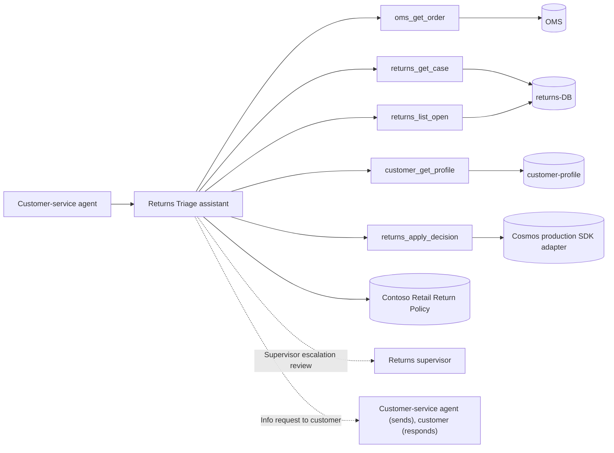

# Returns Triage — Specification

> **Last updated:** 2026-07-07
> Exported from a Threadlight `specs/SPEC.md` by `export_agentic_loop_spec.py`.
> Section references (§) inside carried text point to that Threadlight SPEC.

## 1. Summary

When a customer requests a return, the AI assistant pulls the originating order, the return record, and the customer profile, then triages the case against Contoso Retail's return policy. It recommends one of four outcomes — approve refund, deny refund, escalate to a returns supervisor, or request more information — with a cited policy rationale and an audit record. A customer-service agent runs the assistant; a returns supervisor handles escalations.

Domain: Retail / CPG (reverse logistics). Sponsor persona: Mixed (COO / customer-service ops lead + CISO for audit).

## 2. Goals & Non-Goals

**Goals**
- **Primary**: Cut return-decision cycle time from hours of manual lookup to a sub-minute, policy-cited recommendation the CS agent can action or escalate.
- **Secondary**: Make every decision auditable (policy citation + rationale + who/what decided), and surface fraud/serial-returner risk automatically.
- In scope: Triage of a single return case; the four decisions (`approve_refund`, `deny_refund`, `escalate_to_supervisor`, `request_more_info`); reads against OMS, returns-DB, and customer-profile (all mocked); the supervisor escalation gate.
- KPI `return_cycle_time_business_days_p50`: target < 5 business days (BR-001)
- KPI `restock_a_pct`: target 60–80% (apparel) (BR-001)
- KPI `deny_rate`: target industry-realistic band (BR-002)
- KPI `human_escalation_rate`: target 8–15% (BR-003)
- KPI `policy_citation_rate`: target 100% (BR-005)

**Non-Goals**
- Executing the actual refund/payment settlement, generating shipping labels/RMAs downstream, warehouse disposition beyond a recommendation, and chargeback/dispute handling.

## 3. Users & Scenarios

| Persona | Scenario | Success Criteria |
| --- | --- | --- |
| Customer-service agent | S-001 In-window fit return — input: RMA-2026-004410 | `approve_refund`, cite 30-day window (BR-001, BR-005) |
| Customer-service agent | S-002 Boundary — refund exactly at ceiling — input: refund = $250, in-window | `approve_refund` (≤ ceiling) (BR-001, BR-003) |
| Customer-service agent | S-003 Final-sale changed-mind — input: RMA-2026-004418 | `deny_refund`, cite final-sale clause (BR-002, BR-005) |
| Customer-service agent | S-004 High-value refund — input: RMA-2026-004425 ($1,180) | `escalate_to_supervisor` (BR-003, BR-005) |
| Customer-service agent | S-005 Window lapsed, no override — input: RMA-2026-004431 (86 days) | `deny_refund` (BR-002, BR-005) |
| Customer-service agent | S-006 Damage claim, no photos — input: RMA-2026-004440 | `request_more_info` (ask for photos) (BR-004, BR-005) |
| Customer-service agent | S-007 Serial returner — input: RMA-2026-004452 (return rate 0.63) | `escalate_to_supervisor` (BR-003, BR-005) |
| Customer-service agent | S-008 Unmatched order — input: unknown order id | `request_more_info` (BR-004) |
| Customer-service agent | S-009 Out-of-scope ask — input: "process the payment now" | decline — settlement is out of scope |

Participants (humans, agents and systems):

- **Customer-service agent** (human): Runs the assistant on a live return case; actions the recommendation or forwards escalations
- **Returns supervisor** (human): Reviews escalated cases (high-value, window-lapsed, fraud-flagged) and makes the final call
- **Returns Triage assistant** (agent): The AI agent that gathers data, applies policy, and recommends a decision
- **Order-management system** (system): Source of order + delivery data (mock)
- **Returns database** (system): Source of return-case data; receives the applied decision (mock)
- **Customer-profile service** (system): Source of loyalty tier + lifetime return-rate (mock)

## 4. Functional Requirements

Business rules (`BR-xxx`) are carried as testable requirements; the source
rule ID stays in each row so evaluations can trace back to it.

| ID | Requirement | Priority |
| --- | --- | --- |
| FR-001 | BR-001: Approve in-window eligible return. The system MUST apply this rule. When: `days_since_delivery ≤ 30` AND `final_sale == false` AND `item_condition ∈ {unworn_tags_attached, unopened, defective}` AND `refund_amount ≤ 250` AND `lifetime_return_rate < 0.40`. Then: `approve_refund`; recommend disposition `restock_a` (or `liquidation` if defective). Exception: any risk/value gate in BR-003 overrides to escalation. | Must |
| FR-002 | BR-002: Deny ineligible return. The system MUST apply this rule. When: `final_sale == true` (changed-mind reason) OR (`days_since_delivery > 30` AND no qualifying override such as `arrived_damaged` or `defective`). Then: `deny_refund` with the cited policy clause; recommend disposition `return_to_customer`. Exception: a damaged/defective item within statutory rights routes to BR-004 (request evidence) rather than an outright deny. | Must |
| FR-003 | BR-003: Escalate high-value or high-risk cases. The system MUST apply this rule. When: `refund_amount > 250` OR `lifetime_return_rate ≥ 0.40` OR `account_status == review_flagged` OR (`days_since_delivery > 30` AND a plausible override reason exists that needs human judgement). Then: `escalate_to_supervisor` with a summarized risk rationale. Exception: none — the human gate is mandatory when this fires. | Must |
| FR-004 | BR-004: Request more information on incomplete cases. The system MUST apply this rule. When: order cannot be matched OR `reason_code` missing OR (`reason_code == arrived_damaged` AND `photos_provided == false`) OR authoritative customer risk data is unavailable. Unknown risk never authorizes a finalized refund; any already-known BR-003 risk still overrides immediately. Then: `request_more_info` with a templated list of exactly what's needed. Exception: known authoritative BR-003 risk overrides missing information immediately; if info is still missing after one request cycle → escalate. | Must |
| FR-005 | BR-005: Cite policy and write an audit record on every decision. The system MUST apply this rule. When: always (every case, every branch). Then: attach ≥ 1 policy citation + a plain-language rationale + a structured audit record (`decision.outcome`, `decision.business_rules_fired`, `answer.citations[]`, actor, timestamp). | Must |
| FR-006 | Supervisor escalation review. The system MUST route the case to a human (Returns supervisor). When: BR-003 fires (refund > $250, serial-returner ≥ 0.40, flagged account, or window-lapsed with a judgement-call override); gate: ACS escalation → native Agent Hooks resolver → Task8 pending request → authenticated, role-allowlisted human `decide` → exact-action one-use `consume` → remote durable receipt ACK → conditional Cosmos handoff write (BR-003, BR-005). | Must |
| FR-007 | Info request to customer. The system MUST route the case to a human (Customer-service agent (sends), customer (responds)). When: BR-004 fires; gate: `request-info` (BR-004, BR-005). | Must |

## 5. Non-Functional Requirements

| Category | Requirement |
| --- | --- |
| Performance | Automated disposition decision **< 60s** per case; open-queue list **< 2s**. |
| Quality | `policy_citation_rate` = 100%; escalation precision high enough that supervisors overturn < 15% of auto-approvals. |
| Availability | SLA `99.5`, RTO `4h`, RPO `1h` |
| Security | keyless — user-assigned managed identity + `DefaultAzureCredential` end-to-end; Entra ID groups — `returns-cs-agents` (run + view), `returns-supervisors` (escalation edit-and-approve) |
| Privacy & Compliance | PII: yes (customer name + email — email masked; no PAN ever shown, per PCI-DSS v4.0 default). GDPR applies (EU customer data); Residency: EU (Sweden Central primary, West Europe fallback); Retention: 90 days for traces/case data in the PoC (regulated-7y is a deferred decision — see § 11f); Regulatory: GDPR, PCI-DSS v4.0 (payment data never surfaced), consumer distance-selling / statutory return rights |
| Audit | decision rationale, citations, model + prompt version, actor, human overrides, upstream data lineage. 90-day PoC / 7-year if regulated. |
| Responsible AI | `consequential` (affects a customer refund outcome); mandatory human gate on escalations; transparency via citations. |
| Scalability | PoC demo scale; production band 10K–100K returns/week; per-case, independent |
| Observability | OpenTelemetry traces; emit `decision.outcome`, `decision.business_rules_fired`, `answer.citations[]`, `escalation.reason`, `disposition.recommended`. |

## 6. Architecture Overview

Workflow model: `agent` (Threadlight § 11e).
Process steps: Intake & correlation; Eligibility check; Risk & value gate; Decision & audit.

## 7. Tech Stack

| Layer | Choice | Rationale |
| --- | --- | --- |
| Agent shape | `agent` | Threadlight § 11e workflow model |
| Agent framework | Agentic Loop policy default | Applied by the Agentic Loop policy layer after this spec |
| IaC | `azd` + Bicep | Agentic Loop / Spec2Cloud default |
| Module `cosmos-db` | selected | Persistent case state + audit log |
| Module `ai-search` | selected | Foundry IQ backing for the return policy |
| Module `storage-blob` | selected | Policy corpus + dataset hosting |
| Module `app-insights` | selected | Telemetry — required for continuous evals |
| Module `key-vault` | selected | Existing versioned policy-signing key; no application passwords |
| Module `foundry-iq-index` | selected | Pre-provisioned return-policy Knowledge Base |

## 8. Azure Services

| Service | Purpose | SKU/Tier | Notes |
| --- | --- | --- | --- |
| Microsoft Foundry | Models, hosted agent, evaluations | per plan | Managed identity |
| Azure Cosmos DB for NoSQL | Persistent case state + audit log | per plan | Threadlight module `cosmos-db` |
| Azure AI Search | Foundry IQ backing for the return policy | per plan | Threadlight module `ai-search` |
| Azure Storage (Blob) | Policy corpus + dataset hosting | per plan | Threadlight module `storage-blob` |
| Application Insights | Telemetry — required for continuous evals | per plan | Threadlight module `app-insights` |
| Azure Key Vault | Existing versioned policy-signing key; no application passwords | per plan | Threadlight module `key-vault` |
| Foundry IQ knowledge base | Pre-provisioned return-policy Knowledge Base | per plan | Threadlight module `foundry-iq-index` |
| Existing AI governance hub (APIM gateway) | Model traffic governance | existing | Consume access contract(s) tl-returns-triage; do not create a gateway |

## 9. AI / Foundry

| Item | Choice | Rationale |
| --- | --- | --- |
| Foundry model — Chat reasoning (triage) | `gpt-5.4` (2026-03-05) — house default for multi-skill pilots | Sweden Central (primary) / West Europe (fallback) — EU boundary; `50K` GlobalStandard; `medium` |
| Hosted agent(s) | Returns Triage assistant | Protocol and framework per Agentic Loop policy |
| Knowledge — Contoso Retail Return Policy | Foundry IQ (agentic retrieval + citations) | Citations: `mandatory` — BR-005 requires ≥ 1 clause per decision. |
| Evaluation | 9 scenarios in § 3 plus KPIs in § 2 | Keep every business rule covered |
| Guardrails | Content safety plus the human gates in § 4 | `consequential` (affects a customer refund outcome); mandatory human gate on escalations; transparency via citations. |

## 10. Data Model

### orders
| Field | Type | Notes | System of record |
|-------|------|-------|------------------|
| id | string | `ORD-YYYY-NNNNNN` | OMS (mock) |
| customer_id | string | FK → customers.id | OMS |
| status | enum | `shipped` \| `delivered` \| `cancelled` | OMS |
| channel | enum | `online` \| `store` | OMS |
| order_date | date | ISO-8601 | OMS |
| delivery_date | date\|null | null until delivered | OMS |
| currency | string | ISO-4217 | OMS |
| order_total | number | order subtotal | OMS |
| items | array | `{sku, brand, name, category, qty, unit_price, final_sale}` | OMS |

### returns
| Field | Type | Notes | System of record |
|-------|------|-------|------------------|
| id | string | `RMA-YYYY-NNNNNN` | returns-DB (mock) |
| order_id | string | FK → orders.id | returns-DB |
| customer_id | string | FK → customers.id | returns-DB |
| status | enum | `in_triage` \| `escalated` \| `closed` | returns-DB |
| reason_code | enum | `fit_too_small` \| `wrong_size` \| `changed_mind` \| `arrived_damaged` \| `not_as_described` \| `defective` | returns-DB |
| requested_at | date | ISO-8601 | returns-DB |
| refund_amount | number | requested refund | returns-DB |
| currency | string | ISO-4217 | returns-DB |
| item_condition | enum | `unworn_tags_attached` \| `unopened` \| `opened` \| `used` \| `damaged` \| `defective` | returns-DB |
| photos_provided | bool | evidence attached? | returns-DB |
| final_sale | bool | denormalized from order line | returns-DB |
| disposition | enum\|null | `restock_a` \| `restock_b` \| `liquidation` \| `return_to_customer` \| `destroy` | returns-DB |
| decision | enum\|null | `approve_refund` \| `deny_refund` \| `escalate_to_supervisor` \| `request_more_info` | returns-DB |

### customers
| Field | Type | Notes | System of record |
|-------|------|-------|------------------|
| id | string | `CR-CUST-NNNNN` | customer-profile (mock) |
| name | string | synthetic | customer-profile |
| email_masked | string | masked PII | customer-profile |
| region | enum | `EU` (single-region PoC) | customer-profile |
| loyalty_tier | enum | `bronze` \| `silver` \| `gold` \| `platinum` | customer-profile |
| account_status | enum | `active` \| `review_flagged` \| `closed` | customer-profile |
| lifetime_orders | int | count | customer-profile |
| lifetime_return_rate | number | 0–1; ≥ 0.40 flags serial-returner | customer-profile |
| tenure_months | int | account age | customer-profile |

Retention: 90 days for traces/case data in the PoC (regulated-7y is a deferred decision — see § 11f).

## 11. Interfaces

- **Agent tools** — each tool is a governed interface of the agent.

| Tool | Purpose | Inputs | Side effects | Backed by |
| --- | --- | --- | --- | --- |
| `oms_get_order` | Fetch an order + delivery date + line items by order id. | `order_id: string (required)` | none | OMS (mock) |
| `returns_get_case / returns_list_open` | Fetch a single return case, or list open (`in_triage`) cases. | `rma_id: string (required)` / `offset,limit` | none declared | returns-DB (mock) |
| `customer_get_profile` | Fetch loyalty tier + lifetime return rate + account status. | `customer_id: string (required)` | none declared | customer-profile (mock) |
| `returns_apply_decision` | Persist the triage outcome + disposition + audit record. | `rma_id, decision, disposition, citations[], rationale` | Cosmos case replace + decision-audit create in one batch on `/case_id`, using the authorized case `_etag` as `if_match_etag`. No settlement. An identical persisted decision returns the existing audit id without another business mutation; a stale read cannot authorize a new write. | Cosmos production SDK adapter, keyless UAMI. |

- **External integrations**
  - Order-management system (OMS): read; managed identity (real) / none (mock); **mock** — no PoC access; backed by `specs/sample-data/orders.json`
  - Returns database: read + write (applies the decision); managed identity (real) / none (mock); real Cosmos adapter over **synthetic, operator-seeded cases**. `specs/sample-data/returns.json` is a read-only seed specification, not a runtime writable database. The runtime never resets or seeds customer storage.
  - Customer-profile service: read; managed identity (real) / none (mock); **mock** — backed by `specs/sample-data/customers.json`

- **Events and triggers**
  - Trigger: on-demand (CS agent opens a case) + optional scheduled sweep of the open-returns queue.
  - Schedule: optional `*/15 * * * *` open-queue pre-triage.
  - Event source: n/a for the PoC (real system would emit a `return.created` event).
  - Receiver: on-demand invocation (chat/workspace); optional ACA cron job for the queue sweep.
  - Idempotency key: `returns.id` (a case is triaged once; re-runs are idempotent).
  - Dedup window: 24h.
  - Dead-letter: cases that fail 3 tool-fetch attempts → `escalate_to_supervisor` with a `system_error` reason.

- **Human review channels**
  - Supervisor escalation review: authenticated Task8 `/approvals/resolve` API. A Teams/workspace review frontend is an operator integration, not supplied by this runtime.
  - Info request to customer: templated email / chat composer.

## 12. Open Questions

Mark unknowns inline as `[NEEDS CLARIFICATION: <question>]`; track resolution here.

| # | Question | Owner | Status |
| --- | --- | --- | --- |
| 1 | Real return-policy thresholds (window, ceiling, serial-returner definition)? | | open |
| 2 | Which real systems back OMS / returns-DB / customer-profile, and their auth? | | open |
| 3 | Production retention — 90 days vs regulated 7-year? | | open |
| 4 | Named business sponsor + CISO sign-off owner for the pilot? | | open |
| 5 | Confirm assumption: The three upstream systems (OMS, returns-DB, customer-profile) are **mocked**; the schema in § 4 is the contract for the real swap. | | assumed |
| 6 | Confirm assumption: Return window = 30 days, auto-approve ceiling = $250, serial-returner threshold = lifetime return rate ≥ 0.40. These are demo defaults — confirm with the customer's actual policy. | | assumed |
| 7 | Confirm assumption: Refund settlement, RMA/label generation, and warehouse disposition execution are out of scope (the agent recommends; it does not settle). | | assumed |
| 8 | Confirm assumption: Neutral brand + `external-demo` framing applied silently (Fast-PoC). | | assumed |

> Identity, secrets, and deployment targets live in `.azure/deployment-plan.md`,
> produced by the Agentic Loop plan stage.

## Appendix — Threadlight provenance

This file is an export. The Threadlight `specs/SPEC.md` stays the source of truth
for governance, production readiness and value evidence. Re-export after changing
the SPEC instead of editing both. The export does not run Agentic Loop, prove its
policy layer accepted the spec, or deploy anything.

| Threadlight section | Exported to | Keep using |
| --- | --- | --- |
| § 1. Process Overview | § 1, § 2, § 3 | — |
| § 2. Process Flow | § 6 | — |
| § 3. Business Rules | § 4 | — |
| § 4. Data Models | § 10 | — |
| § 5. System Integrations | § 11 | — |
| § 5b. External Systems & Mocks (MCP contract) | not carried | `threadlight-mcp-aca` |
| § 6. Tool Contracts | § 11 | — |
| § 7. Knowledge Sources | § 9 | — |
| § 7b. AI Services & Model Selection | § 9 | — |
| § 8. Human Interaction Points | § 4, § 11 | `threadlight-hitl-patterns` |
| § 8b. Human Interaction (Workspace UX) | not carried | `threadlight-workspace-ui` |
| § 9. Success Criteria | § 2, § 3, § 5 | `threadlight-evals` |
| § 10. Trigger & Run Model | § 5, § 11 | `threadlight-event-triggers` |
| § 11. Security, Compliance & Governance | § 5 | `threadlight-govern` |
| § 11c. Tech Stack (Module selectors) | § 7, § 8 | — |
| § 11d. Demo Data (Realism rules) | not carried | `threadlight-demo-data-factory` |
| § 11e. Workflow Model | § 6 | — |
| § 11f. Deployment Posture | not carried | `threadlight-deploy` |
| § 12. Production Readiness | § 5 | `threadlight-production-ready` |
| § 13. Assumptions & Open Questions | § 12 | — |
| § 14. Value Model | not carried | `threadlight-consumption-iq` |
