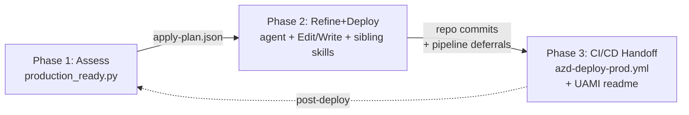

# Threadlight Production Ready — paving the path to production

> **v0.3.0 — "the real way to land in prod"** (Nov 2025). Replaces 16
> regex-over-Bicep-text static checks with a real ARM-graph parser
> (`BicepGraph` shells `az bicep build` and walks compiled JSON), wires
> 5 long-stubbed live probes (OBS-106, OBS-102 KQL, SEC-106, SRE-104,
> NET-501 Citadel APIM via `TL_CITADEL_HUB_RG`), retires unimplemented
> stubs to `experimental: true` (24 IDs total — 23 new + 1 inherited
> from v0.2.0 — excluded from scoring unless `--include-experimental`),
> adds **15 new** non-experimental Defender/Policy/quota/restore-drill/
> Foundry-RBAC finding IDs, fixes the scoring bug that gave
> `not-verified` 50% credit (now 0), and ships `--diff`, `--gate-preview`,
> `--remediate`, trend CSV, and an OIDC CI recipe. **`bicep` CLI is now a
> hard prerequisite** — missing CLI exits 2 with `az bicep install`
> instructions, no silent regex fallback. See
> `docs/production-readiness.md#whats-new-in-v030` for the full diff.

The single skill in the chain that asks "**is this pilot ready for the
customer architecture review, or is it about to land in the lab graveyard?**"
and answers with a structured, evidence-backed artefact instead of tribal
knowledge.

> **Why this skill exists.** The `threadlight-*` chain ships a working
> agent in one session (design → local-test → deploy → safe-check).
> `safe-check` proves the pilot is **structurally complete and behaves**:
> every selector landed, every channel reaches, every cron ran, no
> placeholder image. But "green safe-check" ≠ "production-ready". The
> next conversation — CISO, SRE, FinOps, network architect, data
> protection — needs an artefact that says: **what posture is this in,
> what's missing, what would the uplift cost, who owns each gap, can we
> go live with waivers?** Without that artefact every pilot grows a
> tribal-knowledge answer that takes weeks to assemble, the customer
> defers the production phase, and the pilot quietly becomes a "lab
> graveyard" demo.
>
> This skill produces the artefact in one command.

## What this skill does NOT replace

| Concern | Use instead |
|---|---|
| Authoring SPEC / `deployment_manifest{}` | `threadlight-design` |
| Running `azd up` | `threadlight-deploy` |
| Structural / behavioural deploy gate | `threadlight-safe-check --phase post-deploy` |
| Invocation testing of the agent | `foundry-evals` |
| Wiring App Insights / OTel | `foundry-observability` |
| Provisioning Citadel hub | `citadel-hub-deploy` |
| Onboarding spoke to Citadel | `citadel-spoke-onboarding` |
| Provisioning Azure SRE Agent | `azure-sre-agent` |
| Authoring AGT in-process middleware | `foundry-agt` |
| Generating Bicep / Terraform | `azd-patterns`, `azureterraform`, `bicepschema` |
| Deploying to a VNet-injected Foundry | `foundry-vnet-deploy` |

**This skill recommends an assessment, then executes the remediation through the
agent.** v0.4.0 introduces a 3-phase production-onboarding flow — see
[What this skill does in v0.4.0](#what-this-skill-does-in-v040) below for the
contract details.

## What this skill does in v0.4.0



The skill drives **production onboarding** in three phases:

1. **Assess.** A Python script (`scripts/production_ready.py`) inventories your
   target Azure subscription/resource group, scores it against 151 findings
   spanning 13 production-readiness pillars, and emits an `apply-plan.json`
   that names every must-fix gap and the remediation recipe that closes it.

2. **Refine + Deploy.** The Copilot agent reads `apply-plan.json`, opens the
   recipes named there, and **executes** each fix using its native Edit/Write
   tools (for `kind: repo-edit`) or by invoking sibling awesome-gbb skills
   (for `kind: sibling-skill`). Items marked `kind: manual` are surfaced to
   you for explicit acknowledgement before any change. Items marked
   `kind: deferred-to-pipeline` are recorded for Phase 3.

   **Stale-plan detection (the agent MUST do this before applying anything).**
   Each `apply-plan.json` carries a `manifest_sha256` field — the SHA256 of
   the canonical JSON of the `production-readiness-manifest.json` it was
   built from. Before executing the first item, the agent recomputes
   `sha256(canonical_json(<current production-readiness-manifest.json>))`
   and compares. If the two hashes differ, the manifest has been
   re-generated since the plan was emitted (e.g. the operator re-ran
   `--onboard` in another shell, or hand-edited the manifest) and the plan
   is stale: **the agent refuses to apply and tells the operator to re-run
   the Assess phase to get a fresh apply-plan.** Skipping this check risks
   applying remediations for findings that no longer exist or missing
   findings that now do — silent drift between the plan and reality is the
   single failure mode this gate exists to prevent.

3. **CI/CD Handoff.** When the apply-plan contains pipeline-deferred items
   (or you pass `--scaffold-cicd`), the script renders a GitHub Actions
   workflow (`.github/workflows/azd-deploy-prod.yml`) and a central-platform-
   team runbook (`docs/threadlight-cicd/central-team-uami-readme.md`)
   explaining exactly which UAMI + federated credential to provision so
   future pushes to `main` deploy without long-lived secrets.

   > **This is the *basic* scaffold (GitHub Actions only).** The authoritative,
   > expanded CI/CD home is the dedicated **`threadlight-cicd`** skill: GitHub
   > Actions **and** Azure DevOps, an onboarding-path decision gate, env-setup
   > runbooks (UAMI/federated creds, least-privilege RBAC, private-VNet runners),
   > and an explicit central-platform boundary (keeps the pilot pipeline separate
   > from `citadel-hub-deploy`). After this readiness gate is green, hand off to
   > `threadlight-cicd` for the production pipeline.

**The Python script is assessor-only for remediation findings.** It never mutates your repo or
subscription for findings — fixes are dispatched to the agent as apply-plan tasks. The single
documented exception is `--scaffold-cicd`, which writes 2 files (`.github/workflows/azd-deploy-prod.yml`
and `docs/threadlight-cicd/central-team-uami-readme.md`) into the customer repo so the
production-onboarding pipeline can run. That exception is bounded, opt-in, and writes deterministic
templates only — it does not emit remediation patches.

## How to invoke

### Quick assess (no changes)
```
python3 scripts/production_ready.py \
  --target-sub <SUB> --target-rg <RG>
```

### Full onboarding (interactive framing wizard)
```
python3 scripts/production_ready.py --onboard
```

### Headless / CI-friendly
```
python3 scripts/production_ready.py --onboard \
  --framing-file framing.json \
  --apply-plan-out apply-plan.json \
  --no-rights-probe
```

### Phase 3 scaffold only
```
python3 scripts/production_ready.py \
  --framing-file framing.json \
  --scaffold-cicd \
  --repo-full-name owner/repo
```

## Framing wizard questions

`--onboard` asks these 8 questions; `--framing-file` uses the same IDs.
The IDs and prompts are sourced from `FRAMING_QUESTIONS` in
`scripts/production_ready.py`.

| # | ID | Description |
|---|---|---|
| 1 | `target_subscription_id` | Azure subscription ID for the production target. |
| 2 | `target_resource_group` | Resource group name for the production target. |
| 3 | `target_posture` | Posture profile: `citadel-spoke`, `standard-ai-gateway`, `agt`, or `hybrid`. |
| 4 | `provisioning_rights` | Whether the operator has Contributor-or-higher rights on the target resource group. |
| 5 | `central_platform_team` | Whether a central platform/Citadel team owns shared gateways, Key Vault, or networking. |
| 6 | `restricted_environment` | Whether direct writes are restricted and all changes must go through CI/CD. |
| 7 | `cicd_target` | CI/CD target; `github-actions` is the only supported v0.5.0 value. |
| 8 | `azure_tenant_id` | Azure tenant ID (UUID) where the production subscription lives; new in v0.5.0. |

## Remediation recipes

Every must-fix finding has a recipe at `references/remediation-recipes/{FINDING_ID}.md`.
Recipes declare `kind: repo-edit | sibling-skill | manual | deferred-to-pipeline`
in their YAML front-matter; the apply-plan inherits this `kind` field so the
agent knows whether to edit a file, invoke a sibling skill, or surface a
prompt to the operator. See `references/remediation-recipes/_template.md`
for the schema, and `references/sibling-skills-map.md` for the awesome-gbb
skills threadlight delegates to.

## When to invoke

| You are at… | Run | Get |
|---|---|---|
| `safe-check --phase post-deploy` returned green and the customer wants to talk about production | `python tests/production_ready.py` | Markdown report + JSON manifest |
| Customer architecture review in 3 days | `python tests/production_ready.py --target citadel-spoke` (or other posture) | Same as above, scored against the declared target |
| Pilot has been parked for weeks; someone asks "could we ship this?" | `python tests/production_ready.py --static` (no live Azure auth needed) | Pure static scorecard from repo + safe-check manifests |
| You inherited a pilot whose SPEC has no § 12 | Skill still runs — posture falls back to `standard-ai-gateway`, an `RDY-002` finding surfaces "SPEC § 12 missing — add it from `references/spec-section-12-template.md`" | Author § 12, re-run for full scorecard |
| AGT v4 shipped (2026-06-01) and you want deep checks against the v4 surface | `python tests/production_ready.py --pillar agent-governance --agt-profile v4_preview` | AGT-only scorecard against the 5-distribution reorg, ACS `intervention_points:` schema, dynamic policy conditions, composite-action pinning, and v4 audit-field set (AGT-V4-001/002/003/006/007 + AGT-V4-101 live stub), in addition to the version-agnostic AGT-001..006 / AGT-101..102 |
| Customer accepted some `must-fix` findings as risk | Author `tests/production-readiness-waivers.json`, re-run | Report shows `score_with_waivers` and `would_fail_hard_gate` flags |

> **Rule of thumb.** This skill runs at most twice per pilot
> lifecycle: once when the pilot is heading into the customer
> architecture review (the artefact that lives in the deck), and once
> immediately before the go-live decision (the artefact that goes to
> CISO / the change advisory board). Running it every commit is noise.

## The 13 pillars

Each pillar gets its own reference doc under `references/pillars/`; the
skill ships with prose-heavy guidance per pillar so the LLM can reason
about findings, not just emit them.

| # | Pillar | What "good" looks like | Primary remediation skill |
|---|---|---|---|
| 1 | [`network-posture`](references/pillars/01-network-posture.md) | Resolved posture target met (Citadel spoke / AGT / VNet / standard); data-residency considered (model region, APIM region, backup region, cross-border support) — declarative SPEC check, not sub-scored | `citadel-spoke-onboarding`, `foundry-vnet-deploy`, `foundry-network-runbook` |
| 2 | [`agent-governance`](references/pillars/02-agent-governance.md) | AGT module imported in app code (capability-based, version-agnostic) — wiring depth not asserted by static check; policy + verifier artefacts present; OWASP-ASI reference present | `foundry-agt` |
| 3 | [`identity-access`](references/pillars/03-identity-access.md) | Workloads use managed identity; **no client secrets**; RBAC least-privilege; KV access via RBAC not access policies | `foundry-hosted-agents`, `azure-tenant-isolation`, `azd-patterns` |
| 4 | [`secrets`](references/pillars/04-secrets.md) | Key Vault with **soft-delete + purge protection**; no hardcoded secrets in repo; rotation policy declared; control-plane vs data-plane access scoped | `azd-patterns`, `foundry-hosted-agents` |
| 5 | [`observability`](references/pillars/05-observability.md) | App Insights connected at **account-level** (Foundry); OTel emit verified (recent traces); alert rules wired; workbook + retention declared | `foundry-observability` |
| 6 | [`continuous-evals`](references/pillars/06-continuous-evals.md) | SPEC § 9 scenarios scheduled (Plan A or Plan B); threshold alerts wired; last run within freshness window; eval datasets stored | `foundry-evals` |
| 7 | [`responsible-ai`](references/pillars/07-responsible-ai.md) | Content filters, jailbreak shields, grounded-language eval; AGT RAI policy; PII redaction declared; allow/deny tested | `foundry-agt`, `foundry-evals` |
| 8 | [`hitl-audit`](references/pillars/08-hitl-audit.md) | If SPEC § 8 declares gates: wired, persistent audit trail, escalation channel reachable, idempotent | `threadlight-hitl-patterns` |
| 9 | [`supply-chain`](references/pillars/09-supply-chain.md) | Container images pinned **by digest**; Bicep modules pinned; dependency scanning enabled; SBOM emitted; **skills/tools published as pinned, versioned Foundry artifacts** (no force-publish, no floating default) | `azd-patterns`, `foundry-skill-catalog`, `foundry-toolbox` |
| 10 | [`cost`](references/pillars/10-cost.md) | Pricing plan declared (PAYG vs PTU); budget + anomaly alerts wired; cost-projection artefact fresh (`COST-005`); unaddressed recommendations reviewed (`COST-006`); idle-resource sweep done | `paygo-ptu-cost-analyzer`, `threadlight-consumption-iq` |
| 11 | [`reliability`](references/pillars/11-reliability.md) | Multi-region plan vs RTO/RPO from § 12; backup/restore configured AND restore-drill artefact present and ≤90 days old (REL-007); runbook exists; chaos test referenced | `foundry-vnet-deploy`, `foundry-caphost-lifecycle` |
| 12 | [`sre-handover`](references/pillars/12-sre-handover.md) | **Evidence-based:** incident owner + escalation path; runbook links; alert destinations; SRE Agent resource/recipe if selected; handoff acceptance signed | `azure-sre-agent` (with `threadlight-pilot-handover` recipe) |
| 13 | [`model-lifecycle`](references/pillars/13-model-lifecycle.md) | Model deployment **names + versions pinned** (no `latest`); fallback model declared; retirement-notice owner; A/B or rollback strategy; region/capacity documented | `paygo-ptu-cost-analyzer`, `foundry-hosted-agents` |

**Per-finding status taxonomy:**

| Status | Meaning | Counts toward raw score? |
|---|---|---|
| `pass` | Check ran and the pillar requirement is met | ✅ |
| `should-fix` | Gap exists; not a hard blocker but should be addressed before go-live | ❌ |
| `must-fix` | Hard blocker for production go-live; would fail a v2 hard-gate | ❌ |
| `not-applicable` | Check correctly skipped (e.g., Citadel scoring against an AGT-target deployment) | ✅ (counts as pass for raw, with justification) |
| `not-verified` | Check could not run (no Azure auth, insufficient RBAC, static-only mode) | ⚪ (excluded from raw score; surfaced in `not_verified[]`) |
| `waived` | Customer explicitly accepted the gap with documented compensating control | ✅ in `score_with_waivers`, ❌ in `raw_score` |

### MCP supply-chain gate (SUP-010..013)

When a repo declares MCP servers (a `.mcp.json`, an `mcpServers`/`servers` map in
any JSON config, or a remote MCP URL in source), the supply-chain pillar also
scores the MCP surface: servers must be **pinned** to an exact version or image
digest (SUP-010), resolve from a **known registry/source** (SUP-011), be tracked
in a committed **`mcp-lock.json`** so server/tool drift is reviewable (SUP-012),
and never commit **inline credentials** (SUP-013). The assessor writes an
`mcp-sbom.json` sidecar next to the manifest. Generate/refresh the lock with:

`python3 scripts/mcp_sbom.py --root . --update-lock`

Remediation points at `foundry-toolbox` (secret injection), Key Vault, and ACR —
this hardens how you consume MCP on the platform; it does not replace it.

### Agent-identity binding — NHI governance (IAM-006..009)

An agent is a **non-human identity (NHI)**. Beyond catching secrets in source
(IAM-001..003), the identity-access pillar governs the identity the agent *is*. A
sibling producer, `scripts/agent_identity.py`, inventories every declared identity
(UAMI / federated / app-secret) from compiled ARM, Bicep, and source signals and
writes an **`agent-identity.json`** sidecar next to the report. Four static checks
score it: the binding is **passwordless** — managed identity or federated, not a
client secret (IAM-006, must-fix); it names a **responsible owner** (IAM-007,
should-fix); it is scoped **least-privilege** — no Owner/Contributor/UAA or
wildcard `*.ReadWrite.All` Graph (IAM-008, must-fix); and it declares a
**lifecycle** — a `reviewBy`/`expiresOn` signal, with federated identities passing
automatically (IAM-009, should-fix). Inspect or refresh the inventory with:

`python3 scripts/agent_identity.py --root . --out agent-identity.json`

Optionally declare `agent-identity.governance.json` at the repo root to supply
owner / review metadata per subject id. Remediation points at `entra-agent-id`,
`foundry-agt`, `azure-rbac`, and Entra access reviews / PIM — it amplifies the
platform's identity primitives; it does not replace them.

## CLI

The CLI lives at `skills/threadlight-production-ready/scripts/production_ready.py`.
Pilot repos either:

1. **Install as a package wrapper** (matches `threadlight-safe-check`):
   create `threadlight/__init__.py` and drop `production_ready.py` as
   `scripts/production_ready.py` (copy into `tests/production_ready.py` in pilot repos, same pattern as `safe_check.py`). Invoke as `python tests/production_ready.py`.
2. **Copy as a tests script:** copy to `tests/production_ready.py`. Invoke
   as `python tests/production_ready.py`.

Both invocations are supported. The `-m` form is canonical (matches
`safe-check`); the file-path form is the no-packaging fallback.

```bash
# Default — all 13 pillars, live + static, both outputs
python tests/production_ready.py

# Subset of pillars
python tests/production_ready.py --pillar network-posture,observability

# Static only (no Azure auth required; live checks all → not-verified)
python tests/production_ready.py --static

# Quick smoke (subset of checks per pillar; for iteration)
python tests/production_ready.py --quick

# Explicit posture override (overrides SPEC § 12 resolution)
python tests/production_ready.py \
  --target citadel-spoke|agt|standard-ai-gateway|hybrid

# AGT profile (capability-based, version-agnostic)
python tests/production_ready.py --agt-profile auto|v3_7|v4_preview|none

# Explicit waiver file path
python tests/production_ready.py \
  --waivers tests/production-readiness-waivers.json

# Allow stale safe-check manifest (default rejects >24h or RG/sub/hash mismatch)
python tests/production_ready.py --accept-stale-safe-check

# Override output paths
python tests/production_ready.py \
  --out tests/production-readiness-manifest.json \
  --report docs/production-readiness-report.md

# Quiet output for CI / hooks
python tests/production_ready.py --quiet
```

Exit codes:

| Code | Meaning |
|---|---|
| `0` | Checks ran and report was written. Per-finding statuses (including `must-fix` and `not-verified`) live inside the report. **The skill never returns non-zero for findings in v1 — it is soft-advisory.** |
| `2` | Missing prerequisite: no `specs/manifest.json`, no `tests/postdeploy-manifest.json`, safe-check manifest stale (use `--accept-stale-safe-check` to override) or scope-mismatched (different subscription/RG), or unknown `--pillar` id. **Missing SPEC § 12 does NOT exit 2** — the skill emits an `RDY-002` finding, falls back to `standard-ai-gateway` posture, and still produces the report. |
| `3` | I/O failure: cannot read inputs, cannot write outputs, `az` not on PATH at all. |

> Missing Azure auth or insufficient permissions for specific live
> probes ⇒ those checks are marked `not-verified` in the report;
> exit code stays `0`. The skill *never* turns into a deployment
> blocker by accident.

## Files in this skill

```
threadlight-production-ready/
├── SKILL.md                              (this file)
├── scripts/
│   └── production_ready.py               (single-file CLI; stdlib + az subprocess)
└── references/
    ├── spec-section-12-template.md       (how to author SPEC § 12)
    ├── report-template.md                (markdown report skeleton)
    ├── waivers-schema.json               (waiver file shape — JSON Schema)
    ├── ci-github-actions.yml             (sample CI workflow — PR comments + artifacts)
    ├── handoff-checklist.md              (customer pre-go-live checklist)
    ├── live-probe-permissions.md         (per-check minimum Azure RBAC, tiered)
    ├── pillars/                          (one md per pillar — 13)
    │   ├── 01-network-posture.md
    │   ├── 02-agent-governance.md
    │   ├── 03-identity-access.md
    │   ├── 04-secrets.md
    │   ├── 05-observability.md
    │   ├── 06-continuous-evals.md
    │   ├── 07-responsible-ai.md
    │   ├── 08-hitl-audit.md
    │   ├── 09-supply-chain.md
    │   ├── 10-cost.md
    │   ├── 11-reliability.md
    │   ├── 12-sre-handover.md
    │   └── 13-model-lifecycle.md
    └── fixtures/
        └── sample-pilot/                 (mocked SPEC + manifest + az responses)
```

The CLI is **one file** (~600-800 LOC) intentionally — same posture as
`safe-check`. **Dependencies: stdlib + `az` CLI subprocess only.** No
`azure-mgmt-*` SDK packages, no `azure-identity` direct use. `az` carries
the `AzureCliCredential` for free.

## Inputs

| Source | Used for | Required? |
|---|---|---|
| `specs/SPEC.md` § 12 | Target posture, must-have pillars, residency, RTO/RPO, SLA, incident owner | **Yes** (skill exits 2 without it) — **except Kratos-export mode**, where the framing wizard supplies § 12 instead (see below) |
| `specs/manifest.json` `deployment_manifest{}` | Selector-to-resource map; consumed by pillar 1 (network), 5 (observability) | Yes — in Kratos-export mode, derived from the export's `infra/` + `azure.yaml` |
| `tests/postdeploy-manifest.json` | Latest `safe-check --phase post-deploy` output; **pre-flight checks freshness, RG/sub match, hash** | Yes |
| `infra/**/*.bicep`, `azure.yaml`, `src/**/Dockerfile` | Static analysis (pillars 4, 9, 10, 11, 13) | Yes |
| `tests/production-readiness-waivers.json` | Customer-accepted findings | Optional |
| `azd env get-values` | Current deployment binding (subscription, resource group, region) | Yes for live mode |
| Live Azure via `az` | Live probes (tiered per pillar — see [`references/live-probe-permissions.md`](references/live-probe-permissions.md)) | Optional (default on); missing perms → `not-verified` |

### Kratos-export mode (no SPEC § 12; trimmed infra is intentional)

A **Kratos-exported project** (`src/hosted-agent/` + `use-cases/<x>/`, trimmed
`infra/`) is a valid target. Detect it as `threadlight-deploy` does (see
[`docs/KRATOS-BRIDGE.md`](../../docs/KRATOS-BRIDGE.md)) and adapt so the scorecard
stays useful instead of becoming a wall of "missing module" findings:

- **No `specs/SPEC.md` § 12 → run the framing wizard, do NOT exit 2.** When the
  export has no SPEC, gather § 12 inputs (posture target, residency, RTO/RPO,
  SLA, incident owner) via the interactive framing wizard
  (`--full-onboarding`), or accept them headless via flags. The export is a
  legitimate starting point, not a malformed project.
- **Trimmed infra is intentional — score it `not-applicable`, not `must-fix`.**
  The Kratos exporter deliberately drops **APIM / AI Gateway** and the
  **multi-tenant frontend**. For **pillar 1 (network posture)**, the absence of
  APIM is a `must-fix` **only if** the resolved posture target requires a Citadel
  spoke / AI Gateway. For a `pilot` / AGT / standard-VNet target, absent APIM is
  `not-applicable` (intentional trim) with a one-line justification — it must not
  read as a missing module. The multi-tenant FE is never scored against a bare
  export; it appears only after `threadlight-workspace-ui` is invoked.
- **Derive the deployment binding from `azd env` + the export's `infra/`** — the
  Kratos infra names Cosmos / Foundry / ACA resources differently than a
  `threadlight-design` deployment, so resolve them from compiled Bicep outputs
  and `azd env get-values`, not from a SPEC manifest.

Net effect: a freshly-exported, freshly-deployed Kratos agent produces a
scorecard whose findings are **real uplift items** (governance, observability,
evals backfill, cost) — not noise about infra that was trimmed on purpose.

### Pre-flight: safe-check manifest validation

Before running any pillar, the skill validates `tests/postdeploy-manifest.json`:

1. **Exists** — file present at `--in-postdeploy` path (default `tests/postdeploy-manifest.json`).
2. **Phase** — top-level `phase == "post-deploy"`.
3. **Freshness** — `checked_at` timestamp within the freshness window
   (default 24h; override with `--accept-stale-safe-check`).
4. **Scope match** — `subscription_id` and `resource_group` match the
   current `azd env get-values` output (override with `--accept-stale-safe-check`).
5. **Hash match** — SHA256 of `specs/manifest.json` `deployment_manifest{}`
   matches the hash safe-check signed (catches "manifest changed after
   safe-check passed").

A stale or mismatched safe-check manifest is gameable — the operator
could pass safe-check, then edit the deployment, then run
production-ready. The hash and freshness checks prevent that. Override
explicitly with `--accept-stale-safe-check` if you know what you're doing.

### Per-evidence freshness (multi-day pilots)

For multi-day pilots, every live probe records its own `captured_at`
timestamp in the `evidence_register`. The manifest also exposes a
top-level `evidence_freshness` block summarising the oldest/newest
probe and whether any evidence is stale relative to the run's
`checked_at`. The executive summary of the markdown report adds a
single "Oldest evidence" bullet only when staleness is flagged.

- The same `--freshness-hours N` flag controls **two** thresholds:
  the safe-check `checked_at` pre-flight tolerance (default 24h),
  and the evidence-staleness banner in this skill (also default 24h).
  If a pilot needs different windows for the two, run safe-check
  separately with `--accept-stale-safe-check` and pass
  `--freshness-hours` here for the evidence-staleness threshold.
- Static-mode runs (`--static`) emit `evidence_register: []` and an
  `evidence_freshness` block with all-null timestamps and
  `stale: false` (nothing to evaluate).
- The staleness flag uses a strict `>` comparison: evidence exactly
  `freshness-hours` old is *not* flagged. Raw timestamps are always
  in the JSON manifest for downstream re-evaluation with stricter or
  looser thresholds.
- Unparseable `captured_at` strings are skipped and surfaced as
  warnings. If *all* evidence rows are unparseable, a loud warning
  appears and `stale` stays `false` (we can't know).
- Clock skew (a `captured_at` after the run's `checked_at`) also
  surfaces a warning and does not flag staleness — that's a system
  clock problem, not stale evidence.

## Outputs

### `tests/production-readiness-manifest.json` (machine-readable scorecard)

```jsonc
{
  "schema_version": "1.0",
  "generated_at": "2025-06-09T22:30:00Z",
  "tool_version": "1.0.0",
  "posture": {
    "declared": "citadel-spoke",     // from SPEC § 12 target_posture
    "detected": "citadel-spoke",     // from Azure evidence (APIM hub conn, etc.)
    "resolved": "citadel-spoke",     // CLI > SPEC § 12 > § 11b > evidence > standard-ai-gateway
    "resolution_path": [
      "CLI --target not provided",
      "SPEC § 12 target_posture = citadel-spoke",
      "Evidence: APIM Foundry connection present in spoke RG"
    ]
  },
  "score": {
    "raw": {                    // raw score — waivers do NOT improve this
      "pass": 28,
      "should_fix": 6,
      "must_fix": 3,
      "not_applicable": 4,
      "not_verified": 2,
      "total_assessable": 41,
      "percent_pass": 78
    },
    "with_waivers": {           // raw + accepted waivers folded in
      "pass": 30,
      "should_fix": 5,
      "must_fix": 1,
      "not_applicable": 4,
      "not_verified": 2,
      "waived": 3,
      "percent_pass_with_waivers": 86
    }
  },
  "go_live_recommendation": "ready_with_waivers",  // ready | ready_with_waivers | ready_with_residual_risk | ready_with_unverified_risk | not_ready
  "would_fail_hard_gate": true,                    // bool — preview of v2 hard-mode behavior
  "verification_coverage": {                       // v0.3.0: of verifiable findings (pass + should-fix + must-fix + not-verified + waived; not-applicable EXCLUDED), what fraction has a non-not-verified status. Pre-v0.3.0 this incorrectly inflated coverage by counting not-applicable as "verified".
    "verified": 22,
    "total_scoreable": 41,
    "percent": 53
  },
  "verification_debt": {                           // v0.3.0 NEW: count of not-verified findings (the "couldn't check this" gap). Surfaced as first-class exec-summary metric so the gap no longer hides inside score percent.
    "total": 19,
    "by_pillar": {"network-posture": 3, "sre-handover": 4, ...}
  },
  "summary": {
    "top_findings": [
      { "pillar": "secrets", "id": "SEC-004", "status": "must-fix",
        "title": "Key Vault lacks purge protection",
        "remediation_skill": "azd-patterns" },
      // ... up to 5
    ]
  },
  "pillars": [
    {
      "id": "network-posture",
      "score": "pass-with-should-fix",
      "subsections": [
        { "id": "residency", "score": "pass", "findings": [/*...*/] }
      ],
      "findings": [
        { "id": "NET-001", "status": "pass",
          "title": "Resolved posture target met (citadel-spoke)",
          "evidence_ref": "EV-101" }
      ]
    }
    // ... 12 more
  ],
  "evidence_register": [
    {
      "id": "EV-101",
      "command": "az resource list -g rg-pilot --resource-type Microsoft.ApiManagement/service/apis",
      "scope": "subscription:abc.../resourceGroup:rg-pilot",
      "captured_at": "2025-06-09T22:29:55Z",
      "permission_tier": 5,
      "permission_role_required": "API Management Service Reader",
      "result": "1 resource matched"
    }
    // ... every probe recorded
  ],
  "evidence_freshness": {                   // issue #22: multi-day-pilot freshness
    "oldest_captured_at": "2025-06-08T09:14:02Z",
    "newest_captured_at": "2025-06-09T22:29:55Z",
    "span_hours": 37,                       // newest - oldest, floor(h)
    "stale": true,                          // (checked_at - oldest) > threshold_hours
    "threshold_hours": 24                   // echoed from --freshness-hours
  },
  "not_verified": [
    {
      "id": "NV-001",
      "pillar": "cost",
      "check_id": "COST-002",
      "reason": "Cost Management Reader role missing on subscription",
      "permission_tier_required": 3
    }
  ],
  "waivers_applied": [
    {
      "id": "W-001",
      "finding_id": "REL-003",
      "owner": "alice@customer.com",
      "expiry": "2025-09-30",
      "justification": "Multi-region cutover scheduled for Q3",
      "compensating_control": "Backup tested weekly + restore drill 2025-07-15",
      "accepted_risk": "RPO 24h vs target 1h during cutover window"
    }
  ],
  "context": {
    "subscription_id": "abc...",
    "subscription_name": "Customer Sandbox",
    "tenant_id": "def...",
    "resource_group": "rg-pilot",
    "region": "westeurope",
    "azd_env_name": "pilot-fsi"
  }
}
```

### `docs/production-readiness-report.md` (customer-facing markdown)

10 sections, all required in v1 (no opt-out):

1. **Executive summary** — one page. Resolved posture, raw + waiver score, top 5 gaps, go-live recommendation, would-fail-hard-gate flag.
2. **Posture diagram** — current vs. target (Citadel spoke / AGT / standard / hybrid), as a mermaid block.
3. **Hard-gate preview** — what would fail if this were a gate, not advisory. The bridge to v2.
4. **Pillar scorecard** — 13-row table with score per pillar, plus the residency sub-section under pillar 1.
5. **Pillar deep-dives** — one block per pillar with all findings, evidence references, remediation links.
6. **Uplift plan** — ordered next steps. Each step links to the awesome-gbb skill that fixes it.
7. **Cost projection** — current usage → forecast under target SLA; PAYG vs PTU recommendation; idle-resource sweep.
8. **Outcome KPI scorecard** — joins the three signals CAF asks teams to measure as a real outcome: eval pass-rate (`specs/evals-manifest.json`), cost-per-interaction (`specs/cost-manifest.json`), and live traces (foundry-observability wiring), plus the declared baselines (latency / cost-per-interaction / success-rate) and whether a deviation alert is wired. Scored as `KPI-001..003` under pillar 5.
9. **Residual risk register + RACI + rollout/rollback/cutover** — the "what's left after waivers, who owns it, how do we land in production safely?" trio.
10. **Appendix** — glossary, reference architecture diagram, evidence register (table), waiver register (table), assumptions list.

The report is the customer-facing artefact. It's intentionally
dense — designed to land in a deck, an SRT, a CISO review, and a CAB
ticket without further editing.

## Posture target resolution

Citadel is the **recommended** enterprise posture, but the skill never
defaults *detection* to Citadel — that would spam non-Citadel customers
with irrelevant findings. The resolution order:

```
1. CLI --target flag                            (operator override)
2. SPEC § 12 target_posture                     (declared customer intent)
3. SPEC § 11b governance_hub.required: yes      (signals Citadel intent)
4. Deployed evidence:
   • APIM Foundry connection in current sub  →  citadel-spoke
   • Foundry account VNet-injected           →  hybrid / vnet
   • AGT middleware visible in src/agent     →  agt (if posture not else set)
   • Otherwise                               →  standard-ai-gateway
5. Default → standard-ai-gateway                (NOT Citadel)
```

When the resolved target ≠ Citadel:

- `network-posture` findings about Citadel are scored `not-applicable`
  (so they don't drag the raw score down).
- The executive summary surfaces a **non-scoring callout**: *"Recommended
  enterprise posture: Citadel-spoke. To assess against this posture,
  declare `target_posture: citadel-spoke` in SPEC § 12 or pass
  `--target citadel-spoke`."*
- The report includes a short side-comparison so the customer sees
  what Citadel would add (and what it would cost) **without being
  scored against it**.

## Live-probe permission tiers

Each check declares the minimum Azure RBAC tier it needs. Missing the
tier ⇒ the check is marked `not-verified`, the operator sees a
remediation hint, and the exit code stays `0`.

| Tier | Role | What it unlocks |
|---|---|---|
| 1 | `Reader` (sub or RG) | Resource inventory, types, names, tags, network config, role assignments, App Insights existence |
| 2 | `Monitoring Reader` / `Log Analytics Reader` | KQL queries for trace freshness, alert rule presence, workbook count |
| 3 | `Cost Management Reader` | Budget presence, anomaly alerts, PAYG/PTU split, idle resources |
| 4 | `Key Vault Reader` (control plane) | Vault config, soft-delete, purge protection, RBAC vs access-policies. **Never reads secret values, even with permission.** |
| 5 | Reader on the **Citadel hub RG** + `API Management Service Reader` | APIM Access Contract presence, Foundry connection status, hub-spoke wiring |

See [`references/live-probe-permissions.md`](references/live-probe-permissions.md)
for the per-check mapping. The skill prints a "what would I check with
more permissions?" hint at the end of the report so the operator can
go back and elevate before the customer review.

## Industrialization recipes

The skill is single-file Python on purpose so it slots into existing
delivery surfaces without dragging in a runtime. Two patterns ship with
the skill — both are **opt-in** and **soft-advisory** so they never
break a demo.

### Recipe A — CI publishes the scorecard on every PR

Copy `references/ci-github-actions.yml` to `.github/workflows/production-ready.yml`
in the pilot repo. The workflow:

- Runs in **static mode** on every PR (no Azure auth required) and posts
  the markdown report as a sticky PR comment
- Runs in **live mode** on `main` pushes if an `AZURE_CREDENTIALS` secret
  is present
- Uploads `docs/production-readiness-report.md` +
  `tests/production-readiness-manifest.json` as 90-day artifacts
- Never fails the build — the skill always exits 0; CI is for visibility,
  not gating

This is the right pattern when "merge to main" is the natural review
checkpoint and the team wants the scorecard visible in PR review.

### Recipe B — `azd up` postdeploy hook (opt-in)

Add a postdeploy hook to `azure.yaml` so the scorecard is generated
automatically after every `azd up`. Gate behind an env var so demo
workspaces don't auto-produce customer-review artefacts.

```yaml
# azure.yaml
hooks:
  postdeploy:
    posix:
      shell: sh
      continueOnError: true     # never block azd up on advisory output
      interactive: false
      run: |
        if [ "${THREADLIGHT_PRODUCTION_READY:-0}" = "1" ]; then
          echo "→ Threadlight production-readiness scorecard (opt-in)"
          python tests/production_ready.py --quiet \
            --out tests/production-readiness-manifest.json \
            --report docs/production-readiness-report.md
          echo "  report:   docs/production-readiness-report.md"
          echo "  manifest: tests/production-readiness-manifest.json"
        else
          echo "→ Skipping production-ready (set THREADLIGHT_PRODUCTION_READY=1 to enable)"
        fi
```

Operator invocation:

```bash
# Default — skipped (demo workspace)
azd up

# Opt-in for the run that produces the customer hand-off package
THREADLIGHT_PRODUCTION_READY=1 azd up

# Or pin it for an environment
azd env set THREADLIGHT_PRODUCTION_READY 1
azd up
```

`continueOnError: true` guarantees the hook can never turn a successful
deploy into a red `azd up`. `tests/production_ready.py` must already be
in the pilot repo (copied from this skill's `scripts/` directory) — the
hook does not auto-fetch it.

This is the right pattern when the team runs `azd up` against named
customer environments (`dev` → `prod`) and wants the scorecard generated
on the same beat as the deployment.

## Waiver discipline

Waivers turn `must-fix` into "accepted risk + compensating control"
without falsifying the raw score. The skill enforces a strict shape so
"waive everything" doesn't quietly produce a green report.

### Schema (see `references/waivers-schema.json`)

```jsonc
{
  "schema_version": "1.0",
  "binding": {                                       // OPTIONAL but STRONGLY RECOMMENDED
    "subscription_id": "aaaa-…",                     // anchors the file to ONE customer +
    "resource_group": "rg-contoso-prod-westus3",     // ONE deployment + ONE posture so
    "deployment_manifest_sha256": "…",               // copying repos between MVPs cannot
    "target_posture": "citadel-spoke",               // silently leak approved waivers
    "customer_or_pilot_id": "contoso-claim-triage",  // free-form, for audit trail
    "approver_record": "CR-12345 / approval.pdf"     // free-form, for audit trail
  },
  "waivers": [
    {
      "id": "W-001",                         // string, unique within file
      "finding_id": "SEC-004",               // must match a finding in the report
      "owner": "alice@customer.com",         // accountable person
      "expiry": "2025-09-30",                // ISO date; waiver invalidates after
      "justification": "string",             // why is this acceptable?
      "compensating_control": "string",      // what offsets the risk?
      "accepted_risk": "string"              // who is taking the residual risk?
    }
  ]
}
```

All five waiver fields (`owner`, `expiry`, `justification`,
`compensating_control`, `accepted_risk`) are **required**. Missing any
field ⇒ waiver is ignored and a `WAIVER-INVALID` finding is added to
the report.

### Binding discipline (industrialization)

When a delivery team runs many MVPs back-to-back, the biggest waiver
trap is **file leakage**: a `tests/production-readiness-waivers.json`
approved for Contoso gets accidentally inherited by the next pilot
(Northwind) because the repo was copied. The `binding` block prevents
that. Behavior:

| Binding state | Skill behavior | Warning emitted |
|---|---|---|
| Missing or empty | Waivers applied (backward compat) | `WAIVER-UNBOUND` — surfaces in report appendix |
| Present, every populated field matches | Waivers applied | `WAIVER-BOUND` confirmation (sub/rg/posture/sha) |
| Present, any populated field mismatches | Waivers **ignored entirely** (score reverts to raw) | `WAIVER-BINDING-MISMATCH` — lists each mismatched field with declared vs current |

Empty-string fields in `binding` are treated as wildcards (acceptable
for any value). Use this when the same approver intentionally signed
waivers off across, e.g., dev + test subscriptions for the same RG name.

The `deployment_manifest_sha256` is the SHA256 over the post-deploy
manifest's `deployment_manifest{}` block — the skill prints this value
in `safe_check_ref.deployment_manifest_sha256` of every run, so the
operator can copy it into the binding once approval is signed.

### Score interaction

- `raw_score` never improves via waivers. It reflects the actual gap state.
- `score_with_waivers` is what you show the customer. Waived findings move
  from `must-fix` to `waived`.
- `would_fail_hard_gate: true` is set when the raw score has any
  `must-fix` finding even if waivers cover them — the report shows
  "this would NOT pass a hard gate; you are going live with N accepted
  risks" prominently.

This prevents the failure mode where a pilot ships with everything
waived and the next reviewer can't tell.

### Go-live recommendation taxonomy

The skill resolves one of five labels. Waivers never lift the
recommendation above `ready_with_waivers` — the "READY" word is
reserved for runs the architecture-review board can quote without
caveats.

| Label | Meaning | Trigger |
|---|---|---|
| 🟢 `ready` | No unwaived must-fix, ≥80% verification coverage, ≥80% weighted score, zero red pillars. The plain READY label is conservative on purpose. | All gates clean. |
| 🟡 `ready_with_residual_risk` | No unwaived must-fix and coverage is OK, but the weighted score is <80% or at least one pillar is red. Architecture review still has open work. | Score <80% OR red pillar count > 0. |
| 🟡 `ready_with_unverified_risk` | No unwaived must-fix, but verification coverage is too low to vouch for the rest of the surface. | Coverage <50% (severe) or <80% with otherwise clean state. |
| 🟡 `ready_with_waivers` | Must-fix findings exist; every one of them is waived. Hard-gate would still fail. | Raw must-fix present, all waived. |
| 🔴 `not_ready` | At least one unwaived must-fix remains. | Raw must-fix unwaived. |

### POS-001 — declared posture contradiction

When `SPEC § 12` declares an enterprise posture (`citadel-spoke`, `agt`,
or `hybrid`) but live tier-1 evidence (APIM Access Contract, Foundry
hub connection, AGT middleware in `src/`) confirms none of it, the
skill emits a `POS-001 should-fix` finding under the `network-posture`
pillar. This catches stale declarations, "we'll wire it next sprint"
hand-waving, and operator-permission gaps that masquerade as
unconfigured posture. The finding does NOT fire in static mode, when
tier 1 is unreachable, or when declared posture is `standard-ai-gateway`
or unset (no contradiction to surface).

## TDD pressure scenarios (RED baseline)

These are the scenarios the skill must handle correctly. Use the
`writing-skills` TDD RED-GREEN-REFACTOR cycle to validate.

1. **No Azure auth, live default.** Must not exit non-zero. Must produce a report with `not-verified` covering every live check. Exec summary shows static-only mode.
2. **Reader-only Azure auth.** Tier-1 checks pass; tier 2/3/4/5 skipped as `not-verified` with remediation hints.
3. **Stale post-deploy manifest (>24h).** Must reject with exit 2 unless `--accept-stale-safe-check`.
4. **Subscription/RG mismatch between manifest and current `azd env`.** Same — exit 2 unless override.
5. **Hash mismatch (`deployment_manifest{}` changed after safe-check).** Same — exit 2 unless override.
6. **Standard AI Gateway target, no Citadel hub.** Must **not** spam Citadel findings — score `not-applicable` with a non-blocking enterprise-posture callout.
7. **Citadel target declared in § 12, no APIM Foundry connection.** Surface as `must-fix` in `network-posture`.
8. **AGT absent for a read-only retrieval agent (no actions).** Acceptable; `not-applicable` with justification linked to AGENTS.md tool list.
9. **AGT v4-looking artefact unknown to v3.7 checks.** With `--agt-profile auto`: `not-verified` + v4-migration callout. Never hard-fail.
10. **Key Vault exists but no purge protection / no rotation metadata.** `should-fix` in `secrets`.
11. **App Insights exists but no traces in last 30 min.** `should-fix` in `observability` — "claimed but not flowing".
12. **Eval dataset exists but no scheduled eval or alert.** `must-fix` in `continuous-evals`.
13. **Budget absent; PTU/PAYG unspecified.** `must-fix` in `cost`.
14. **Waiver file waives every `must-fix`.** `raw_score` unchanged; `score_with_waivers` reflects; `would_fail_hard_gate: true` prominent in the exec summary.
15. **SRE handoff has named owner but no alert route.** `should-fix` in `sre-handover` — partial credit.
16. **Multi-region/RTO declared but no backup/restore evidence.** `must-fix` in `reliability`.
17. **Model unpinned / using `latest` tag.** `must-fix` in `model-lifecycle`.

## Anti-rationalization counters

The skill explicitly counters the most common "this pilot is
production-ready, ship it" rationalizations. Each one maps to a pillar
finding so the LLM doesn't waive it implicitly.

| Rationalization | Counter |
|---|---|
| "Safe-check was green, so prod-ready" | Safe-check covers **structural** completeness only. Production needs all 13 pillars. Reference the 17 pressure scenarios above — most safe-check-green pilots fail at least 4. |
| "Customer didn't ask for Citadel" | Citadel scoring is opt-in via § 12 / `--target`. Even non-Citadel customers still need residency, governance, identity, secrets — those are pillar-independent. |
| "It's only a pilot" | The report IS the artefact that argues for the production investment. "Lab graveyard" happens to pilots that can't articulate what production would need. |
| "Key Vault exists, so secrets are solved" | KV existence ≠ purge protection ≠ soft-delete ≠ rotation policy ≠ RBAC scoping. Pillar 4 checks each independently. |
| "App Insights exists, so observability is solved" | AppIn resource ≠ ingestion. Pillar 5 checks **trace freshness** + alert rules + workbook + retention. |
| "Manual evals are enough" | Manual evals don't catch regression after a model swap or a prompt refactor. Pillar 6 requires **scheduled** evals + threshold alerts. |
| "Latest model/image tag is fine" | Models retire (Pillar 13). Images mutate (Pillar 9). Pin or page the on-call. |
| "SRE handoff happens after go-live" | No owner at go-live = pager goes to /dev/null. Pillar 12 requires owner + escalation route + signed acceptance **before** go-live. |
| "We don't have Azure permissions, so the report isn't useful" | Missing permissions are themselves verification debt. `not-verified` findings are reported as gaps, not skipped. The exec summary shows **verification coverage** (N of M checks verified) so the customer can decide whether to grant Reader and re-run. |
| "Everything is waived, so we're green" | Waivers never improve `score.raw` — only `score.with_waivers`. `would_fail_hard_gate` stays true while any unwaived must-fix remains, and the exec summary surfaces it prominently. |
| "Most checks were not-verified, so the percentage looks fine" | The exec summary reports verification coverage alongside score. Below the verification-coverage threshold the go-live recommendation cannot rise above `ready_with_unverified_risk` / `not_ready`. |
| "Platform/Citadel team owns this, not us" | Platform guardrails prove the hub exists, not that this workload is onboarded, routed, observed, evaluated, or owned. Pillar 1 checks the access contract; pillars 5/6/12 check the per-workload signals. |
| "It's internal-only / no PII" | Internal agents still need identity, audit, evals, owner, rollback, and a documented data-handling stance. "No PII" must be evidenced in § 12 + pillar 7, not assumed. |
| "Too many reds will scare the customer" | Hidden gaps scare CISOs more. The report separates raw gaps, accepted risks (waivers), and the remediation plan so the customer-facing artefact is a roadmap, not a verdict. |

The CLI surfaces the relevant counter alongside any `must-fix` finding
so the LLM-reading-this-report can't quietly waive it.

## Per-customer overrides (SPEC § 12 / Bucket 4)

For pilots where the customer's policy posture intentionally diverges from
threadlight's defaults, pass `--customer-overrides PATH` to flip individual
finding statuses without authoring a waiver.

```bash
python3 scripts/production_ready.py \
    --root /path/to/customer-repo \
    --customer-overrides /path/to/customer-overrides.yaml \
    --in-postdeploy tests/postdeploy-manifest.json \
    --out tests/production-readiness-manifest.json \
    --report docs/production-readiness-report.md
```

**Status-flips only.** `pass` ↔ `fail`. Severity is not changed; the recipe
ID is preserved; the audit trail (`override_customer`, `override_reason`)
appears in every overridden finding in the manifest.

**Must-fix findings cannot be overridden.** Attempting to override a finding
with `severity: must-fix` exits 2 with a loud error — no silent must-fix
bypass. To demote a must-fix recipe, work with the threadlight maintainers
on a permanent severity change.

See `references/customer-overrides-schema.md` for the full schema, the
worked example at `references/customer-overrides.example.yaml`, and the test
matrix at `tests/test_customer_overrides.py`.

**Parser is strict-mode (audit-trail safety).** The mini-YAML loader is
intentionally not feature-complete — it rejects YAML constructs whose
silent loss would corrupt the audit trail. Rejected: tab indentation,
block scalars (`|`, `>`), unquoted `<space>#` in values, duplicate
top-level keys, duplicate `recipe_id` entries, and unknown top-level or
per-override keys. Quote any value that contains `#`.

**`--customer-overrides` is only valid on the v0.3.0 assess codepath.**
Combining it with `--remediate`, `--onboard`, or standalone `--scaffold-cicd`
(no manifest) exits 2 — those codepaths don't apply overrides, so
honoring the flag would silently drop them.

## Integration with the threadlight chain

```
threadlight-design          (writes SPEC § 12 with TODOs)
   ↓
threadlight-local-test
   ↓
threadlight-deploy
   ↓
threadlight-safe-check --phase post-deploy   (gaps: [] required)
   ↓
threadlight-production-ready                 ← this skill
   ↓
(customer architecture review / CISO sign-off / go-live decision)
   ↓
[uplift loop: re-run remediation skills → re-run this skill]
```

This skill is **chain step #9.** It does not modify the SPEC, the
manifest, the deployed resources, or any source file in the pilot repo
other than:

- `tests/production-readiness-manifest.json` (created/overwritten)
- `docs/production-readiness-report.md` (created/overwritten)
- `tests/production-readiness-waivers.json` (read-only; never written by the skill)

## Cross-skill index (remediation links)

When a pillar emits a `must-fix` or `should-fix`, the report links to the
remediation skill. These are the canonical mappings — keep this table in
sync with the awesome-gbb skill catalog as it evolves.

| Finding theme | Remediation skill | Family |
|---|---|---|
| Citadel spoke not onboarded / Access Contract missing | `citadel-spoke-onboarding` | `citadel-*` |
| Citadel hub absent (need to provision) | `citadel-hub-deploy` | `citadel-*` |
| VNet-injected Foundry needed | `foundry-vnet-deploy` | `foundry-*` |
| Network diagnostics needed | `foundry-network-runbook` | `foundry-*` |
| AGT in-process middleware needed | `foundry-agt` | `foundry-*` |
| Cap-host lifecycle / day-2 | `foundry-caphost-lifecycle` | `foundry-*` |
| Hosted-agent RBAC / managed identity | `foundry-hosted-agents` | `foundry-*` |
| OTel emit / AppIn wiring | `foundry-observability` | `foundry-*` |
| Eval scheduling / dataset shape | `foundry-evals` | `foundry-*` |
| Tenant-isolation hardening | `azure-tenant-isolation` | `azure-*` |
| ACR / Bicep / azd patterns | `azd-patterns` | `azd-*` |
| Cost analysis (PAYG vs PTU) | `paygo-ptu-cost-analyzer` | `paygo-*` |
| SRE Agent + handover recipe | `azure-sre-agent` (with `threadlight-pilot-handover` recipe) | `azure-sre-*` |
| HITL gate wiring | `threadlight-hitl-patterns` | `threadlight-*` |

## What changed since v0.6.1

v0.7.0 extends the **identity-access** pillar to govern the agent's own non-human
identity (NHI). A new producer, `scripts/agent_identity.py`, inventories every
declared agent identity and writes an `agent-identity.json` sidecar; the assessor
scores four new findings — passwordless binding (IAM-006, must-fix), responsible
owner (IAM-007, should-fix), least-privilege scope (IAM-008, must-fix), and
lifecycle/review (IAM-009, should-fix).

| Area | v0.7.0 delta |
| --- | --- |
| Identity-access pillar | Adds IAM-006..009 for the agent NHI surface (passwordless, owner, least-privilege, lifecycle). |
| New producer | `scripts/agent_identity.py` — stdlib-only identity discovery (UAMI / federated / app-secret) → `agent-identity.json`, with a `--check` CLI. |
| Recipes | Four new remediation recipes (IAM-006..009) point at `entra-agent-id`, `foundry-agt`, `azure-rbac`, and Entra access reviews / PIM. |
| Governance manifest | Optional `agent-identity.governance.json` supplies owner / review metadata per subject id. |
| Degrade-safe | A producer error degrades the four findings to `not-verified` — the assessor never crashes on the identity scan. |

## What changed since v0.5.1

v0.6.0 extends the supply-chain pillar to the **MCP surface**. When a repo
declares MCP servers, the assessor now scores four new findings — servers pinned
to an exact version/image digest (SUP-010, must-fix), resolving from a known
registry/source (SUP-011, should-fix), tracked in a committed `mcp-lock.json`
free of undocumented drift (SUP-012, must-fix), and free of inline credentials
(SUP-013, must-fix) — and writes an `mcp-sbom.json` sidecar next to the manifest.

| Area | v0.6.0 delta |
| --- | --- |
| Supply-chain pillar | Adds SUP-010..013 for the MCP server/tool surface (pin, source, lock-drift, inline-creds). |
| New producer | `scripts/mcp_sbom.py` — stdlib-only MCP discovery → SBOM → lock-diff, with a `--check` / `--update-lock` CLI. |
| Recipes | Three new must-fix remediation recipes (SUP-010/012/013) point at ACR digests, the lock producer, and Key Vault / `foundry-toolbox`. |
| Degrade-safe | A producer error degrades the four findings to `not-verified` — the assessor never crashes on the MCP scan. |

## What changed since v0.4.0

v0.5.0 closes the cleanup buckets that make the v0.4.0 onboarding flow
release-ready: per-customer status overrides, an 8th tenant-framing question,
idempotent assessor output exclusion, GitHub-Actions-only CI/CD wording, and
field-test protocols without claiming field execution.

| Area | v0.5.0 delta |
| --- | --- |
| Per-customer policy | `--customer-overrides` supports auditable `pass` ↔ `fail` status flips while rejecting must-fix bypasses. |
| Framing wizard | Adds `azure_tenant_id`, bringing onboarding to 8 questions. |
| Recipe catalog | Promotes NET-502, EVAL-101, EVAL-102, SUP-101, and SRE-103 from experimental to must-fix coverage. |
| Manual boundaries | IAM-101 and OBS-106 are now `kind: manual`; ADO/GitLab CI/CD targets remain out of scope. |
| Runbooks/tests | Adds sibling-skill flip protocol, customer-overrides tests, idempotency tests, and stale wording gates. |

## What changed since v0.3.0

| Capability | v0.3.0 | v0.4.0 |
| --- | --- | --- |
| Assessment | ✅ 127/151 findings, 4 postures, RBAC probe | ✅ unchanged (still assessor-only) |
| Apply-plan output | ❌ — only scorecard + report | ✅ `apply-plan.json` with 4 `kind` types |
| Remediation recipes | ❌ — advice in pillar refs | ✅ 61 must-fix recipes (`references/remediation-recipes/`) |
| Phase 2 execution | ❌ — manual | ✅ agent-driven via Edit/Write + sibling skills |
| Phase 3 CI/CD scaffold | ❌ | ✅ `.github/workflows/azd-deploy-prod.yml.tmpl` + UAMI runbook |
| Rights probe | ✅ informational | ✅ now decides Phase-2 mode (self-service vs handoff) |
| Framing wizard | ❌ | ✅ 8 questions, TTY or `--framing-file` |
| New CLI flags | — | `--onboard`, `--framing-file`, `--apply-plan-out`, `--scaffold-cicd`, `--no-rights-probe`, `--repo-full-name`, `--target-sub`, `--target-rg` |
| Removed / explicitly NOT added | — | `--apply FINDING_ID` (script stays assessor-only by design) |

## What this skill is NOT

- **Not a hard gate.** v1 is soft-advisory; the `would_fail_hard_gate`
  field is the bridge to v2. A v2 `--mode gate` flag would convert
  `must-fix` to exit code 1.
- **The Python script is not an executor.** The script produces an
  assessment, an apply-plan, and (in v0.4.0) CI/CD scaffolds rendered
  into your repo from templates. It never runs `azd up`, modifies
  infra, creates RBAC role assignments, or rotates secrets. **The
  Copilot agent** consumes `apply-plan.json` and performs repo edits /
  invokes sibling skills — every mutation flows through `git diff` +
  PR review so the audit trail is preserved.
- **Not a substitute for `foundry-evals`.** The eval summary pillar reads
  the latest eval-runs output; it does not run new evals.
- **Not a cost model.** The cost pillar checks for budget/anomaly
  presence and surfaces PAYG-vs-PTU recommendations from
  `paygo-ptu-cost-analyzer` outputs; it does not compute Azure pricing.
- **Not Citadel-specific.** Citadel is the recommended posture, not the
  default detection result. See "Posture target resolution".
- **Not cross-tenant.** v1 assumes single-tenant pilots.

## Out of scope for v0.5.0 (deferred to v0.6.0+)

- `gateway-resilience` pillar (Bucket 2 — cross-region failover scoring; ~25-40
  new recipes plus a new framing question; deferred so it can ship as its own
  themed release)
- ADO and GitLab `--scaffold-cicd` targets (v0.5.0 still ships GitHub Actions
  only; deferred pending field-test signal on demand)
- 4 remaining sibling-skill flips: awesome-gbb#267 (REL-007), #269, #270,
  #272 (SRE-104); gated on upstream landings, then follow
  `references/runbooks/sibling-skill-flip-protocol.md`
- ~19 remaining experimental recipes (`"experimental": True` in
  `FINDING_CATALOG`); promote one-by-one as field signal arrives
- Real-customer field-test execution (Phase G shipped protocol only — see
  `references/field-test-protocol.md`; actual customer engagement is
  post-v0.5.0 follow-up work)

## Versioning

Skill semver. v0.3.0 was soft-advisory assessor only. v0.4.0 added the
3-phase production-onboarding flow (assess → refine+deploy → CI/CD
handoff). v0.5.0 closes production-ready cleanup buckets: per-customer
overrides, 8-question framing, idempotency exclusions, and recipe catalog
promotions. v0.6.0 extends the supply-chain pillar to the MCP surface
(SUP-010..013 + `mcp_sbom.py` producer + `mcp-sbom.json` sidecar); the
deferrals above remain follow-on work. Breaking changes to
`apply-plan.json` are gated behind `schema_version` (currently 1).

## See also — official Azure Skills

Threadlight exists to make Microsoft's own platform **trivial to adopt** — never
to replace it. For first-party depth behind this readiness scorecard, reach for
the official **[Azure Skills](https://github.com/microsoft/azure-skills)** catalog.
*Further reading, not a dependency* — Threadlight's guidance stays the source of
truth for the pilot flow:

- **[`azure-reliability`](https://github.com/microsoft/azure-skills/blob/main/skills/azure-reliability/SKILL.md)** — PaaS **reliability posture** (zone redundancy, ZRS storage, health probes, multi-region) that deepens this scorecard's reliability pillar.
