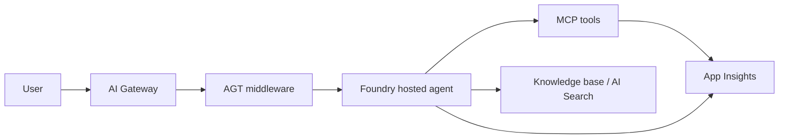

# Production-readiness report template

> **What this is.** The skeleton the skill renders into
> `docs/production-readiness-report.md`. Each section is required in v1
> (no opt-out). The skill fills in placeholders below from the JSON
> manifest at runtime.

---

# Production-readiness report — `{pilot_name}`

> Generated by `threadlight-production-ready` v{tool_version} at
> `{generated_at}` against subscription `{subscription_name}` (RG
> `{resource_group}`, region `{region}`).
>
> **This is an advisory artefact.** It is the input to the customer
> architecture review, CISO sign-off, and the go-live decision. Soft
> findings (`should-fix`) do not block; hard findings (`must-fix`) are
> recommended blockers but may be waived in `tests/production-readiness-waivers.json`.

## 1. Executive summary

- **Resolved posture:** `{posture.resolved}` (declared: `{posture.declared}`, detected: `{posture.detected}`)
- **Raw score:** `{score.raw.percent_pass}%` — `{score.raw.pass}` pass / `{score.raw.must_fix}` must-fix / `{score.raw.should_fix}` should-fix / `{score.raw.not_applicable}` N/A / `{score.raw.not_verified}` not-verified
- **Score with waivers:** `{score.with_waivers.percent_pass_with_waivers}%` (`{score.with_waivers.waived}` waivers applied)
- **Go-live recommendation:** **`{go_live_recommendation}`**
- **Would fail hard-gate:** `{would_fail_hard_gate}` *(preview of v2 hard-mode behaviour)*

### Top 5 gaps

| # | Pillar | Finding | Remediation |
|---|---|---|---|
| 1 | `{summary.top_findings[0].pillar}` | `{summary.top_findings[0].title}` | `{summary.top_findings[0].remediation_skill}` |
| 2 | … |  |  |
| 5 | … |  |  |

---

## 2. Posture diagram

```mermaid
graph TD
    A[Spoke RG: {resource_group}] -->|target: {posture.resolved}| B{Resolved posture}
    B -->|citadel-spoke| C[Citadel Hub: APIM + Access Contract]
    B -->|agt| D[AGT policy + CI gate]
    B -->|standard-ai-gateway| E[Customer APIM AI Gateway]
    B -->|hybrid| F[Mixed: per-workload]
```

*Rendered with the resolved branch highlighted. Non-resolved branches
shown dotted for context.*

---

## 3. Hard-gate preview *(would this pass a v2 hard-gate?)*

This skill is soft-advisory. The table below previews what a v2
`--mode gate` would have done:

| Outcome | Count |
|---|---|
| Would block go-live | `{score.raw.must_fix}` `must-fix` findings |
| Would warn | `{score.raw.should_fix}` `should-fix` findings |
| Excluded (waivers) | `{score.with_waivers.waived}` waivers |

If the pilot must pass a future hard-gate without further work,
address every `must-fix` and either fix or waive every `should-fix`.

---

## 4. Pillar scorecard

| # | Pillar | Score | Pass | Should-fix | Must-fix | N/A | Not-verified | Waived |
|---|---|---|---|---|---|---|---|---|
| 1 | `network-posture` | `{pillars[0].score}` | … | … | … | … | … | … |
| ⤷ | `residency` sub-section | … | … | … | … | … | … | … |
| 2 | `agent-governance` | … | … | … | … | … | … | … |
| 3 | `identity-access` | … | … | … | … | … | … | … |
| … | (all 13 pillars) | … | … | … | … | … | … | … |

---

## 5. Pillar deep-dives

### 5.1 `network-posture` *(resolved: `{posture.resolved}`)*

#### Findings

| ID | Status | Title | Evidence | Remediation |
|---|---|---|---|---|
| `NET-001` | `pass` | SPEC § 12 declares `target_posture` | `EV-001` | n/a |
| `NET-501` | `must-fix` | APIM Foundry connection missing in hub | `EV-101` | `citadel-spoke-onboarding` |
| … |  |  |  |  |

#### Data residency sub-section

| Field | Declared | Observed | Status |
|---|---|---|---|
| `model_region` | `westeurope` | `westeurope` | `pass` |
| `gateway_region` | `westeurope` | `westeurope` | `pass` |
| `backup_region` | `westeurope` | `eastus` | `must-fix` |
| … |  |  |  |

*(One sub-block per pillar — 13 total)*

---

## 6. Uplift plan

Ordered remediation steps. Each step links to the awesome-gbb skill
that fixes it. Run each step's skill in a fresh Copilot session, then
re-run this skill to verify.

### Step 1 — `citadel-spoke-onboarding` *(unblocks `NET-501`, `NET-502`)*

> "Onboard a Foundry project as a spoke into an AI Citadel Governance Hub.
> Covers Access Contracts, APIM connections, product policies, JWT auth."

### Step 2 — `azd-patterns` *(unblocks `SEC-001`, `SEC-002`, `SUP-001`)*

> "Tips and patterns for Azure Developer CLI (azd) workflows…"

*(One block per remediation skill triggered by the findings)*

---

## 7. Cost projection

### Current usage

- Period: last 7 days, observed via `Cost Management Reader`.
- Spend: `${current_spend}` USD; trend `{trend}` vs prior 7 days.

### Forecast (90 days at observed rate)

| Scenario | 90-day cost | Confidence |
|---|---|---|
| Current usage extrapolated | `${forecast_low}` | High |
| 5x usage (production launch) | `${forecast_mid}` | Medium |
| 20x usage (full rollout) | `${forecast_high}` | Low |

### PAYG vs PTU recommendation

`{ptu_recommendation_summary}`

(See `paygo-ptu-cost-analyzer` for the full PTU-break-even math
specific to this customer's load shape.)

### Idle resources

| Resource | Type | Last activity | Recommendation |
|---|---|---|---|
| `{idle[0].name}` | `{idle[0].type}` | `{idle[0].last_activity}` | Decommission or scale to zero |

---

## 8. Eval summary

> Source: latest `foundry-evals` run output under `evals/runs/` (or
> Foundry CE result if Plan A).

| Scenario | Threshold | Last result | Status |
|---|---|---|---|
| `{eval[0].name}` | `{eval[0].threshold}` | `{eval[0].score}` | `{eval[0].status}` |

Trend (last N runs):

```
{ascii_sparkline_or_table}
```

Eval freshness: `{last_eval_at}` (within freshness window: `{within_window}`).

---

## 9. Residual risk + RACI + rollout / rollback / cutover

### Residual risk register

Findings that remain after waivers, plus their compensating controls.

| Finding | Status | Compensating control | Risk owner | Expiry |
|---|---|---|---|---|
| `{residual[0].id}` | `waived` | `{residual[0].compensating}` | `{residual[0].owner}` | `{residual[0].expiry}` |

### RACI

| Activity | Responsible | Accountable | Consulted | Informed |
|---|---|---|---|---|
| Daily health monitoring | `{sre_team}` | `{incident_owner}` | `product_team` | `customer_ops` |
| Incident response L1 | `{l1}` | `{incident_owner}` | `product_team` | `customer_ops` |
| Model retirement watch | `{retirement_owner}` | `{incident_owner}` | `product_team` | `customer_ops` |
| Cost monitoring | `finance_partner` | `{incident_owner}` | `product_team` | `customer_ops` |
| Eval threshold breach | `{eval_owner}` | `{incident_owner}` | `product_team` | `customer_ops` |

### Rollout plan

1. Cutover window: `{cutover_window}`
2. Pre-cutover checklist: `{handoff_checklist_link}`
3. Cutover steps: `{cutover_steps_link}`

### Rollback plan

Strategy: `{rollback_strategy}` (per SPEC § 12).

1. Trigger criteria: `{trigger_criteria}`
2. Rollback steps: `{rollback_steps_link}`
3. Restore-from-backup: `{restore_plan_link}`

### Cutover

| Step | Owner | Done? |
|---|---|---|
| Pre-flight evals pass | `{eval_owner}` | ☐ |
| Pre-flight safe-check pass | SE | ☐ |
| Pre-flight this skill pass | SE | ☐ |
| Handoff acceptance signed | `{incident_owner}` | ☐ |
| SRE Agent recipe applied (if adopted) | SRE | ☐ |
| First production traffic | Product | ☐ |
| 24h health review | SRE | ☐ |

---

## 10. Appendix

### Glossary

| Term | Meaning |
|---|---|
| Posture | The customer's declared production-ready shape: Citadel-spoke / AGT / standard-AI-gateway / hybrid |
| AGT | Agent Governance Toolkit — a committed, schema-valid policy (`policy.yaml`) linted, tested, and CI-gated (`agt lint-policy` / `test` / `verify`) |
| Citadel | The AI Citadel Governance Hub reference implementation (APIM AI Gateway + Foundry control plane + access contracts) |
| Pillar | One of the 13 production-readiness dimensions assessed by this skill |
| `pass` / `should-fix` / `must-fix` / `not-applicable` / `not-verified` / `waived` | Per-finding status taxonomy |
| Hard-gate | A future v2 mode that converts `must-fix` to an exit-code-1 block |

### Reference architecture diagram



### Evidence register

Every probe run by the skill. Auditable: command, scope, timestamp,
permission tier used, result. Truncated below — full register in
`tests/production-readiness-manifest.json` `evidence_register[]`.

| ID | Command | Scope | Ran at | Tier | Result |
|---|---|---|---|---|---|
| `EV-001` | `(static)` | `specs/SPEC.md` | `{ts}` | 0 | OK |
| `EV-101` | `az resource list -g rg-pilot --resource-type Microsoft.ApiManagement/...` | `sub/rg-pilot` | `{ts}` | 5 | 1 resource matched |

### Waiver register

| Waiver ID | Finding | Owner | Expiry | Justification (summary) |
|---|---|---|---|---|
| `W-001` | `SEC-004` | `alice@…` | `2025-09-30` | "Purge protection enablement scheduled Q3" |

### Assumptions

This report assumes:
- The pilot is single-tenant.
- The pilot was deployed by `azd up` from this repo.
- `tests/postdeploy-manifest.json` from `threadlight-safe-check` is
  the most recent green run.
- Where Azure live probes were skipped (`not-verified`), the operator
  will re-run with elevated permissions or accept the missing
  coverage explicitly.

### What was not verified

`{not_verified_count}` checks were skipped due to missing permissions
or static-only mode. To unlock them, grant the roles listed in
`tests/production-readiness-manifest.json` `not_verified[]` and
re-run.
